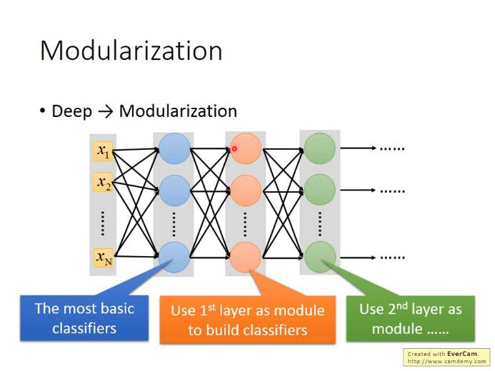

## [P3Regression - Case Study](https://www.bilibili.com/video/BV1JE411g7XF?p=3)

### regularization解决overfitting(L2正则化解决过拟合问题)


> regularization可以使曲线变得更加smooth，training data上的error变大，但是 testing data上的error变小。有关regularization的具体原理说明详见下一部分

原来的loss function只考虑了prediction的error，即$$\sum_{i}^{n}\left(\hat{y}^{i}-\left(b+\sum_{j} w_{j} x_{j}\right)\right)^{2}$$；而regularization则是在原来的loss function的基础上加上了一项$$\lambda \sum\left(w_{i}\right)^{2}$$，就是把这个model里面所有的Wi的平方和用λ加权(其中i代表遍历n个training data，j代表遍历model的每一项)

也就是说，**我们期待参数w i w_i\*w\**i\*越小甚至接近于0的function，为什么呢？**

因为参数值接近0的function，是比较平滑的；所谓的平滑的意思是，当今天的输入有变化的时候，output对输入的变化是比较不敏感的。举例来说，对$y=b+\sum w_{i} x_{i}$这个model，当input变化Δ x，output的变化就是，$$w_{i} \Delta x_{i}$$也就是说，如果w越i小越接近0的话，<u>输出对输入就越不sensitive敏感</u>，我们的function就是一个越平滑的function；说到这里你会发现，我们之前没有把bias——b这个参数考虑进去的原因是**bias的大小跟function的平滑程度是没有关系的**，bias值的大小只是把function上下移动而已

**那为什么我们喜欢比较平滑的function呢？**

如果我们有一个比较平滑的function，由于输出对输入是不敏感的，测试的时候，一些noises噪声对这个平滑的function的影响就会比较小，而给我们一个比较好的结果

**注：这里的λ需要我们手动去调整以取得最好的值**

λ值越大代表考虑smooth的那个regularization那一项的影响力越大，我们找到的function就越平滑

观察下图可知，当我们的λ越大的时候，在training data上得到的error其实是越大的，但是这件事情是非常合理的，因为当λ越大的时候，我们就越倾向于考虑w的值而越少考虑error的大小；但是有趣的是，虽然在training data上得到的error越大，但是在testing data上得到的error可能会是比较小的

我们喜欢比较平滑的function，因为它对noise不那么sensitive；但是我们又不喜欢太平滑的function，因为它就失去了对data拟合的能力；而function的平滑程度，就需要通过调整λ来决定，就像下图中，当λ=100时，在testing data上的error最小，因此我们选择λ=100

## [P4Basic Concept](https://www.bilibili.com/video/BV1JE411g7XF?p=4)

### bias和variance


bias表示离靶心的距离, 而variance表示散布情况


图中所示，只有足够大的函数搜索空间，才能找到正确的“靶心”，因此就需要吧模型设计得足够复杂。而复杂模型需要大数据来降低方差， 因此需要大量的数据防止过拟合


如果来自variance的误差很大， 那么就是过拟合； 如果来自bias的误差很大，那么就是欠拟合（underfitting）


bias大： 如果无法fit训练数据, 证明是欠拟合;如果能fit训练数据，但是在测试数据上有较大的误差，那么就是过拟合——做法：增大特征or增大次项

variance大： 更多的数据（数据增强）or 正则化


### 交叉验证： 


在trainingset训练后,虽然在公开的测试集上表示良好,但是private testing set不好的话, 则还是比较糟糕的模型。因此在判断一个模型的好坏的时候， 可以将trainingSet进行交叉验证


非常不建议因为在public testing set上表现不好而反过来重新选择trainingSet的模型， 因为这相当于在训练的时候吧testing也考虑在内了， 违背了设计的初衷，并且这样的结果在private testing set上也会表现不好。


#### N-fold cross validation （十折交叉验证）

如果不相信某一个trainset的结果的话， 那就分很多trainset


## [5. P5Gradient Descent](https://www.bilibili.com/video/BV1JE411g7XF?p=5)

$$
\theta^{*}=\arg \min _{\theta} L(\theta)
$$
L: loss function
$\theta$ : parameters(上标表示第几组参数, 下标表示这组参数中的第几个参数)


当参数有很多个的时候(>3)，其实我们很难做到将<u>loss随每个参数的变化可视化出来(因为最多只能可视化出三维的图像，也就只能可视化三维参数</u>)，但是我们可以把update的次数作为唯一的一个参数，将loss随着update的增加而变化的趋势给可视化出来(上图右半部分)

所以做gradient descent一个很重要的事情是，要把不同的learning rate下，loss随update次数的变化曲线给可视化出来，它可以提醒你该如何调整当前的learning rate的大小，直到出现稳定下降的曲线

**总结：梯度下降法指的是函数值loss随梯度下降的方向减小**

### Adaptive Learning rates

显然这样手动地去调整learning rates很麻烦，因此我们需要有一些自动调整learning rates的方法

##### 最基本、最简单的大原则是：learning rate通常是随着参数的update越来越小的

因为在起始点的时候，通常是离最低点是比较远的，这时候步伐就要跨大一点；而经过几次update以后，会比较靠近目标，这时候就应该减小learning rate，让它能够收敛在最低点的地方

##### Adagrad

> Divide the learning rate of each parameter by the root mean square(方均根) of its previous derivatives

Adagrad就是将不同参数的learning rate分开考虑的一种算法(adagrad算法update到后面速度会越来越慢，当然这只是adaptive算法中最简单的一种)

### Stochastic Gradicent Descent

随机梯度下降的方法可以让训练更快速，传统的gradient descent的思路是<u>看完所有的样本点</u>之后再构建loss function，然后去update参数；而stochastic gradient descent的做法是，<u>看到一个样本点就update一次</u>，因此它的loss function不是所有样本点的error平方和，而是这个随机样本点的error平方

### Feature Scaling

##### 概念介绍

特征缩放，当多个特征的分布范围很不一样时，最好将这些不同feature的范围缩放成一样


##### 对gradient decent的帮助

之前我们做的demo已经表明了，对于这种长椭圆形的error surface，如果不使用Adagrad之类的方法，是很难搞定它的，因为在像w1和w2这样不同的参数方向上，会需要不同的learning rate，用相同的lr很难达到最低点

如果有scale的话，loss在参数w1、w2平面上的投影就是一个正圆形，update参数会比较容易

而且gradient descent的每次update并不都是向着最低点走的，每次update的方向是顺着等高线的方向(梯度gradient下降的方向)，而不是径直走向最低点；但是当经过对input的scale使loss的投影是一个正圆的话，不管在这个区域的哪一个点，它都会向着圆心走。因此feature scaling对参数update的效率是有帮助的

##### scaling method:

z-score:

归一化

### gradient descent数学理论


注意 learning rate需要设置好, 否则Δθ不为0, 则泰勒近似不成立。


#### gradient descent的限制

▲gradient descent的限制是，它在gradient即微分值接近于0的地方就会停下来，而这个地方不一定是global minima，它可能是local minima，可能是saddle point**鞍点**，甚至可能是一个loss很高的plateau平缓高原


## [6. P10Classification_1](https://www.bilibili.com/video/BV1JE411g7XF?p=10)

特征、特征向量是什么？

> **要想把一个东西当做计算机能理解的function的input，就需要把它数值化**

特性数值化：用一组数字来描述一只宝可梦的特性， 比如用一组数字表示它有多强(total strong)、它的生命值(HP)、它的攻击力(Attack)、它的防御力(Defense)、它的特殊攻击力(Special Attack)、它的特殊攻击的防御力(Special defend)、它的速度(Speed)，以皮卡丘为例，我们可以用以上七种特性的数值就是特征量， 而多个特征量所组成的vector就是特征向量

---

我们希望蓝色的这些属于class 1的宝可梦，input到Regression的model，output越接近1越好；红色的属于class 2的宝可梦，input到Regression的model，output越接近-1越好。如果使用回归来硬解分类问题的话， 异常值影响比较大。 异常值则远远大于1， 跟目标不一致

Regression的output是连续性质的数值，而classification要求的output是离散性质的点，我们很难找到一个Regression的function使大部分样本点的output都集中在某几个离散的点附近

因此，**Regression定义model好坏的定义方式对classification来说是不适用的**

#### Solution：Generative model——朴素贝叶斯分类器


我们可以把loss function定义成$\hat{L}(f)=\sum_{n} \delta\left(f\left(x^{n}\right) \neq \hat{y}^{n}\right)$，即这个model在所有的training data上predict预测错误的次数，也就是说分类错误的次数越少，这个function表现得就越好

**贝叶斯公式=单条路径概率/所有路径概率和**


这一整套想法叫做**Generative model**(生成模型)，为什么叫它Generative model呢？因为有这个model的话，就可以拿它来generate生成x(如果你可以计算出每一个x出现的概率，就可以用这个distribution分布来生成x、sample x出来)

现在的问题是，怎么得到$P\left(x \mid C_{1}\right)$ 和 $P\left(x \mid C_{2}\right)$ 的值==> 认为数据服从 高斯分布

#### 高斯分布

$f_{\mu, \Sigma}(x)=\frac{1}{(2 \pi)^{D / 2}} \frac{1}{|\Sigma|^{1 / 2}} \exp \left\{-\frac{1}{2}(x-\mu)^{T} \Sigma^{-1}(x-\mu)\right\}$

假设海龟的vector是[103 45]，虽然这个点在已有的数据里并没有出现过，但是不可以认为它出现的概率为0，我们需要用已有的数据去估测海龟出现的可能性

你可以想象说这已有的79只水系宝可梦的data其实只是冰山一角，假定水系神奇宝贝的Defense和SP Defense是从一个Gaussian的distribution里面sample出来的，下图只是采样了79个点之后得到的分布，但是从高斯分布里采样出海龟这个点的几率并不是0，那从这79个已有的点，怎么找到那个Gaussian distribution函数呢？

#### 最大似然估计_参数估计

那接下来的问题就是怎么去找出这个Gaussian，**只需要去估测出这个Gaussian的均值和协方差即可**

估测和的方法就是极大似然估计法(Maximum Likelihood)，极大似然估计的思想是，找出最特殊的那对u和covariance，从它们<u>共同决定的高斯函数</u>中再次采样出79个点，使”得到的分布情况与当前已知79点的分布情况相同“这件事情发生的可能性最大===>最大似然估计

> 根据sample样本, 求得使出现**该样本组合可能性最大**(所以是每一个点产生的概率相乘)的那组**参数**


预测：


===> 训练结束：再把testing data上得到的结果可视化出来，即右下角的图，发现分的不是太好，正确率才是47%我们之前用的只是Defense和SP Defense这两个参数，在二维空间上得到的效果不太好，但实际上一开始就提到了宝可梦总共是有6个features的，也许在二维空间上它们是重叠在一起的，但是在六维空间上看它们也许会分得很好，每一个宝可梦都是六维空间中的一个点，于是我们的是一个6-dim的vector，则是一个6*6的matrix，发现得到的准确率也才64%，这个分类器表现得很糟糕，是否有办法将它改进的更好？

#### Modifying Model

其实之前使用的model是不常见的，你是不会经常看到给每一个Gaussian都有自己的mean和covariance，比如我们的class 1用的是u1和$\Sigma_1$，class 2用的是u2和$\Sigma_2$，比较常见的做法是，**不同的class可以share同一个cocovariance matrix**

其实variance是跟input的feature size的平方成正比的，所以当feature的数量很大的时候，$\Sigma$大小的增长是可以非常快的，在这种情况下，给不同的Gaussian以不同的covariance matrix，会造成model的参数太多，而参数多会导致该model的variance过大，出现overfitting的现象，因此对不同的class使用同一个covariance matrix，可以有效减少参数

### 案例总结

> 回顾几率模型

machine learning可以概况为以下三个step


---


选择的概率分布为经验之谈： 可以选择任意你喜欢的， 但是最后还是得看效果： 如果你选择的是简单的分布函数(参数比较少)，那你的bias就大，variance就小；如果你选择复杂的分布函数，那你的bias就小，variance就大，那你就可以用data set来判断一下，用什么样的Probability distribution作为model是比较好的

朴素贝叶斯：

这里每一个dimension的分布函数都是一维的Gaussian distribution，如果这样假设的话，等于是说，原来那多维度的Gaussian，它的covariance matrix变成是diagonal(对角的)，在不是对角线的地方，值都是0，这样就可以更加减少需要的参数量，就可以得到一个更简单的model

我们把上述这种方法叫做**Naive Bayes Classifier(朴素贝叶斯分类法)**，如果<u>真的明确了所有的feature之间是相互独立的，是不相关的，使用朴素贝叶斯分类法的performance是会很好的</u>，如果这个假设是不成立的，那么Naive bayes classfier的bias就会很大，它就不是一个好的classifier(朴素贝叶斯分类法本质就是减少参数)

当然这个例子里如果使用这样的model，得到的结果也不理想，因为各种feature之间的covariance还是必要的，比如战斗力和防御力它们之间是正相关的，covariance不能等于0

总之，寻找model总的原则是，尽量减少不必要的参数，但是必然的参数绝对不能少

那怎么去**选择分布函数**呢？有很多时候凭直觉就可以看出来，比如宝可梦有某个feature是binary的，它代表的是：是或不是，这个时候就不太可能是高斯分布了，而很有可能是伯努利分布(两点分布)

#### Analysis Posterior Probability分析后置概率的表达式


[上面的推导过程](https://sakura-gh.github.io/ML-notes/ML-notes-html/6_Classification.html)可能比较复杂，但是得到的最终结果还是比较好的：(当和共用一个时，经过化简相消z就变成了一个linear的function，x的系数是一个vector w，后面的一大串数字其实就是一个常数项b)


**$P\left(C_{1} \mid x\right)=\sigma(w \cdot x+b)$这个式子就解释了，当class 1和class 2共用的时候，它们之间的boundary会是linear的**

## [7. P11Logistic Regression](https://www.bilibili.com/video/BV1JE411g7XF?p=11)

### Three Steps of machine learning

#### Step 1：function set

这里的function set就是Logistic Regression——逻辑回归


#### Step 2：Goodness of a function

现在我们有N笔Training data，每一笔data都要标注它是属于哪一个class

假设这些Training data是从我们定义的posterior Probability中产生的(后置概率，某种意义上就是概率密度函数)，而w和b就决定了这个posterior Probability，那我们就可以去计算某一组w和b去产生这N笔Training data的概率，利用<u>极大似然估计</u>的思想，最好的那组参数就是有最大可能性产生当前N笔Training data分布的和

似然函数只需要将每一个点产生的概率相乘即可，注意，这里假定是二元分类，class 2的概率为1减去class 1的概率. $f_{w, b}(x)$为x为C1种类的概率, 则在二元分类中$( 1 - f_{w, b}(x) )$


由于 $L(w, b)$ 是乘积项的形式, 为了方便计算, 我们将上式做个变换: (注意这边的L(w,b) 是最大似然函数, 而不是Loss function)
$$
\begin{array}{l}
\qquad w^{*}, b^{*}=\arg \max _{w, b} L(w, b)=\arg \min _{w, b}(-\ln L(w, b)) \\
-\ln L(w, b)=-\ln f_{w, b}\left(x^{1}\right) \\
\quad-\ln f_{w, b}\left(x^{2}\right) \\
\quad-\ln \left(1-f_{w, b}\left(x^{3}\right)\right) \\
\quad-\ldots
\end{array}
$$
由于class 1和class 2的概率表达式不统一，上面的式子无法写成统一的形式, 为了统一格式, 这里将Logistic Regression里的所有Training data都打上0和1的标签, 即output $\hat{y}=1$ 代表class $1,$ output $\hat{y}=0$ 代表class $2,$ 于是上式进一步改写成:
$$
\begin{aligned}
-\ln L(w, b)=&-\left[\hat{y}^{1} \ln f_{w, b}\left(x^{1}\right)+\left(1-\hat{y}^{1}\right) \ln \left(1-f_{w, b}\left(x^{1}\right)\right)\right] \\
&-\left[\hat{y}^{2} \ln f_{w, b}\left(x^{2}\right)+\left(1-\hat{y}^{2}\right) \ln \left(1-f_{w, b}\left(x^{2}\right)\right)\right] \\
&-\left[\hat{y}^{3} \ln f_{w, b}\left(x^{3}\right)+\left(1-\hat{y}^{3}\right) \ln \left(1-f_{w, b}\left(x^{3}\right)\right)\right] \\
&-\ldots
\end{aligned}
$$
现在已经有了统一的格式, 我们就可以把要minimize的对象写成一个summation的形式:
$$
-\ln L(w, b)=\sum_{n}-\left[\hat{y}^{n} \ln f_{w, b}\left(x^{n}\right)+\left(1-\hat{y}^{n}\right) \ln \left(1-f_{w, b}\left(x^{n}\right)\right)\right]
$$
这里表示第n个样本点，表示第n个样本点的class标签(1表示class 1,0表示class 2)，最终这个summation的形式，里面其实是两个**Bernouli distribution(两点分布)的cross entropy(交叉熵)**

##### 交叉熵


假设有如上图所示的两个distribution p和q，它们的交叉商就是 $H(p, q)=-\sum_{x} p(x) \ln (q(x)),$ 这也就是之前的 推导中在 $-\ln L(w, b)$ 前加一个负号的原因

<u>cross entropy交叉嫡的含义是表达这两个distribution有多接近, 如果p和q这两个distribution一模一样的话, 那 它们算出来的cross entropy就是0(详细解释在“信息论"中)</u>, 而这里 $f\left(x^{n}\right)$ 表示function的output, $\hat{y}^{n}$ 表示预期 的 target, 因此交叉嫡实际上表达的是希望这个function的output和它的target越接近越好
总之, 我们要找的参数实际上就是:
$$
w^{*}, b^{*}=\arg \max _{w, b} L(w, b)=\arg \min _{w, b}\left(-\ln L(w, b)=\sum_{n}-\left[\hat{y}^{n} \ln f_{w, b}\left(x^{n}\right)+\left(1-\hat{y}^{n}\right) \ln \left(1-f_{w, b}\left(x^{n}\right)\right)\right]\right.
$$


#### step 3：Find the best function

实际上就是去找到使loss function即交叉嫡之和最小的那组参数 $w^{*}, b^{*}$ 就行了， 这里用gradient descent的方法进 行运算就Ok
这里sigmoid function的微分可以直接作为公式记下来: $\frac{\partial \sigma(z)}{\partial z}=\sigma(z)(1-\sigma(z)),$ sigmoid和它的微分的图像如 下:


先计算 $-\ln L(w, b)=\sum_{n}-\left[\hat{y}^{n} \ln f_{w, b}\left(x^{n}\right)+\left(1-\hat{y}^{n}\right) \ln \left(1-f_{w, b}\left(x^{n}\right)\right)\right]$ 对 $w_{i}$ 的偏微分 $,$ 这里 $\hat{y}^{n}$ 和 $1-\hat{y}^{n}$ 是常数先不用管它，只需要分别求出 $lnf_{w, b}\left(x^{n}\right)$ 和 $\ln \left(1-f_{w, b}\left(x^{n}\right)\right)$ 对 $w_{i}$ 的偏微分即可，整体推导过程如下：


将得到的式子进行进一步化简，可得：


梯度: 
$$
\theta^{*}=\arg \min _{\theta} L(\theta)
$$
L: loss function
$\theta$ : parameters(上标表示第几组参数, 下标表示这组参数中的第几个参数)

正好跟gradient descent的目标一致, 因此可以直接用gradient descent来找到最好的参数θ

梯度更新公式: $\left[\begin{array}{l}\Delta \theta_{1} \\ \Delta \theta_{2}\end{array}\right]=-\eta\left[\begin{array}{l}u \\ v\end{array}\right]=>\left[\begin{array}{l}\theta_{1} \\ \theta_{2}\end{array}\right]=\left[\begin{array}{l}a \\ b\end{array}\right]-\eta\left[\begin{array}{l}u \\ v\end{array}\right]=\left[\begin{array}{l}a \\ b\end{array}\right]-\eta\left[\begin{array}{l}\frac{\partial L(a, b)}{\partial \theta_{1}} \\ \frac{\partial L(a, b)}{\partial \theta_{z}}\end{array}\right]$ or $\theta^{i}=\theta^{i-1}-\eta \nabla L\left(\theta^{i-1}\right)$

我们发现最终的结果竟然异常的简洁，gradient descent每次update只需要做：

$w_{i}=w_{i}-\eta (\sum_{n}-\left(\hat{y}^{n}-f_{w, b}\left(x^{n}\right)\right) x_{i}^{n})$

那这个式子到底代表着什么意思呢? 现在你的update取决于三件事:
- learning rate, 是你自己设定的
- $\cdot x_{i},$ 来自于data
-  $\hat{y}^{n}-f_{w, b}\left(x^{n}\right),$ 代表function的output跟理想target的差距有多大, 如果离目标越远, update的步伐就要越 大

### Logistic Regression V.s. Linear Regression

##### 


compare in step1

- Logistic Regression是把每一个feature $x_{i}$ 加权求和, 加上bias, 再通过sigmoid function, 当做function的 output
- 因为Logistic Regression的output是通过sigmoid function产生的, 因此一定是介于0 1之间; 而linear Regression的output并没有通过sigmoid function, 所以它可以是任何值

##### compare in step2

在Logistic Regression中，我们定义的loss function, 即要去minimize的对象, 是所有example(样本点)的 output $\left(f\left(x^{n}\right)\right)$ )和实际target $\left(\hat{y}^{n}\right)$ 在Bernoulli distribution(两点分布)下的**cross entropy(交叉嫡)总和**

交叉嫡的描述：这里把 $f\left(x^{n}\right)$ 和 $\hat{y}^{n}$ 各自看做是一个Bernoulli distribution(两点分布)，那它们的cross entropy $l\left(f\left(x^{n}\right), \hat{y}^{n}\right)=-\left[\hat{y}^{n} \ln f\left(x^{n}\right)+\left(1-\hat{y}^{n}\right) \ln \left(1-f\left(x^{n}\right)\right)\right]$ 之和, 就是我们要去minimize的对象, 直观来讲, 就
是希望function的output $f\left(x^{n}\right)$ 和它的target $\hat{y}^{n}$ 越接近越好

注：这里的“看做"只是为了方便理解和计算，并不是真的做出它们是两点分布的假设
而在linear Regression中, loss function的定义相对比较简单, 就是单纯的function的output $\left(f\left(x^{n}\right)\right)$ 和实际 $\operatorname{target}\left(\hat{y}^{n}\right)$ 在**数值上的平方和的均值**
这里可能会有一个疑惑, 为什么Logistic Regression的loss function不能像linear Regression一样用square error 来表示呢? 后面会有进一步的解释

##### compare in step3

神奇的是，<u>Logistic Regression和linear Regression的update的方式是一模一样的</u>，唯一不一样的是，Logistic Regression的target 和output 都必须是在0和1之间的，而linear Regression的target和output的范围可以是任意值

### Logistic Regression + Square error？

> 先说结论, 在分类问题中Square error不合适, cross entropy适合于分类问题

Square error求微分情况:


现在会遇到一个问题：如果第n个点的目标target是class $1,$ 则 $\hat{y}^{n}=1,$ 此时如果function的output $f_{w, b}\left(x^{n}\right)=1$ 的话, 说明现在离target很接近了, $f_{w, b}(x)-\hat{y} 丶 \bar{x}$ 一项是0, 于是得到的微分 $\frac{\partial L}{\partial w_{i}}$ 会变成0，这件事情是很合理的; 但是当function的output $f_{w, b}\left(x^{n}\right)=0$ 的时候, 说明离target还很遥远, 但是由于在step3中求出来的update表达 式中有一个 $f_{w, b}\left(x^{n}\right),$ 因此这个时候也会导致得到的微分 $\frac{\partial L}{\partial w_{i}}$ 变成0==>简而言之, 微分的结果不便于下一步的gradient descent
如果举class 2的例子，得到的结果与class 1是一样的
如果我们把参数的变化对total loss作图的话, loss function选择cross entropy或square error, 参数的变化跟 loss的变化情况可视化出来如下所示：(黑色的是cross entropy, 红色的是square error)


假设中心点就是距离目标很近的地方，<u>如果是cross entropy的话，距离目标越远，微分值就越大，参数update的时候变化量就越大，迈出去的步伐也就越大</u>

但当你选择square error的时候，过程就会很卡，<u>因为距离目标远的时候，微分也是非常小的，移动的速度是非常慢的</u>，我们之前提到过，实际操作的时候，当gradient接近于0的时候，其实就很有可能会停下来，因此使用square error很有可能在一开始的时候就卡住不动了，而且这里也不能随意地增大learning rate，因为在做gradient descent的时候，你的gradient接近于0，有可能离target很近也有可能很远，因此不知道learning rate应该设大还是设小

综上，尽管square error可以使用，但是会出现update十分缓慢的现象，而使用cross entropy可以让你的Training更顺利

### Discriminative v.s. Generative

#### same model but different currency

Logistic Regression的方法，我们把它称之为discriminative的方法；而我们用Gaussian来描述posterior Probability这件事，我们称之为Generative的方法, 

实际上它们用的model(function set)是一模一样的, 都是 $P\left(C_{1} \mid x\right)=\sigma(w \cdot x+b),$ 如果是用Logistic Regression 的话, 可以用gradient descent的方法直接去把b和W找出来; 如果是用Generative model的话，我们要先去算 $u_{1}, u_{2}, \Sigma^{-1} \quad$ 然后算出b和w

区别在于: 是否有假设?

你会发现用这两种方法得到的b和w是不同的，尽管我们的function set是同一个，但是由于做了不同的假设，最终从同样的Training data里找出来的参数会是不一样的

在Logistic Regression里面，我们**没有做任何实质性的假设**，没有对Probability distribution有任何的描述，我们就是单纯地去找b和w(推导过程中的假设只是便于理解和计算，对实际结果没有影响)

而在Generative model里面，我们对Probability distribution是**有实质性的假设**的，之前我们假设的是Gaussian(高斯分布)，甚至假设在相互独立的前提下是否可以是naive bayes(朴素贝叶斯)，根据这些假设我们才找到最终的b和w

例子: https://sakura-gh.github.io/ML-notes/ML-notes-html/7_Logistic-Regression.html

所以，**Generative model和discriminative model的差别就在于，Generative的model它有做了某些假设，假设你的data来自于某个概率模型；而Discriminative的model是完全不作任何假设的, 完全根据数据说话**

> Generative model做的事情就是脑补，它会自己去想象一些事情，于是会做出一个和我们人类直觉想法不太一样的判断结果，就像toy example里，我们做了naive bayes这样一个假设(事实上我们并不知道这两个feature是否相互独立)，于是Naive bayes会在class 2里并没有出现过两个feature都是1的样本点的前提下，自己去脑补有这样的点
>
> 通常脑补不是一件好的事情，因为你给你的data强加了一些它并没有告诉你的属性，但是在data很少的情况下，脑补也是有用的，discriminative model并不是在所有的情况下都可以赢过Generative model，discriminative model是十分依赖于data的，当data数量不足或是data本身的label就有一些问题，那Generative model做一些脑补和假设，反而可以把data的不足或是有问题部分的影响给降到最低

---

### Conclusion

对于分类的问题(主要是二元分类)，我们一般有两种方法去处理问题，一种是Generative的方法，另一种是Discriminative的方法，注意到分类问题的model都是从贝叶斯方程出发的，即

$\begin{aligned} P\left(C_{i} \mid x\right)=& \frac{P\left(C_{i}\right) P\left(x \mid C_{i}\right)}{\sum_{j=1}^{n} P\left(C_{j}\right) P\left(x \mid C_{j}\right)}(1) \\ &=\sigma(z)=\frac{1}{1+e^{-z}}=\frac{1}{1+e^{-\left(b+\sum_{k} w_{k} x_{k}\right)}} \end{aligned}$

Generative model的好处是，它对data的依赖并没有像discriminative model那么严重，在data数量少或者data本身就存在noise的情况下受到的影响会更小，而它还可以做到Prior部分与class-dependent部分分开处理，如果可以借助其他方式提高Prior model的准确率，对整一个model是有所帮助的(比如前面提到的语音辨识)

而Discriminative model的好处是，在data充足的情况下，它训练出来的model的准确率一般是比Generative model要来的高的

### Multi-class Classification

#### softmax

> softmax的意思是对最大值做强化，因为在做第一步的时候，对取exponential会使大的值和小的值之间的差距被拉得更开，也就是强化大的值

##### Limitation of Logistic Regression

Logistic Regression其实有很强的限制，给出下图的例子中的Training data，想要用Logistic Regression对它进行分类，其实是做不到的, 如**异或**

##### Feature Transformation

如果坚持要用Logistic Regression的话，有一招叫做**Feature Transformation**，原来的feature分布不好划分，那我们可以将之转化以后，找一个比较好的feature space，让Logistic Regression能够处理

但麻烦的是，我们并不知道怎么做feature Transformation，如果在这上面花费太多的时间就得不偿失了，于是我们会希望这个Transformation是机器自己产生的，怎么让机器自己产生呢？**我们可以让很多Logistic Regression cascade(连接)起来**

我们让一个input x的两个feature $x_{1}, x_{2}$ 经过两个Logistic Regression的transform, 得到**新的feature** $x_{1}^{\prime}, x_{2}^{\prime},$ 在 这个新的feature space上, class 1和class 2是可以用一条直线分开的, 那么最后只要再接另外一个Logistic Regression的model(对它来说, $x_{1}^{\prime}, x_{2}^{\prime}$ 才是每一个样本点的"feature", 而不是原先的 $\left.x_{1}, x_{2}\right),$ 它根据新的 feature, 就可以把class 1和class 2分开

### Powerful Cascading Logistic Regression

通过上面的例子，我们发现，多个Logistic Regression连接起来会产生powerful的效果，**我们把每一个Logistic Regression叫做一个neuron(神经元)，把这些Logistic Regression串起来所形成的network，就叫做Neural Network，就是类神经网路，这个东西就是Deep Learning！**


## [8. P12 Brief Introduction of Deep Learning](https://www.bilibili.com/video/BV1JE411g7XF?p=12)

### Ups and downs of Deep Learning

- 1958：Perceptron(linear model)，感知机的提出
  - 和Logistic Regression类似，只是少了sigmoid的部分
- 1969：Perceptron has limitation，from MIT
- 1980s：Multi-layer Perceptron，多层感知机
  - 和今天的DNN很像
- 1986：Backpropagation，反向传播
  - Hinton propose的Backpropagation
  - 存在problem：通常超过3个layer的neural network，就train不出好的结果
- 、1989: 1 hidden layer is “good enough”，why deep？
  - 有人提出一个理论：只要neural network有一个hidden layer，它就可以model出任何的function，所以根本没有必要叠加很多个hidden layer，所以Multi-layer Perceptron的方法又坏掉了，这段时间Multi-layer Perceptron这个东西是受到抵制的
- 2006：RBM initialization(breakthrough)：Restricted Boltzmann Machine，受限玻尔兹曼机
  - Deep learning -> another Multi-layer Perceptron ？在当时看来，它们的不同之处在于在做gradient descent的时候选取初始值的方法如果是用RBM，那就是Deep learning；如果没有用RBM，就是传统的Multi-layer Perceptron
  - 那实际上呢，RBM用的不是neural network base的方法，而是graphical model，后来大家试验得多了发现RBM并没有什么太大的帮助，因此现在基本上没有人使用RBM做initialization了
  - RBM最大的贡献是，它让大家重新对Deep learning这个model有了兴趣(石头汤的故事)
- 2009：GPU加速的发现
- 2011：start to be popular in speech recognition，语音识别领域
- 2012：win ILSVRC image competition，Deep learning开始在图像领域流行开来

实际上，<u>Deep learning跟machine learning一样，也是“大象放进冰箱”的三个步骤</u>：

在Deep learning的step1里define的那个function，就是neural network


### Neural Network

#### concept

把多个Logistic Regression前后connect在一起，然后把一个Logistic Regression称之为neuron，整个称之为neural network


我们可以用不同的方法连接这些neuron，就可以得到不同的structure，neural network里的每一个Logistic Regression都有自己的weight和bias，这些weight和bias集合起来，就是这个network的parameter，我们用来描述

### Network Structure

如果一个**neural network**的参数weight和bias已知的话，它就是一个**function**，它的**input**是一个vector，**output**是另一个vector，这个vector里面放的是**样本点的feature**，vector的dimension就是feature的个数

- input的地方，叫做**input layer**，输入层(严格来说input layer其实不是一个layer，它跟其他layer不一样，不是由neuron所组成的)
- output的地方，叫做**output layer**，输出层
- 其余的地方，叫做**hidden layer**，隐藏层
- 激活函数: 每一个neuron里面的sigmoid function，在Deep Learning中被称为**activation function**(激励函数)，事实上它不见得一定是sigmoid function，还可以是其他function(sigmoid function是从Logistic Regression迁移过来的，现在已经较少在Deep learning里使用了)

★.network structure+neuron该如何连接在一起的含义: 其实是define了一个function set(model)

### **Feedforward network**


▲.全连接: 因为layer和layer之间，**所有的neuron都是两两连接**，所以它叫Fully connected的network；因为现在传递的方向是从layer 1->2->3，由后往前传，所以它叫做Feedforward network


#### Output Layer

我们可以把hidden layers这部分，看做是一个**feature extractor(特征提取器)**，这个feature extractor就replace了我们之前手动做feature engineering，feature transformation这些事情，经过这个feature extractor得到的就可以被当作一组新的feature

output layer做的事情，其实就是把它当做一个**Multi-class classifier**，它是拿经过feature extractor转换后的那一组比较好的feature(能够被很好地separate)进行分类的，由于我们把output layer看做是一个Multi-class classifier，所以我们会在最后一个layer加上**softmax**

### 整个手写体识别分析:

我们唯一需要的就是一个**function**，这个function的input是一个256的vector，**output是一个10维的vector**，这个function就是neural network(这里我们用简单的Feedforward network)

input固定为256维(图片)，output固定为10维的feedforward neural network，实际上这个network structure就已经确定了一个function set(model)的形状，在这个function set里的每一个function都可以拿来做手写数字识别，接下来我们要做的事情是用gradient descent去计算出一组参数，挑一个最适合拿来做手写数字识别的function

**注：input、output的dimension，加上network structure，就可以确定一个model的形状，前两个是容易知道的，而决定这个network的structure则是整个Deep Learning中最为关键的步骤**

所以这里很重要的一件事情是，我们要对network structure进行design，之前在做Logistic Regression或者是linear Regression的时候，我们对model的structure是没有什么好设计的，但是对neural network来说，我们现在已知的constraint只有input是256维，output是10维，而中间要有几个hidden layer，每个layer要有几个neuron，都是需要我们自己去设计的，它们近乎是决定了function set长什么样子

如果你的network structure设计的很差，这个function set里面根本就没有好的function，那就会像大海捞针一样，结果针并不在海里(滑稽

#### Step 1：Neural Network


intput输入为16*16的图片(256维) -->经过神经网络(函数) --> 输出10维的vector --> 经过softmax函数选出可能性最大的结果输出-output

#### Step 2：Goodness of function


input这张image的256个pixel，通过这个neural network之后，会得到一个output，称之为y；而从这张image的label中转化而来的target，称之为，有了output 和target 之后，要做的事情是计算它们之间的**cross entropy(交叉熵)**，这个做法跟我们之前做Multi-class classification的时候是一模一样的---> 分类问题多使用交叉熵

Cross Entropy $: l(y, \hat{y})=-\sum_{i=1}^{10} \hat{y}_{i}$lny$_{i}$

#### Step 3：Pick the best function

接下来就去调整参数，让这个cross entropy越小越好，当然整个training data里面不会只有一笔data，你需要把所有data的cross entropy都sum起来, 得到一个total loss $L=\sum_{n=1}^{N} l^{n}$ （所有case的Cross Entropy  ）, 得到loss function之后你要做的事情是找一组network的parameters：$\theta^{*}$。它可以minimize这个total loss，这组parameter对应的function就是我们最终训练好的model

老规矩：我们使用**Gradient Descent**来优化total loss来获得model。实际上在deep learning里面用gradient descent，跟在linear regression里面使用完全没有什么差别，只是function和parameter变得更复杂了而已，其他事情都是一模一样的。

但是相比在liner model中求导还是比较轻松的， 在network中的function式子到底是长什么样子呢？==> 需要用到反向传播--->但是人工计算是比较复杂的, 因此有了pytorch, tensorflow等微分toolkit可以来计算Backpropagation

### Design network structure V.s. Feature Engineering(网络结构设计 vs 特征工程)

> deep learning: 通过network 找到一组合适的param来训练, 让机器自动学会如何提取特征==>获得model
> 传统方法: 通过古圣先贤的先验知识对信息进行特征提取和分析==>获得model

其实network structure的design是一件蛮难的事情，我们到底要怎么决定layer的数目和每一个layer的neuron的数目呢？其实这个只能够凭着经验和直觉、多方面的尝试，有时候甚至会需要一些domain knowledge(专业领域的知识)，<u>从非deep learning的方法到deep learning的方法，并不是说machine learning比较简单，而是我们把一个问题转化成了另一个问题</u>

原先非deep learning的model，要得到一个好的结果，往往需要做**feature engineering(特征工程)**，也就是做feature transform，然后找一组好的feature；一开始学习deep learning的时候，好像会觉得deep learning的layers之间也是在做feature transform，但实际上在做deep learning的时候，往往不需要一个好的feature ，比如说在做影像辨识的时候，你可以把所有的pixel直接丢进去，但是在过去做图像识别，你是需要对图像抽取出一些人定的feature出来的，这件事情就是feature transform，但是有了deep learning之后，你完全可以直接丢pixel进去硬做

但是，今天deep learning制造了一个新的问题，它所制造的问题就是，你需要去design network的structure，所以**你的问题从本来的如何抽取feature==>(转化成)怎么design network structure**，所以deep learning是不是真的好用，取决于你觉得解决哪一个问题比较容易(如，以前做音频识别需要知道DFT些信号处理知识和方法，现在完全可以交给机器，让其自己学会DFT)

如果是影响辨识或者是语音辨识的话，design network structure可能比feature engineering要来的容易，因为，虽然我们人都会看、会听，但是这件事情，它太过潜意识了，它离我们意识的层次太远，我们无法意识到，我们到底是怎么做语音辨识这件事情，所以对人来说，你要抽一组好的feature，让机器可以很方便地用linear的方法做语音辨识，其实是很难的，<u>因为人根本就不知道好的feature到底长什么样子；所以还不如design一个network structure，或者是尝试各种network structure，让machine自己去找出好的feature，这件事情反而变得比较容易，对影像来说也是一样的</u>

有这么一个说法：deep learning在NLP上面的performance并没有那么好。语音辨识和影像辨识这两个领域是最早开始用deep learning的，一用下去进步量就非常地惊人，比如错误率一下子就降低了20%这样，但是在NLP上，它的进步量似乎并没有那么惊人，甚至有很多做NLP的人，现在认为说deep learning不见得那么work，这个原因可能是，人在做NLP这件事情的时候，由于人在文字处理上是比较强的，比如叫你设计一个rule去detect一篇document是正面的情绪还是负面的情绪，你完全可以列表，列出一些正面情绪和负面情绪的词汇，然后看这个document里面正面情绪的词汇出现的百分比是多少，你可能就可以得到一个不错的结果。<u>所以NLP这个task，对人来说是比较容易设计rule的，你设计的那些ad-hoc(特别的)的rule，往往可以得到一个还不错的结果，这就是为什么deep learning相较于NLP传统的方法，觉得没有像其他领域一样进步得那么显著(但还是有一些进步的)</u>===>简言之, 这个语言问题较为容易研究, 以及前人传统方法研究已经非常深入, 效果也较好, 因此机器学习并没有太多的提升

长久而言，可能文字处理中会有一些隐藏的资讯是人自己也不知道的，所以让机器自己去学这件事情，还是可以占到一些优势，只是眼下它跟传统方法的差异看起来并没有那么的惊人，但还是有进步的


### [P15Why Deep-](https://www.bilibili.com/video/BV1JE411g7XF?p=15)


Q:参数变多,是变宽还是变深呢? 是不是暴力的方法呢?

A: 

- 论文比较相同参数, 深度效果好于宽度;
- DNN结构一个很大的优势是，Modularization(模块化)，它用的是结构化的架构

#### Modularization

> 就像写程序一样，shallow network实际上就是把所有的程序都写在了同一个main函数中，所以它去检测不同的class使用的方法是相互独立的；而deep network则是把整个任务分为了一个个小任务，每个小任务又可以不断细分下去，以形成modularization，就像下图一样
>
> 在DNN的架构中，实际上每一层layer里的neuron都像是在解决同一个级别的任务，它们的output作为下一层layer处理更高级别任务的数据来源，低层layer里的neuron做的是对不同小特征的检测，高层layer里的neuron则根据需要挑选低层neuron所抽取出来的不同小特征，去检测一个范围更大的特征；neuron就像是一个个classifier ，后面的classifier共享前面classifier的参数
>
> 这样做的好处是，低层的neuron输出的信息可以被高层不同的neuron重复使用，而并不需要像shallow network一样，每次在用到的时候都要重新去检测一遍，因此大大降低了程序的复杂度


- 理解效果：模组化： 如分类长发的女孩、长头发的男孩、短发的女孩、短发男孩。

  ​	如果按照shallow network的想法，我们分别独立地train四个classifier(其实就相当于训练四个独立的model)，然后就可以解决这个分类的问题。但是显而易见的是长头发的男生样本会非常少，没有太多的training data，所以，你train出来的classifier就比较weak，去detect长头发男生的performance就比较差

  

但其实我们的input并不是没有关联的，长头发的男生和长头发的女生都有一个共同的特征，就是长头发，因此如果我们分别**独立地训练四个model作为分类器**，实际上就是忽视了这个共同特征，也就是没有高效地用到data提供的全部信息，这恰恰是shallow network的弊端

而利用modularization的思想，使用deep network的架构，我们可以**训练一个model作为分类器就可以完成所有的任务**，我们可以把整个任务分为**两个子任务**：

- Classifier1：检测是男生或女生
- Classifier2：检测是长头发或短头发

虽然长头发的男生data很少，但长头发的人的data就很多，经过前面几层layer的特征抽取，就可以头发的data全部都丢给Classifier2，把男生或女生的data全部都丢给Classifier1，这样就真正做到了**充分、高效地利用数据**，最终的Classifier再根据Classifier1和Classifier2提供的信息给出四类人的分类结果

你会发现，经过层层layer的任务分解，其实每一个Classifier要做的事情都是比较简单的，又因为这种分层的、模组化的方式充分利用了data，并提高了信息利用的效率，所以只要用比较少的training data就可以把结果train好



#### deep -> modularization

做modularization的好处是**把原来比较复杂的问题变得简单**，比如原来的任务是检测一个长头发的女生，但现在你的任务是检测长头发和检测性别，而当检测对象变简单的时候，就算training data没有那么多，我们也可以把这个task做好，并且**所有的classifier都用同一组参数检测子特征**，提高了参数使用效率，这就是modularization、这就是模块化的精神

**由于deep learning的deep就是在做modularization这件事，所以它需要的training data反而是比较少的**，这可能会跟你的认知相反，AI=big data+deep learning，但deep learning其实是为了解决less data的问题才提出的

每一个neuron其实就是一个basic的classifier：

- 第一层neuron，它是一个最basic的classifier，检测的是颜色、线条这样的小特征
- 第二层neuron是比较复杂的classifier，它用第一层basic的classifier的output当作input，也就是把第一层的classifier当作module，利用第一层得到的小特征分类出不同样式的花纹
- 而第三层的neuron又把第二层的neuron当作它module，利用第二层得到的特征分类出蜂窝、轮胎、人
- 以此类推


这边要强调的是，在做deep learning的时候，怎么做模块化这件事情是machine自动学到的，也就是说，第一层要检测什么特征、第二层要检测什么特征...这些都不是人为指定的，人只有定好有几层layer、每层layer有几个neuron，剩下的事情都是machine自己学到的

传统的机器学习算法，是人为地根据domain knowledge指定特征来进行提取，这种指定的提取方式，甚至是提取到的特征，也许并不是实际最优的，所以它的识别成功率并没有那么高；但是如果提取什么特征、怎么提取这件事让机器自己去学，它所提取的就会是那个最优解，因此识别成功率普遍会比人为指定要来的高

#### Conclusion

Deep总结：

- 考虑input之间的内在关联，所有的class用同一个model来做分类
- modularization思想，复杂问题简单化，把检测复杂特征的<u>大任务</u>分割成检测简单特征的<u>小任务</u>
- 所有的classifier使用同一组参数的子特征检测器，<u>共享检测到的子特征</u>
- 不同的classifier会share部分的参数和data，效率高
- 联系logic circuit和剪纸画的例子
- 多层hidden layer对complex问题的处理上比较有优势

## [9. P13Backpropagation](https://www.bilibili.com/video/BV1JE411g7XF?p=13)

Backpropagation是神经网络中用来做gradient descent的方法， 目的是使优化函数尽可能得变成我们想要的， 假设我们现在要处理的是分类任务，loss function为交叉熵， total loss为$L(\theta)=\sum_{n=1}^{N} l^{n}(\theta)$

我们把training data里任意一个样本点 $x^{n}$ 代到neural network里面, 它会output一个 $y^{n},$ 我们把这个output跟样 本点本身的label标注的target $\hat{y}^{n}$ 作cross entropy, 这个交叉嫡定义了output $y^{n}$ 与target $\hat{y}^{n}$ 之间的距离 $l^{n}(\theta)$。 如果cross entropy比较大的话, 说明output和target之间距离很远, 这个network的parameter的loss是比较大 的, 反之则说明这组parameter是比较好的， 然后总和所有training data的cross entropy $l^{n}(\theta),$ 得到total loss $L(\theta),$ 这就是我们的loss function, 用这个 $L(\theta)$ 对某一个参数w做偏微分, 表达式如下:
$$
\frac{\partial L(\theta)}{\partial w}=\sum_{n=1}^{N} \frac{\partial l^{n}(\theta)}{\partial w}
$$
这个表达式告诉我们, 只需要考虑如何计算对某一笔data的 $\frac{\partial l^{n}(\theta)}{\partial w},$ 再将所有training data的cross entropy对参数 w的偏微分累计求和, 就可以把total loss对某一个参数w的偏微分给计算出来。


我们逐一分析，我们先考虑某一个neuron, 先拿出上图中被红色三角形圈住的neuron, 假设只有两个input $x_{1}, x_{2},$ 通过这个 neuron, 我们先得到 $z=b+w_{1} x_{1}+w_{2} x_{2},$ 然后经过activation function从这个neuron中output出来, 作为后 续neuron的input, 再经过了非常非常多的事情以后, 会得到最终的output $y_{1}, y_{2}$
现在的问题是这样： $\frac{\partial l}{\partial w}$ 该怎么算? 按照chain rule, 可以把它拆分成两项, $\frac{\partial l}{\partial w}=\frac{\partial z}{\partial w} \frac{\partial l}{\partial z},$ 这两项分别去把它计算
出来。前面这一项是比较简单的, 后面这一项是比较复杂的
计算前面这一项 $\frac{\partial z}{\partial w}$ 的这个process, 我们称之为Forward pass; 而计算后面这项 $\frac{\partial l}{\partial z}$ 的process, 我们称之为 Backward pass


### Forward pass

先考虑 $\frac{\partial z}{\partial w}$ 这一项, 完全可以秒算出来, $\frac{\partial z}{\partial w_{1}}=x_{1}, \frac{\partial z}{\partial w_{2}}=x_{2}$
它的规律是这样的：**求 $\frac{\partial z}{\partial w},$ 就是看w前面连接的input是什么, 那微分后的 $\frac{\partial z}{\partial w}$ 值就是什么**，因此只要计算出 neural network里面每一个neuron的output就可以知道任意的z对W的偏微分

- 比如input layer作为neuron的输入时，前面连接的是，所以微分值就是；前面连接的是，所以微分值就是
- 比如hidden layer作为neuron的输入时，那该neuron的input就是前一层neuron的output，于是的值就是前一层的z经过activation function之后输出的值(下图中的数据是假定activation function为sigmoid function得到的)


### Backward pass

再考虑 $\frac{\partial l}{\partial z}$ 这一项, 它是比较复杂的, 这里我们依旧假设activation function是sigmoid function

**公式推导**

我们的<u>z通过activation function得到a</u>, 这个neuron的output是 $a=\sigma(z),$ 接下来这个a会乘上某一个weight $w_{3}$ 再加上其它一大堆的value得到 $z^{\prime},$ 它是下一个neuron activation function的input, 然后a又会乘上另一个 weight $w_{4},$ 再加上其它一雄value得到 $z^{\prime \prime},$ 后面还会发生很多很多其他事情, 不过这里我们就只先考虑下一步会 发生什公事情:
$$
\frac{\partial l}{\partial z}=\frac{\partial a}{\partial z} \frac{\partial l}{\partial a}
$$
这里的 $\frac{\partial a}{\partial z}$ 实际上就是<u>1. activation function的微分(在这里就是sigmoid function的微分)</u>，接下来的问题是 $\frac{\partial l}{\partial a}$ 应该长 什么样子呢? a会影响 $z^{\prime}$ 和 $z^{\prime \prime},$ 而 $z^{\prime}$ 和 $z^{\prime \prime}$ 会影响 $l,$ 所以通过chain rule可以得到
$$
\frac{\partial l}{\partial a}=\frac{\partial z^{\prime}}{\partial a} \frac{\partial l}{\partial z^{\prime}}+\frac{\partial z^{\prime \prime}}{\partial a} \frac{\partial l}{\partial z^{\prime \prime}}
$$
这里的 $\frac{\partial z^{\prime}}{\partial a}=w_{3}, \frac{\partial z^{\prime \prime}}{\partial a}=w_{4},$ 那 $\frac{\partial l}{\partial z^{\prime}}$ 和 $\frac{\partial l}{\partial z^{\prime \prime}}$ 又该怎么算呢? 这里先假设我们已经通过某种方法把 $\frac{\partial l}{\partial z^{\prime}}$ 和 $\frac{\partial l}{\partial z^{\prime \prime}}$ 这两项给算出来了，然后回过头去就可以把 $\frac{\partial l}{\partial z}$ 给轻易地算出来 ==> 上面是个递归的过程，因此需要从output计算 $\frac{\partial l}{\partial a}$ 
$$
\frac{\partial l}{\partial z}=\frac{\partial a}{\partial z} \frac{\partial l}{\partial a}=\sigma^{\prime}(z)\left[w_{3} \frac{\partial l}{\partial z^{\prime}}+w_{4} \frac{\partial l}{\partial z^{\prime \prime}}\right]
$$


case 1: Output Layer
假设蓝色的这个neuron已经是hidden layer的最后一层了, 也就是说连接在 $z^{\prime}$ 和 $z^{\prime \prime}$ 后的这两个红色的neuron已经 是output layer, 它的output就已经是整个network的output了, 这个时候计算就比较简单
$$
\frac{\partial l}{\partial z^{\prime}}=\frac{\partial y_{1}}{\partial z^{\prime}} \frac{\partial l}{\partial y_{1}}
$$
其中 $\frac{\partial y_{1}}{\partial z^{\prime}}$ 就是output layer的<u>activation function (softmax) 对 $z^{\prime}$ 的偏微分</u>
而 $\frac{\partial l}{\partial y_{1}}$ 就是<u>loss function对 $y_{1}$ 的偏微分</u>, 它取决于你的loss function是怎么定义的, 也就是你的output和target之间是怎么 evaluate的, 你可以用cross entropy, 也可以用mean square error, 用不同的定义, $\frac{\partial l}{\partial y_{1}}$ 的值就不一样
这个时候, 你就已经可以把l对 $w_{1}$ 和 $w_{2}$ 的偏微分 $\frac{\partial l}{\partial w_{1}}, \frac{\partial l}{\partial u_{2}}$ 算出来了


另一个观点——反向计算的一句

这个式子还是蛮简单的, 然后, 我们可以从另外一个观点来看待这个式子
你可以想象说, 现在有另外一个neuron, 它不在我们原来的network里面, 在下图中它被画成三角形, 这个 neuron的input就是 $\frac{\partial l}{\partial z^{\prime}}$ 和 $\frac{\partial l}{\partial z^{n}},$ 那input $\frac{\partial l}{\partial z^{\prime}}$ 就乘上 $w_{3},$ input $\frac{\partial l}{\partial z^{\prime \prime}}$ 就乘上 $w_{4},$ 它们两个相加再乘上activation
function的微分 $\sigma^{\prime}(z),$ 就可以得到output $\frac{\partial l}{\partial z}$


这张图描述了一个新的“neuron"，它的含义跟图下方的表达式是一模一样的, 作这张图的目的是为了方便理解
值得注意的是, 这里的 $\sigma^{\prime}(z)$ 是一个constant常数, 它并不是一个function, 因为z其实在计算forward pass的时候 就已经被决定好了, z是一个固定的值
所以这个neuron其实跟我们之前看到的sigmoid function是不一样的, 它并不是把input通过一个non-linear进行 转换, 而是直接把input乘上一个constant $\sigma^{\prime}(z),$ 就得到了output, 因此这个neuron被画成三角形, 代表它跟我 们之前看到的圆形的neuron的运作方式是不一样的, 它是直接乘上一个constant(这里的三角形有点像电路里的运 算放大器op-amp, 它也是乘上一个constant)

知道 $z^{\prime}$ 和 $z^{\prime \prime}$ 就可以知道 $z,$ 知道 $z_{a}$ 和 $z_{b}$ 就可以知道 $z^{\prime}, \ldots \ldots,$ 现在这个过程就可以反复进行下去, 直到找到output layer, 我们可以算出确切的值, 然后再一层一层反推回去
你可能会想说, 这个方法听起来挺让人崩溃的, 每次要算一个微分的值, 都要一路往后走, 一直走到network的 output, 如果写成表达式的话, 一层一层往后展开, 感觉会是一个很可怕的式子, 但是! 实际上并不是这个样子 做的
你只要换一个方向, 从output layer的 $\frac{\partial l}{\partial z}$ 开始算, 你就会发现它的运算量跟原来的network的Feedforward path 其实是一样的


▲注: 如果是正向做Backward pass的话, 实际上每次计算一个 $\frac{\partial l}{\partial z},$ 就需要把该neuron后面所有的 $\frac{\partial l}{\partial z}$ 都给计算一 遍, 会造成很多不必要的里复运算, 如果写成code的形式, 就<u>相当于调用了很多次里复的函数;</u> 而如果是反向做 Backward pass，实际上就是把这些调用函数的过程都变成调用“值"的过程, 因此可以直接计算出结果, 而不需要 占用过多的堆栈空间

### Summary

最后，我们来总结一下Backpropagation是怎么做的

**Forward pass**，每个neuron的activation function的output，就是它所连接的weight的

**Backward pass**，建一个与原来方向相反的neural network，它的三角形neuron的output就是

把通过forward pass得到的和通过backward pass得到的乘起来就可以得到对的偏微分


## [11. P17Convolutional Neural Network](https://www.bilibili.com/video/BV1JE411g7XF?p=17)

[11_Convolutional Neural Network part1](https://sakura-gh.github.io/ML-notes/ML-notes-html/11_Convolutional-Neural-Network-part1.html)
[12_Convolutional Neural Network part2](https://sakura-gh.github.io/ML-notes/ML-notes-html/12_Convolutional-Neural-Network-part2.html)

### Why CNN for Image？

> 想要做图像的分类，那你就去train一个neural network，它的input是一张图片，你就用里面的pixel来表示这张图片，也就是一个很长很长的vector，而output则是由图像类别组成的vector，假设你有1000个类别，那output就有1000个dimension。那么我们自然可以用一般的neural network来做影像处理， 为什么要用CNN呢？

实际上，在train neural network的时候，我们会有一种期待说，在这个network structure里面的每一个neuron，都应该代表了一个最基本的classifier；事实上，在文献上，根据训练的结果，也有很多人得到这样的结论，举例来说，下图中：


- 第一个layer的neuron，它就是最简单的classifier，它做的事情就是detect有没有绿色出现、有没有黄色出现、有没有斜的条纹出现等等——最基础的特征点
- 那第二个layer，它做的事情是detect更复杂的东西，根据第一个layer的output，它如果看到直线横线，就是窗框的一部分；如果看到棕色的直条纹就是木纹；看到斜条纹加灰色的，这个有可能是很多东西，比如说，轮胎的一部分等等——局部的特征组件
- 再根据第二个hidden layer的output，第三个hidden layer会做更复杂的事情，比如它可以知道说，当某一个neuron看到蜂巢，它就会被activate；当某一个neuron看到车子，它就会被activate；当某一个neuron看到人的上半身，它就会被**activate**等等

那现在的问题是这样子：**当我们直接用一般的fully connected的feedforward network来做图像处理的时候，往往会需要太多的参数**。所以，**CNN做的事情其实是，来简化这个neural network的架构，我们根据自己的知识和对图像处理的理解，一开始就把某些实际上用不到的参数给过滤掉**，我们一开始就想一些办法，不要用fully connected network——***局部连接***，而是用比较少的参数，来做图像处理这件事情，<u>所以CNN其实是比一般的DNN还要更简单的</u>（虽然CNN看起来，它的运作比较复杂，但事实上，它的模型比DNN还要更简单，我们就是用prior knowledge，去把原来fully connected的layer里面的一些参数拿掉，就变成CNN）

### Three Property for CNN theory base(CNN三大特征)

1. **Some patterns are much smaller than the whole image**（某些模式不需要看全局，仅是局部就能判断）：对一个neuron来说，想要侦测有没有某一个pattern出现，它其实并不需要看整张image，只需要看这张image的一小部分，就可以决定这件事情了。

  - 举例来说，假设现在我们有一张鸟的图片，那第一层hidden layer的某一个neuron的工作是，检测有没有鸟嘴的存在(你可能还有一些neuron侦测有没有鸟嘴的存在、有一些neuron侦测有没有爪子的存在、有一些neuron侦测有没有翅膀的存在、有没有尾巴的存在，之后合起来，就可以侦测，图片中有没有一只鸟)，那它其实并不需要看整张图，

  ▲所以**每一个neuron其实只要连接到一个小块的区域就好，它不需要连接到整张完整的图，因此也对应着更少的参数**

2. **The same patterns appear in different regions**(同样的pattern，可能会出现在image的不同部分，但是它们有同样的形状、代表的是同样的含义), 它们也可以用同样的neuron、同样的参数，被同一个detector检测出来

  - 举例来说，上图中分别有一个处于左上角的鸟嘴和一个处于中央的鸟嘴，但你并不需要训练两个不同的detector去专门侦测左上角有没有鸟嘴和中央有没有鸟嘴这两件事情，这样做太冗余了，我们要cost down(降低成本)，我们并不需要有两个neuron、两组不同的参数来做duplicate(重复一样)的事情，

  ▲所以**我们可以要求这些功能几乎一致的neuron共用一组参数，它们share同一组参数就可以帮助减少总参数的量**

3. **Subsampling the pixels will not change the object**(夏彩云不会影响图像分析)：

  - 假如你把它奇数行、偶数列的pixel拿掉，image就可以变成原来的十分之一大小，而且并不会影响人对这张image的理解，对你来说，下面两张大小不一的image看起来不会有什么太大的区别，你都可以识别里面有什么物件，因此subsampling对图像辨识来说，可能是没有太大的影响的

  ▲所以，**我们可以利用subsampling这个概念把image变小，从而减少需要用到的参数量**

上述就是3个为什么CNN能work的原因，以及什么情况下能使用CNN的场景。

### The whole CNN structure

Input -> convolution -> maxpooling -> convolution -> maxpooling -> .... -> fallen ->Fully connected network -> output


我们基于之前提到的三个对影像处理的观察，设计了CNN这样的架构，第一个是要侦测一个pattern，你不需要看整张image，只要看image的一个小部分；第二个是同样的pattern会出现在一张图片的不同区域；第三个是我们可以对整张image做subsampling
那**前面这两个property，是用convolution的layer来处理的；最后这个property，是用max pooling来处理的**


### 解释Convolution

假设现在我们network的input是一张6*6的image，图像是黑白的，因此每个pixel只需要用一个value来表示，而在convolution layer里面，有一堆Filter（卷积核），**这边的每一个Filter，其实就等同于是Fully connected layer里的一个neuron**，每一个Filter其实就是一个matrix，这个matrix里面每一个element的值，就跟那些neuron的weight和bias一样，是network的parameter，它们具体的值都是通过Training data学出来的，而不是人去设计的
--->翻译：每个卷积核都可以理解成一个过滤器，其参数也是需要训练得出来的。

#### Property 1

一个filter是3*3的size，意味着它就是在侦测一个3*3的pattern，**当它侦测的时候，并不会去看整张image，它只看一个3\*3范围内的pixel，就可以判断某一个pattern有没有出现，这就考虑了property 1**

#### Property 2

这个filter是从image的左上角开始，做一个slide window，每次向右挪动一定的距离，这个距离就叫做stride，由你自己设定，每次filter停下的时候就跟image中对应的3*3的matrix做一个内积(相同位置的值相乘并累计求和)，这里假设stride=1，那么我们的filter每次移动一格，<u>当它碰到image最右边的时候，就从下一行的最左边开始重复进行上述操作</u>，经过一整个convolution的process，

**同一个pattern出现在image左上角的位置和左下角的位置，并不需要用到不同的filter，我们用filter1就可以侦测出来，这就考虑了property 2**

#### Feature Map

在一个convolution的layer里面，它会有一打filter，不一样的filter会有不一样的参数，但是这些filter做卷积的过程都是一模一样的，你把filter2跟image做完convolution以后，你就会得到另外一个蓝色的4*4 matrix，那这个蓝色的4*4 matrix跟之前红色的4*4matrix合起来，就叫做**Feature Map(特征映射)**，有多少个filter，对应就有多少个映射后的image

CNN对**不同scale的相同pattern的处理**上存在一定的困难，由于现在每一个filter size都是一样的，这意味着，如果你今天有同一个pattern，它有不同的size，有大的鸟嘴，也有小的鸟嘴，CNN并不能够自动处理这个问题；DeepMind曾经发过一篇paper，上面提到了当你input一张image的时候，它在CNN前面，再接另外一个network，这个network做的事情是，它会output一些scalar，告诉你说，它要把这个image的里面的哪些位置做旋转、缩放，然后，再丢到CNN里面，这样你其实会得到比较好的performance

#### 带有H的卷积核怎么运行

对于彩色图片而言，filter就不再是一个matrix了，它也会是一个立方体，如果你今天是RGB这三个颜色来表示一个pixel的话，那你的input就是$3*6*6$，你的filter就是$3*3*3$，你的filter的高就是3，你在做convolution的时候，<u>就是把这个filter的9个值跟这个image里面的9个值做内积，可以想象成**filter的每一层**都**分别**跟**image的三层**做内积，得到的也是一个**三层的output**</u>，每一个filter同时就考虑了不同颜色所代表的channel

### 深入理解Convolution

#### filter是特殊的”neuron“——卷积可以理解为将输入按照某种规则输入到一层隐藏层

Q： onvolution跟fully connected有什么关系？

A： convolution这件事情，其实就是fully connected的layer把一些weight拿掉而已，下图中绿色方框标识出的feature map的output，其实就是hidden layer的neuron的output

接下来我们来解释这件事情：

如下图所示，我们在做convolution的时候，把filter放在image的左上角，然后再去做inner product，得到一个值3；这件事情等同于，我们现在把这个image的6*6的matrix<u>拉直变成右边这个用于input的vector</u>，然后，你有一个红色的neuron，这些input经过这个neuron之后，得到的output是3(卷积结果可以理解成output结果)


#### 每个“neuron”只检测image的部分区域——该隐藏层连接前一层的部分输入

那这个neuron的output怎么来的呢？这个neuron实际上就是由filter转化而来的，我们把filter放在image的左上角，此时filter考虑的就是和它重合的9个pixel，假设你把这一个6*6的image的36个pixel拉成直的vector作为input，那这9个pixel分别就对应着右侧编号1，2，3的pixel，编号7，8，9的pixel跟编号13，14，15的pixel

如果我们说这个filter和image matrix做inner product以后得到的output 3，就是input vector经过某个neuron得到的output 3的话，这就代表说<u>存在这样一个neuron，这个neuron带weight的连线，就只连接到编号为1，2，3，7，8，9，13，14，15的这9个pixel而已</u>，而这个neuron和这9个pixel连线上所标注的的weight就是filter matrix里面的这9个数值

作为对比，<u>Fully connected的neuron是必须连接到所有36个input上的，但是，我们现在只用连接9个input，因为我们知道要detect一个pattern，不需要看整张image，看9个input pixel就够了</u>，所以当我们这么做的时候，就用了比较少的参数


#### “neuron”之间共享参数——隐藏层间“neuron”之间有部分的输入是相同的，都是前一层的某个input节点

当我们把<u>filter做stride = 1的移动的时候</u>，会发生什么事呢？此时我们通过filter和image matrix的内积得到另外一个output值-1，我们假设这个-1是另外一个neuron的output，那这个neuron会连接到哪些input呢？下图中这个框起来的地方正好就对应到pixel 2，3，4，pixel 8，9，10跟pixel 14，15，16

你会发现output为3和-1的这两个neuron，它们分别去检测在image的两个不同位置上是否存在某个pattern，因此在Fully connected layer里它们做的是两件不同的事情，每一个neuron应该有自己独立的weight

但是，当我们做这个convolution的时候，首先我们把<u>每一个neuron前面连接的weight减少了</u>，然后我们强迫**某些neuron**(比如上图中output为3和-1的两个neuron)，它们一定要<u>共享一组weight</u>，**虽然这两个neuron连接到的pixel对象各不相同(卷积核里的element)，但它们用的weight都必须是一样的（input pixel值），等于filter里面的元素值，这件事情就叫做weight share**，当我们做这件事情的时候，用的参数，又会比原来更少


### 总结

因此我们可以这样想，有这样一些特殊的neuron，它们只连接着9条带weight的线(9=3*3对应着filter的元素个数，这些weight也就是filter内部的元素值，上图中圆圈的颜色与连线的颜色一一对应)

为什么fully connection doesnt work： 当filter在image matrix上移动做convolution的时候，每次移动做的事情实际上是去检测这个地方有没有某一种pattern，对于Fully connected layer来说，它是对整张image做detection的，因此每次去检测image上不同地方有没有pattern其实是不同的事情，所以这些neuron都必须连接到整张image的所有pixel上，并且不同neuron的连线上的weight都是相互独立的

<mark>**那对于convolution layer来说，首先它是对image的一部分做detection的，因此它的neuron只需要连接到image的部分pixel上，对应连线所需要的weight参数就会减少；其次由于是用同一个filter去检测不同位置的pattern，所以这对convolution layer来说，其实是同一件事情，因此不同的neuron，虽然连接到的pixel对象各不相同，但是在“做同一件事情”的前提下，也就是用同一个filter的前提下，这些neuron所使用的weight参数都是相同的，通过这样一张weight share的方式，再次减少network所需要用到的weight参数**</mark>

<font color=red>▲.CNN的本质，就是减少参数的过程</font>

#### 补充

看到这里你可能会问，这样的network该怎么搭建，又该怎么去train呢？

首先，第一件事情就是这都是用toolkit(pytorch, tensorflow)做的，所以你大概不会自己去写；如果你要自己写的话，它其实就是跟原来的Backpropagation用一模一样的做法，只是有一些weight就永远是0，你就不去train它，它就永远是0

然后，怎么让某些neuron的weight值永远都是一样呢？你就用一般的Backpropagation的方法，对每个weight都去算出gradient，再把本来要tight在一起、要share weight的那些weight的gradient平均，然后，让他们update同样值就ok了

### Max Pooling

#### Operation of max pooling

相较于convolution，max pooling是比较简单的，它就是做subsampling，根据filter 1，我们得到一个$4*4$的matrix，根据filter 2，你得到另外一个$4*4$的matrix，接下来，我们要做什么事呢？

我们把output四个分为一组，每一组里面通过选取平均值或最大值的方式，把原来4个value合成一个 value，这件事情相当于在image每相邻的四块区域内都挑出一块来检测，这种subsampling的方式就可以**让你的image缩小**！


### Convolution + Max Pooling结合的表现->Flatten

所以，结论是这样的：

做完一次convolution加一次max pooling，我们就把原来$6*6$的image，变成了一个$2*2$的image；至于这个2*2的image，它每一个pixel的深度，也就是每一个pixel用几个value来表示，就取决于你有几个filter(就是filter的H)，如果你有50个filter，就是50维，像下图中是两个filter，对应的深度就是两维

所以，这是一个新的比较小的image，它表示的是不同区域上提取到的特征，实际上不同的filter检测的是该image同一区域上的不同特征属性，所以每一层channel(通道)代表的是一种属性，**一块区域有几种不同的属性，就有几层不同的channel，对应的就会有几个不同的filter对其进行convolution操作**

这件事情可以repeat很多次，你可以把得到的这个比较小的image，再次进行convolution和max pooling的操作，得到一个更小的image，依次类推
有这样一个问题：假设我第一个convolution有25个filter，通过这些filter得到25个feature map，然后repeat的时候第二个convolution也有25个filter，那这样做完，我是不是会得到25^2个feature map？
其实不是这样的，你这边做完一次convolution，得到25个feature map之后再做一次convolution，还是会得到25个feature map，因为convolution在考虑input的时候，是会考虑深度的，它并不是每一个channel分开考虑，而是一次考虑所有的channel，所以，你convolution这边有多少个filter，再次output的时候就会有多少个channel

因此你这边有25个channel，经过含有25个filter的convolution之后output还会是25个channel，只是这边的每一个channel，它都是一个cubic(立方体)，它的高有25个value那么高

-->翻译： 经过convolution后，input的chanel数不变，但是input又增加了一维。如$25*25*3$，有3个chanel(但不一定要与通道数相同，这边的chanel可以理解为属性)，假设有3个filter，那么每个filter分别跟这3个chanel做卷积，那实际上output还是3个chanel，但是一个filter跟3个chanel卷积的结果额外多出来了一维，高度为3（甚至从高度上来将现在已经变成了3(卷积结果高度)*3(3个chanel不变)。==>原因也就是上述老师提到的`它并不是每一个channel分开考虑，而是一次考虑所有的channel，所以，你convolution这边有多少个filter，再次output的时候就会有多少个channel`

##### 一个重要的问题

看到这里，你可能会有一个疑惑，第二次convolution的input是$25*13*13$的cubic，用50个$3*3$的filter卷积后，得到的输出时应该是50个cubic，且每个cubic的尺寸为$25*11*11$，那么max pooling把长宽各砍掉一半后就是50层$25*5*5$的cubic，那flatten后不应该就是$50*25*5*5$吗？

其实不是这样的，在第二次做convolution的时候，我们是用$25*3*3$的cubic filter对$25*13*13$的cubic input进行卷积操作的，filter的每一层和input cubic中对应的每一层(也就是每一个channel)，它们进行内积后，还要把cubic的25个channel的内积值进行求和，作为这个“neuron”的output，它是一个scalar，这个cubic filter对整个cubic input做完一遍卷积操作后，得到的是一层scalar，然后有50个cubic filter，对应着50层scalar，因此最终得到的output是一个$50*11*11$的cubic！

这里的关键是filter和image都是cubic，每个cubic filter有25层高，它和同样有25层高的cubic image做卷积，并不是单单把每个cubic对应的channel进行内积，还会把这些**内积求和**(见上图如何求卷积结果的)！！！最终变为1层，因此<mark>两个矩阵或者tensor做了卷积后，不管之前的维数如何，都会变为一个scalar</mark>，故如果有50个Filter，无论input是什么样子的，最终的output还会是50层


#### Flatten

做完convolution和max pooling之后，就是FLatten和Fully connected Feedforward network的部分
Flatten的意思是，把<u>左边的feature map拉直，然后把它丢进一个Fully connected Feedforward network</u>，然后就结束了，也就是说，我们之前通过CNN提取出了image的feature，它相较于原先一整个image的vetor，少了很大一部分内容，因此需要的参数也大幅度地减少了，但最终，也还是要丢到一个Fully connected的network中去做最后的分类工作


### CNN in Keras DEMO Coding

#### input:

本来在DNN里，input是一个由image拉直展开而成的vector，但现在如果是CNN的话，它是会考虑input image的几何空间的，所以不能直接input一个vector，而是要input一个tensor给它(tensor就是高维的vector)，这里你要给它一个三维的vector，一个image的长宽各是一维，如果它是彩色的话，RGB就是第三维，所以你要assign一个三维的matrix，这个高维的matrix就叫做tensor

#### layer define

那怎么implement一个convolution的layer呢？

```
model2.add( Convolution2D(25,3,3, input_shape=(28,28,1)) )
```

还是用`model.add`增加CNN的layer，将原先的Dense改成Convolution2D，参数25代表你有25个filter，参数3,3代表你的filter都是3*3的matrix，此外你还需要告诉model，你input的image的shape是什么样子的，假设我现在要做手写数字识别，input就是28*28的image，又因为它的每一个pixel都只有单一颜色，因此`input_shape`的值就是(28,28,1)，如果是RGB的话，1就要改成3

然后增加一层Max Pooling的layer

```
model2.add( MaxPooling2D(2,2) )
```

这里参数(2,2)指的是，我们把通过convolution得到的feature map，按照2*2的方式分割成一个个区域，每次选取最大的那个值，并将这些值组成一个新的比较小的image，作为subsampling的结果

#### 过程描述

- 假设我们input是一个$1*28*28$的image
- 通过25个filter的convolution layer以后你得到的output，会有25个channel，又因为filter的size是$3*3$，因此如果不考虑image边缘处的处理的话，得到的channel会是$26*26$的(28-3+1，不考虑padding)，因此通过第一个convolution得到$25*26*26$的cubic image(这里把这张image想象成长宽为26，高为25的cubic立方体)
  1. ▲在第一个convolution里面，**每一个filter都有9个参数**，它就是一个$3*3$的matrix；
- 接下来就是做Max pooling，把$2*2$的pixel分为一组，然后从里面选一个最大的组成新的image，大小为$25*13*13$(cubic长宽各被砍掉一半)
- 再做一次convolution，假设这次选择50个filter（50个$25*13*13$的filter，25不用写），每个filter size是$3*3$的话，output的channel就变成有50个，那$13*13$的image，通过$3*3$的filter，就会变成$11*11$，因此通过第二个convolution得到$50*11*11$的image(得到一个新的长宽为11，高为50的cubic)
  2. ▲但是在第二个convolution layer里面，虽然每一个filter都是$3*3$，但它其实不是$3*3$个参数，因为它的input是一个$25*13*13$的cubic，这个cubic的channel有25个，所以要用同样高度的cubic filter对它进行卷积，于是我们的**filter实际上是一个$25*3*3$的cubic**，所以这边每个filter共有225个参数
- 再做一次Max Pooling，变成$50*50*5$。通过两次convolution和max pooling的组合，最终的image变成了$50*5*5$的size，然后使用Flatten将这个image拉直，变成一个1250维的vector，再把它丢到一个Fully Connected Feedforward network里面，network structure就搭建完成了


具体过程： https://sakura-gh.github.io/ML-notes/ML-notes-html/11_Convolutional-Neural-Network-part1.html


### What does CNN learn？

要分析第一个convolution的filter是比较容易的，因为第一个convolution layer里面，每一个filter就是一个$3*3$的matrix，它对应到$3*3$范围内的9个pixel，所以你只要看这个filter的值，就可以知道它在detect什么东西，因此第一层的filter是很容易理解的

但是你比较没有办法想像它在做什么事情的，是第二层的filter，它们是50个同样为$3*3$的filter，但是这些filter的input并不是pixel，而是做完convolution再做Max pooling的结果，<u>因此filter考虑的范围并不是$3*3$=9个pixel，而是一个长宽为3*3，高为25的cubic，filter实际在image上看到的范围是远大于9个pixel的，所以你就算把它的weight拿出来，也不知道它在做什么</u>

#### what does filter do

那我们怎么来分析一个filter它做的事情是什么呢？你可以这样做：

那我们怎么来分析 $-$ 个filter它做的事情是什么呢? 你可以这样做：
我们知道在第二个convolution layer里面的50个filter, 每一个filter的output就是一个11*11的matrix, 假设我们 现在把第k个filter的output拿出来, 如下图所示, 这个matrix里的每一个element, 我们叫它 $a_{i j}^{k},$ 上标k表示这是 第k个filter, 下标裂示它在这个matrix里的第i个row, 第j个column


接下来我们]define一个 $a^{k}$ 叫做Degree of the activation of the k-th filter, 这个值表示现在的第k个filter, 它 有多被activate, 有多被“启动"，直观来讲就是描述现在input的东西跟第k个filter有多接近, 它对filter的激活程度 有多少
<u>第k个filter被启动的degree $a^{k}$ 就定义成, 它与input进行卷积所输出的output里所有element的summation,</u> 以 上图为例, 就是这11*11的output matrix里所有元素之和, 用公式描述如下:
$$
a^{k}=\sum_{i=1}^{11} \sum_{j=1}^{11} a_{i j}^{k}
$$
也就是说, 我们input一张image, 然后把这个filter和image进行卷积所output的11*11个值全部加起来, 当作现 在这个filter被activate的程度
接下来我们要做的事情是这样子，我们想要知道第k个filter的作用是什么, 那我们就要找一张image, 这张image 可以让第k个filter被activate的程度最大; 于是我们现在要解的问题是, 找一个image $\mathrm{x},$ 它可以让我们定义的 activation的degree $a^{k}$ 最大, 即:
$$
x^{*}=\arg \max _{x} a^{k}
$$
之前我们求minimize用的是gradient descent, 那现在我们求Maximum用gradient ascent(梯度上升法)就可以做 到这件事了
仔细一想这个方法还是颇为神妙的, 因为我们现在是把input x作为要找的参数, 对它去用gradient descent或 ascent进行update, 原来在train CNN的时候, input是固定的, model的参数是要用gradient descent去找出来 的; 但是现在这个立场是反过来的, 在这个task里面model的参数是固定的, <u>我们要用gradient ascent去update 这个 $\mathrm{x},$ 让它可以使degree of activation最大</u>


上图就是得到的结果，50个filter理论上可以分别找50张image使对应的activation最大，这里仅挑选了其中的12张image作为展示，这些image有一个共同的特征，它们里面都是一些**反复出现的某种texture(纹路)**，比如说第三张image上布满了小小的斜条纹，这意味着第三个filter的工作就是detect图上有没有斜条纹，要知道现在每个filter检测的都只是图上一个小小的范围而已，所以图中一旦出现一个小小的斜条纹，这个filter就会被activate，相应的output也会比较大，所以如果整张image上布满这种斜条纹的话，这个时候它会最兴奋，filter的activation程度是最大的，相应的output值也会达到最大。因此每个filter的工作就是去detect某一种pattern，detect某一种线条，上图所示的filter所detect的就是不同角度的线条，所以今天input有不同线条的话，某一个filter会去找到让它兴奋度最高的匹配对象，这个时候它的output就是最大的

#### what does neuron do

我们做完convolution和max pooling之后，会将结果用Flatten展开，然后丢到Fully connected的neural network里面去，之前已经搞清楚了filter是做什么的，那我们也想要知道<u>在这个neural network里的每一个neuron是做什么的</u>，所以就对刚才的做法如法炮制


我们定义第个neuron的output就是 $a_{j},$ 接下来就用gradient ascent的方法去找一张image $x,$ 把它丢到neural network里面就可以让 $a_{j}$ 的值被maximize, 即：
$$
x^{*}=\arg \max _{x} a^{j}
$$
找到的结果如上图所示, 同理这里仅取出其中的9张image作为展示, 你会发现这9张图跟之前filter所观察到的情 形是很不一样的, 刚才我们观察到的是类似纹路的东西, 那是因为每个filter考虑的只是图上一部分的vision, 所以 它detect的是一种texture; 但是在做完Flatten以后, 每一个neuron不再是只看整张图的一小部分, 它现在的工作 是看整胀图, 所以对每一个neuron来说, 让它最兴奋的、activation最大的image, 不再是texture, 而是一个完 整的图形

#### what about output

接下来我们考虑的是CNN的output, 由于是手写数字识别的demo, 因此这里的output就是10维, 我们把某一维 拿出来, 然后同样去找一张image $\mathrm{x},$ 使这个维度的output值最大, 即
$$
x^{*}=\arg \max _{x} y^{i}
$$
你可以想象说, 既然现在每一个output的每一个dimension就对应到一个数字，那如果我们去找一张image $\mathrm{x},$ 它 可以让对应到数字1的那个output layer的neuron的output值最大, 那这张image显然应该看起来会像是数字1, 你甚至可以期待, 搞不好用这个方法就可以让machine自动画出数字
但实际上，我们得到的结果是这样子, 如下图所示


上面的每一张图分别对应着数字0-8，你会发现，可以让数字1对应neuron的output值最大的image其实长得一点 也不像1，就像是电视机坏掉的样子, 为了验证程序有没有bug, 这里又做了一个实验, 把上述得到的image真的 作为testing data去到CNN里面, 结果classify的结果确实还是认为这些image就对应首数字0-8
所以今天这个neural network, 它所学到的东西跟我们人类一般的想象认知是不一样的

##### 加上constrain->deep dream

那我们有没有办法, 让上面这个图看起来更像数字呢? 想法是这样的, 我们知道一张图是不是一个数字, 它会有一 些基本的假设, 比如这些image, 你不知道它是什么数字，你也会认为它显然就不是一个digit, 因为人大手写出来 的东西就不是长这个样子的, 所以我们要对这个x做一些regularization, 我们要对找出来的x做一些constraint(限 制约束)，我们应该告诉machine说, 虽然有一些x可以让你的y很大, 但是它们不是数字
那我们应该加上什么样的constraint呢? 最简单的想法是说, 画图的时候, 白色代表的是有墨水、有笔画的地方, 而对于 $-$ 个digit来说, 整张image上涂白的区域是有限的，像上面这些整务长图都是白白的, 它一定不会是数字
假设image里的每一个pixel都用 $x_{i j}$ 表示，我们把所有pixel值取绝对值并求和, 也就是 $\sum_{i, j}\left|x_{i j}\right|,$ 这一项其实就是之 前提到过的L1的regularization, 再用 $y^{i}$ 减去这一项, 得到
$$
x^{*}=\arg \max _{x}\left(y^{i}-\sum_{i, j}\left|x_{i j}\right|\right)
$$
这次我们希望再找一个input $\mathrm{x},$ 它可以让 $y^{i}$ 最大的同时, 也要让 $\left|x_{i} j\right|$ 的summation越小越好，也就是说我们希望 找出来的image, 大部分的地方是没有涂颜色的, 只有少数数字笔画在的地方才有颜色出现
加上这个constraint以后, 得到的结果会像下图右侧所示一样, 已经隐约有些可以看出来是数字的形状了

如果再加上一些额外的constraint，比如你希望相邻的pixel是同样的颜色等等，你应该可以得到更好的结果


#### Deep Dream

其实，这就是Deep Dream的精神，Deep Dream是说，如果你给machine一张image，它会在这个image里面加上它看到的东西

怎么做这件事情呢？你就找一张image丢到CNN里面去，然后你把某一个convolution layer里面的filter或是fully connected layer里的某一个hidden layer的output拿出来，它其实是一个vector；<u>接下来把本来是positive的dimension值调大，negative的dimension值调小</u>，也就是让正的更正，负的更负，然后把它作为新的image的目标

这里就是把3.9、2.3的值调大，-1.5的值调小，总体来说就是使它们的绝对值变大，然后用gradient descent的方法找一张image x，让它通过这个hidden layer后的output就是你调整后的target，这么做的目的就是，<u>**让CNN夸大化它看到的东西**——make CNN exaggerates what is sees</u>

<u>也就是说，如果某个filter有被activate，那你让它被activate的更剧烈，CNN可能本来看到了某一样东西，那现在你就让它看起来更像原来看到的东西，这就是所谓的**夸大化**</u>

如果你把上面这张image拿去做Deep Dream的话，你看到的结果就会像下面这个样子

就好像背后有很多念兽，要凝才看得到，比如像上图右侧那一只熊，它原来是一个石头，对机器来说，它看这张图的时候，本来就觉得这个石头有点像熊，所以你就更强化这件事，让它看起来真的就变成了一只熊，这个就是Deep Dream


#### Deep Style

Deep Dream还有一个进阶的版本，就叫做Deep Style，如果今天你input一张image，Deep Style做的事情就是让machine去修改这张图，让它有另外一张图的风格，如下所示

实际上机器做出来的效果惊人的好，具体的做法参考reference：[A Neural Algorithm of Artistic Style](https://arxiv.org/abs/1508.06576)

这里仅讲述Deep Style的大致思路，你把原来的image丢给CNN，得到CNN filter的output，代表这样image里面有什么样的content，然后你把呐喊这张图也丢到CNN里面得到filter的output，注意，我们并不在于一个filter output的value到底是什么，一个单独的数字并不能代表任何的问题，我们真正在意的是，<u>filter和filter的output之间的correlation，这个correlation代表了一张image的style</u>

接下来你就再用一个CNN去找一张image，**这张image的content像左边的图片**，比如这张image的filter output的value像左边的图片；同时让**这张image的style像右边的图片**，所谓的style像右边的图片是说，这张image output的filter之间的correlation像右边这张图片

最终你用gradient descent找到一张image，同时可以maximize左边的content和右边的style，它的样子就像上图左下角所示


#### More Application——Playing Go

##### What does CNN do in Playing Go

想要让machine来下围棋，不见得要用CNN，其实一般typical的neural network也可以帮我们做到这件事情

你只要learn一个network，也就是找一个function，<u>它的input是棋盘当前局势，output是你下一步根据这个棋盘的盘势而应该落子的位置</u>，这样其实就可以让machine学会下围棋了，所以用fully connected的feedforward network也可以做到让machine下围棋这件事情

也就是说，你只要告诉它input是一个19*19的vector，vector的每一个dimension对应到棋盘上的某一个位置，如果那一个位置有一个黑子的话，就是1，如果有一个白子的话，就是-1，反之呢，就是0，所以如果你把棋盘描述成一个19*19的vector，丢到一个fully connected的feedforward network里，output也是19*19个dimension ，每一个dimension对应到棋盘上的一个位置，那machine就可以学会下围棋了

但实际上如果我们采用CNN的话，会得到更好的performance，我们之前举的例子都是把CNN用在图像上面，也就是input是一个matrix，而棋盘其实可以很自然地表示成一个19*19的matrix，那对CNN来说，就是直接把它当成一个image来看待，然后再output下一步要落子的位置，具体的training process是这样的：

上面是supervised的部分，那其实呢AlphaGo还有reinforcement learning的部分，这个后面的章节会讲到

##### Why CNN for Playing Go

自从AlphaGo用了CNN以后，大家都觉得好像CNN应该很厉害，所以有时候如果你没有用CNN来处理问题，人家就会来问你；比如你去面试的时候，你的硕士论文里面没有用CNN来处理问题，口试的人可能不知道CNN是什么 ，但是他就会问你说为什么不用CNN呢，CNN不是比较强吗？这个时候如果你真的明白了为什么要用CNN，什么时候才要用CNN这个问题，你就可以直接给他怼回去

那什么时候我们可以用CNN呢？你要有image该有的那些特性，也就是上一篇文章开头所说的，根据观察到的三个property，我们才设计出了CNN这样的network架构：

- **Some patterns are much smaller than the whole image**
- **The same patterns appear in different regions**
- **Subsampling the pixels will not change the object**

<u>CNN能够应用在Alpha-Go上，是因为围棋有一些特性和图像处理是很相似的</u>

在property 1，**有一些pattern是比整张image要小得多**，在围棋上，可能也有同样的现象，比如下图中一个白子被3个黑子围住，这个叫做吃，如果下一个黑子落在白子下面，就可以把白子提走；只有另一个白子接在下面，它才不会被提走

那现在你只需要看这个小小的范围，就可以侦测这个白子是不是属于被叫吃的状态，你不需要看整个棋盘，才知道这件事情，所以这件事情跟image有着同样的性质；在AlphaGo里面，它第一个layer其实就是用$5*5$的filter，显然做这个设计的人，觉得围棋上最基本的pattern可能都是在5*5的范围内就可以被侦测出来

在property 2，**同样的pattern可能会出现在不同的region**，在围棋上也可能有这个现象，像这个叫吃的pattern，它可以出现在棋盘的左上角，也可以出现在右下角，它们都是叫吃，都代表了同样的意义，所以你可以用同一个detector，来处理这些在不同位置的同样的pattern

所以对围棋来说呢，它在第一个observation和第二个observation是有这个image的特性的，但是，让我们没有办法想通的地方，就是第三点

##### Max Pooling for Alpha Go？——read alpha-go paper

我们可以对一个image做subsampling，你拿掉奇数行、偶数列的pixel，把image变成原来的1/4的大小也不会影响你看这张图的样子，基于这个观察才有了Max pooling这个layer；但是，对围棋来说，它可以做这件事情吗？比如说，你对一个棋盘丢掉奇数行和偶数列，那它还和原来是同一个函式吗？显然不是的


如何解释在棋盘上使用Max Pooling这件事情呢？有一些人觉得说，因为AlphaGo使用了CNN，它里面有可能用了Max pooling这样的构架，所以，或许这是它的一个弱点，你要是针对这个弱点攻击它，也许就可以击败它

AlphaGo的paper内容不多，只有6页左右，它只说使用了CNN，却没有在正文里面仔细地描述它的CNN构架，但是在这篇paper长长附录里，其实是有描述neural network structure的，如上图所示

它是这样说的，**input是一个$19*19*48$的image**，其中19*19是棋盘的格局，<u>对Alpha来说，每一个位置都用48个value来描述，这是因为加上了domain knowledge，它不只是描述某位置有没有白子或黑子，它还会观察这个位置是不是处于叫吃的状态等等</u>

★.先用一个hidden layer对image做zero padding，也就是把原来$19*19$的image外围补0，让它变成一张$23*23$的image，然后使用k个$5*5$的filter对该image做convolution，stride设为1，activation function用的是ReLU，得到的output是21*21的image；接下来使用k个3*3的filter，stride设为1，activation function还是使用ReLU，....

你会发现这个AlphaGo的network structure一直在用convolution，其实**根本就没有使用Max Pooling**，原因并不是疏失了什么之类的，而是根据围棋的特性，我们本来就不需要在围棋的CNN里面，用Max pooling这样的构架

举这个例子是为了告诉大家：

**neural network架构的设计，是应用之道，存乎一心**


## [12. P14Tips for Training DNN](https://www.bilibili.com/video/BV1JE411g7XF?p=14)

包含卷积层和池化层，主要用来识别位移、缩放及其他形式扭曲不变性的二维图形。特殊性特显在1.神经元之间的连接是非全连接的，2.同一层中某些神经元的连接权重是共享的（即相同的）==>从而减少了权值的数量、降低了模型的复杂


## [P13. Recurrent Neural Network (Part I)](https://www.bilibili.com/video/BV1JE411g7XF?p=20)

> RNN，或者说最常用的LSTM，一般用于记住之前的状态，以供后续神经网络的判断，它由input gate、forget gate、output gate和cell memory组成，每个LSTM本质上就是一个neuron，特殊之处在于有4个输入：和三门控制信号、和，每个时间点的输入都是由当前输入值+上一个时间点的输出值+上一个时间点cell值来组成


### Introduction

#### Slot Filling

在智能客服、智能订票系统中，往往会需要slot filling(插槽填入)技术: 它会分析用户说出的语句，将时间、地址等有效的关键词填到对应的槽上，并过滤掉无效的词语

<u>怎么将词汇要转化成vector呢？可以使用1-of-N编码，word hashing或者是word vector等方式</u>，此外我们可以尝试使用Feedforward Neural Network来分析词汇，判断出它是属于时间或是目的地的概率

但这样做会有一个问题，该神经网络会先处理“arrive”和“leave”这两个词汇，然后再处理“Taipei”，这时对NN来说，输入是相同的，它没有办法区分出“Taipei”是出发地还是目的地

这个时候我们就希望神经网络是有记忆的，如果NN在看到“Taipei”的时候，还能记住之前已经看过的“arrive”或是“leave”，就可以根据上下文得到正确的答案


这种有记忆力的神经网络，就叫做Recurrent Neural Network(RNN)


在RNN中, hidden layer每次产生的output $a_{1}, a_{2},$ 都会被存到memory里, 下一次有input的时候, 这些neuron就不仅会考虑新输入 的 $x_{1}, x_{2},$ 还会考虑存放在memory中的 $a_{1}, a_{2}$
注：在input之前, 要先给内存里的 $a_{i}$ 赋初始值, 比如0


注意到，<u>每次NN的输出都要考虑memory中存储的临时值，而不同的输入产生的临时值也尽不相同，因此改变输入序列的顺序会导致最终输出结果的改变(Changing the sequence order will change the output)</u>


##### Slot Filling with RNN

用RNN处理Slot Filling的流程举例如下：

- “arrive”的vector作为输入RNN，通过hidden layer生成，再根据生成，表示“arrive”属于每个slot的概率，其中会被存储到memory中
- “Taipei”的vector作为输入RNN，此时hidden layer同时考虑和存放在memory中的，生成，再根据生成，表示“Taipei”属于某个slot的概率，此时再把存到memory中
- 依次类推


注意：上图为同一个RNN在三个不同时间点被分别使用了三次，并非是三个不同的NN

这个时候，即使输入同样是“Taipei”，我们依旧可以根据前文的“leave”或“arrive”来得到不一样的输出

#### Elman Network & Jordan Network

RNN有不同的变形：

- Elman Network：将hidden layer的输出保存在memory里
- Jordan Network：将整个neural network的输出保存在memory里

由于hidden layer没有明确的训练目标，而整个NN具有明确的目标，因此Jordan Network的表现会更好一些


#### Bidirectional RNN

$\mathrm{RNN}$ 还可以是双向的, 你可以同时训练一对正向和反向的RNN, 把它们对应的hidden layer $x^{t}$ 拿出来, 都接给一个output layer, 得到 最后的 $y^{t}$
使用Bi-RNN的好处是, NN在产生输出的时侯, 它能够看到的范围是比较广的, RNN在产生 $y^{t+1}$ 的时候, 它不只看了从句首 $x^{1}$ 开始到 $x^{t+1}$ 的输入, 还看了从句尾 $x^{n}$ 一直到 $x^{t+1}$ 的输入，这就相当于RNN在看了整个句子之后, 才决定每个词汇具体要被分配到哪一个槽中, 这会 比只看句子的前一半要更好


### LSTM

前文提到的RNN只是最简单的版本，并没有对memory的管理多加约束，可以随时进行读取，而现在常用的memory管理方式叫做长短期记忆(Long Short-term Memory)，简称LSTM

冷知识：可以被理解为**比较长的短期记忆，因此是short-term**，而非是long-short term

#### Three-gate

LSTM有三个gate：

- 当某个neuron的输出想要被写进memory cell，它就必须要先经过一道叫做**input gate**的闸门，如果input gate关闭，则任何内容都无法被写入，而关闭与否、什么时候关闭，都是由神经网络自己学习到的
- output gate决定了外界是否可以从memory cell中读取值，当**output gate**关闭的时候，memory里面的内容同样无法被读取
- forget gate则决定了什么时候需要把memory cell里存放的内容忘记清空，什么时候依旧保存


##### Memory Cell

如果从表达式的角度看LSTM，它比较像下图中的样子

- z是想要被存到cell里的输入值
- zi是操控input gate的信号
- zo是操控output gate的信号
- zf是操控forget gate的信号
- a是综合上述4个input得到的output值


把 $z 、 z_{i}, z_{o} 、 z_{f}$ 通过activation function, 分别得到 $g(z) 、 f\left(z_{i}\right) 、 f\left(z_{o}\right) 、 f\left(z_{f}\right)$
其中对 $z_{i} 、 z_{o}$ 和 $z_{f}$ 来说, 它们通过的激活函数 $f()$ 一般会选sigmoid function, 因为它的输出在0 1 之间, 代表gate被打开的程度
令 $g(z)$ 与 $f\left(z_{i}\right)$ 相乘得到 $g(z) \cdot f\left(z_{i}\right),$ 然后把原先存放在cell中的 $c$ 与 $f\left(z_{f}\right)$ 相乘得到 $c f\left(z_{f}\right),$ 两者相加得到存在memory中的新值 $c^{\prime}=g(z) \cdot f\left(z_{i}\right)+c f\left(z_{f}\right)$
・若 $f\left(z_{i}\right)=0,$ 则相当于没有输入, 若 $f\left(z_{i}\right)=1,$ 则相当于直接输入 $g(z)$
・若 $f\left(z_{f}\right)=1,$ 则保存原来的值c并加到新的值上, 若 $f\left(z_{f}\right)=0,$ 则旧的值将被遗忘清除
从中也可以看出, forget gate的逻辑与我们的直觉是相反的, 控制信号打开表示记得, 关闭表示遗忘
此后, $c^{\prime}$ 通过激活函数得到 $h\left(c^{\prime}\right),$ 与output gate的 $f\left(z_{o}\right)$ 相乘, 得到输出 $a=h\left(c^{\prime}\right) f\left(z_{o}\right)$

#### LSTM Example

输入具体计算过程见李宏毅老师视频https://www.bilibili.com/video/BV1JE411g7XF?p=20

#### LSTM Structure

你可能会觉得上面的结构与平常所见的神经网络不太一样，实际上我们只需要把LSTM整体看做是下面的一个neuron即可


假设目前我们的hidden layer只有两个neuron，则结构如下图所示：

- 输入x1、x2会分别乘上四组不同的weight，作为neuron的输入以及三个状态门的控制信号
- 在原来的neuron里，1个input对应1个output，而在LSTM里，4个input才产生1个output，并且所有的input都是不相同的
- 从中也可以看出LSTM所需要的参数量是一般NN的4倍

LSTM for RNN
从上图中你可能看不出LSTM与RNN有什么关系, 接下来我们用另外的图来表示它
假设我们现在有一整排的LSTM作为neuron, 每个LSTM的cell里都存了一个scalar值, 把所有的scalar连接起来就组成了一个vector $c^{t-1}$
在时间点 $t,$ 输入了一个vector $x^{t},$ 它会乘上一个matrix, 通过转换得到 $z,$ 而z的每个dimension就代表了操控每个LSTM的输入值, 同理 经过不同的转换得到 $z^{i} 、 z^{f}$ 和 $z^{o},$ 得到操控每个LSTM的门信号


下图是单个LSTM的运算情景, 其中LSTM的4个input分别是 $z_{、}, z^{i} 、 z^{f}$ 和 $z^{o}$ 的其中1维, 每个LSTM的cell所得到的input都是各不相同的, 但它们却是可以一起共同运算的, 整个运算流程如下图左侧所示:
$f\left(z^{f}\right)$ 与上一个时间点的cell值 $c^{t-1}$ 相乘, 并加到经过input gate的输入 $g(z) \cdot f\left(z^{i}\right)$ 上, 得到这个时刻cell中的值 $c^{t},$ 最终再乘上output gate的信号 $f\left(z^{o}\right),$ 得到输出 $y^{t}$

上述的过程反复进行下去, 就得到下图中各个时间点上, LSTM值的变化情况, 其中与上面的描述略有不同的是, 这里还需要把hidder layer的最终输出 $y^{t}$ 以及当前cell的值 $c^{t}$ 都连接到下一个时间点的输入上
因此在下一个时间点操控这些gate值, 不只是看输入的 $x^{t+1},$ 还要看前一个时间点的输出 $h^{t}$ 和cell值 $c^{t},$ 你需要把 $x^{t+1}, h^{t}$ 和 $c^{t}$ 这3个 vector并在一起, 乘上4个不同的转换矩阵, 去得到LSTM的4个输入值 $z_{、} z^{i} 、 z^{f} 、 z^{o},$ 再去对LSTM进行操控


## [P14. Recurrent Neural Network (Part II)](https://www.bilibili.com/video/BV1JE411g7XF?p=21)

#### Learning Target

##### Loss Function

依旧是Slot Filling的例子，我们需要把model的输出$y^i$与映射到slot的reference vector求交叉熵，比如“Taipei”对应到的是“dest”这个slot，则reference vector在“dest”位置上值为1，其余维度值为0

RNN的output和**reference vector**的cross entropy之和就是损失函数，也是要minimize的对象

需要注意的是，train的时候，word也要依次输入model，比如“arrive”必须要在“Taipei”前输入，不能打乱语序

##### Training

有了损失函数后，训练其实也是用梯度下降法，为了计算方便，这里采取了反向传播(Backpropagation)的进阶版，Backpropagation through time，简称<u>BPTT算法</u>

BPTT算法与BP算法非常类似，<u>只是多了一些时间维度上的信息</u>，这里不做详细介绍


不幸的是，RNN的训练并没有那么容易

我们希望随着epoch的增加，参数的更新，loss应该要像下图的蓝色曲线一样慢慢下降，但在训练RNN的时候，你可能会遇到类似绿色曲线一样的学习曲线，<u>loss剧烈抖动，并且会在某个时刻跳到无穷大</u>，导致程序运行失败


##### Error Surface

分析可知，<u>RNN的error surface，即loss由于参数产生的变化，是非常陡峭崎岖的</u>

下图中，z轴代表loss，x轴和y轴代表两个参数w1和w2，可以看到loss在某些地方非常平坦，在某些地方又非常的陡峭

如果此时你的训练过程类似下图中从下往上的橙色的点，它先经过一块平坦的区域，又由于参数的细微变化跳上了悬崖，这就会导致loss上下抖动得非常剧烈

如果你的运气特别不好，一脚踩在悬崖上，由于之前一直处于平坦区域，gradient很小，你会把参数更新的步长(learning rate)调的比较大，而踩到悬崖上导致gradient突然变得很大，这会导致参数一下子被更新了一个大步伐，导致整个就飞出去了，这就是学习曲线突然跳到无穷大的原因


想要解决这个问题，就要采用Clipping方法，当gradient即将大于某个threshold的时候，就让它停止增长，比如当gradient大于15的时候就直接让它等于15

为什么RNN会有这种奇特的特性呢？下图给出了一个直观的解释：

假设RNN只含1个neuron，它是linear的，input和output的weight都是1，没有bias，从当前时刻的memory值接到下一时刻的input的weight是w，按照时间点顺序输入[1, 0, 0, 0, ..., 0]

当第1个时间点输入1的时候, 在第1000个时间点, RNN输出的 $y^{1000}=w^{999},$ 想要知道参数w的梯度, 只需要改变w的值, 观察对RNN的输出有多大的影响即可：
- 当 $w$ 从 $1->1.01,$ 得到的 $y^{1000}$ 就从 1 变到了20000，这表示 $w$ 的梯度很大, 需要调低学习率
- 当 $w$ 从0.99->0.01，则 $y^{1000}$ 几寸没有变化, 这表示 $w$ 的梯度很小，需要调高学习率
- 从中可以看出gradient时大时小, error surface很崎枢，尤其是在 $w=1$ 的周围, gradient几寸是突变的, 这让我们很难去调整|earning rate

因此我们可以解释，RNN训练困难，是由于它把同样的操作在不断的时间转换中重复使用

从memory接到neuron输入的参数w，在不同的时间点被反复使用，w的变化有时候可能对RNN的输出没有影响，而一旦产生影响，经过长时间的不断累积，该影响就会被放得无限大，因此RNN经常会遇到这两个问题：

- 梯度消失(gradient vanishing)，一直在梯度平缓的地方停滞不前
- 梯度爆炸(gradient explode)，梯度的更新步伐迈得太大导致直接飞出有效区间


#### Help Techniques

有什么技巧可以帮我们鈞决这个问题呢? LSTM就是最广泛使用的技巧, <u>它会把error surface上那些比较平坦的地方拿掉, 从而解决梯度消失(gradient vanishing) 的问题</u>, 但它无法处理梯度崎枢的部分, 因而也就无法解决梯度豪炸的问题(gradient explode)
但由于做LSTM的时候, 大部分地方的梯度变化都很剧烈, 因此训练时可以放心地把learning rate设的小一些
Q：为什么要把RNN换成LSTM?
A：LSTM可以解决梯度消失的问题
Q：为什么LSTM能够解决梯度消失的问题?
A:  RNN和LSTM对memory的处理其实是不一样的：

- 在RNN中, 每个新的时间点, memory里的旧值都会被新值所覆盖； 在LSTM中, 每个新的时间点, memory里的值会乘上 $f\left(g_{f}\right)$ 与新值相加
- **对RNN来说, $w$ 对memory的影响每次都会被清除, 而对LSTM来说, 除非forget gate被打开, 否则 $w$ 对memory的影响就不会被清除, 而是一直累加保留, 因此它不会有梯度消失的问题**

--->面试经验： 为什么RNN通常使用LSTM， 因为LSTM可以解决梯度问题


##### GRU

另一个版本GRU (Gated Recurrent Unit)，<u>只有两个gate，需要的参数量比LSTM少，鲁棒性比LSTM好，不容易过拟合，</u>它的基本精神是旧的不去，新的不来，GRU会把input gate和forget gate连起来，当forget gate把memory里的值清空时，input gate才会打开，再放入新的值

此外，还有很多技术可以用来处理梯度消失的问题，比如Clockwise RNN、SCRN等


#### More Applications

在Slot Filling中，我们输入一个word vector输出它的label，除此之外RNN还可以做更复杂的事情

- 多对一
- 多对多

##### Sentiment Analysis语义情绪分析

##### Key term Extraction关键词分析

##### Output is shorter概括

##### Sequence to Sequence Learning

###### Seq2Seq for Syntatic Parsing

###### Seq2Seq for Auto-encoder Text

###### Seq2Seq for Auto-encoder Speech

##### Attention-based Model

这种方法通常用在阅读理解上，让机器读一篇文章，再把每句话的语义都存到不同的vector中，接下来让用户向机器提问，神经网络就会去调用读写头的中央处理器，取出memory中与查询语句相关的信息，综合处理之后，可以给出正确的回答

## [P22Semi-supervised](https://www.bilibili.com/video/BV1JE411g7XF?p=22)

> 半监督学习(semi-supervised learning) 
> 1、introduction 
> 2、Semi-supervised Learning for Generative Model 
> 3、Low-density Separation Assumption：非黑即白 
> 4、Smoothness Assumption：近朱者赤，近墨者黑
>  5、Better Representation：去芜存菁，化繁为简

#### Introduction

Supervised Learning: $\left(x^{r}, \hat{y}^{r}\right)_{r=1}^{R}$
- training data中, 每一组data都有input $x^{r}$ 和对应的output $y^{r}$
Semi-supervised Learning: $\left.\left\{\left(x^{r}, \hat{y}^{r}\right)\right\}_{r=1}^{R}\right\}+\left\{x^{u}\right\}_{u=R}^{R+U}$
- training data中, 部分data没有标签, 只有input $x^{u}$
通常遇到的场景是, 无标签的数据量远大于有标签的数据量, 即U>>R
- semi-supervised learning分为以下两种情况:

  - Transductive Learning: unlabeled data is the testing data
    即, 把testing data当做无标签的training data使用, 适用于事先已经知道testing data的情况(一些比賽的时候)
    值得注意的是, 这种方法使用的仅仅是testing data的feature, 而不是label, 因此不会出现“直接对testing data做训练而产生cheating的效果"

  - Inductive Learning: unlabeled data is not the testing data
    即, 不把testing data的feature拿去给机器训练, 适用于事先并不知道testing data的情况(更普遍的情况) 
- 为什么要做semi-supervised learning?
**实际上我们从来不缺data, 只是缺有label的data**, 就像你可以拍很多照片, 但它们一开始都是没有标签的

#### Why semi-supervised learning help？

Q：为什么semi-supervised learning会有效呢？A:*The distribution of the unlabeled data tell us something.*

unlabeled data虽然只有input，但它的**分布**，却可以告诉我们一些事情

以下图为例，在只有labeled data的情况下，红线是二元分类的分界线


但当我们加入unlabeled data的时候，由于**特征分布**发生了变化，分界线也随之改变


semi-supervised learning的使用往往伴随着假设，而该假设的合理与否，决定了结果的好坏程度；比如上图中的unlabeled data，它显然是一只狗，而特征分布却与猫被划分在了一起，很可能是由于这两张图片的背景都是绿色导致的，因此假设是否合理显得至关重要

#### Semi-supervised Learning for Generative Model

##### Supervised Generative Model

事实上，在监督学习中，我们已经讨论过概率生成模型了，假设class1和class2的分布分别为、的高斯分布，计算出Prior Probability后，再根据贝叶斯公式可以推得新生成的x所属的类别


##### Semi-supervised Generative Model

如果在原先的数据下多了unlabeled data(下图中绿色的点)，它就会影响最终的决定，你会发现原先的显然是不合理的，新的需要使得样本点的分布更接近下图虚线圆所标出的范围，除此之外，右侧的Prior Probability会给人一种比左侧大的感觉(右侧样本点"变多"了)

此时，unlabeled data对都产生了一定程度的影响，划分两个class的decision boundary也会随之发生变化


讲完了直观上的解释, 接下来进行具体推导(假设做二元分类)：
先随机初始化一组参数： $\theta=\left\{P\left(C_{1}\right), P\left(C_{2}\right), u^{1}, u^{2}, \Sigma\right\}$
step1: 利用初始model计算每一羊unlabeled data $x^{u}$ 属于class 1 的概率 $P_{\theta}\left(C_{1} \mid x^{u}\right)$
step2: update model
如果不考虑unlabeled data, 则先验概率显然为属于class1的样本点数 $N_{1} /$ 总的样本点数 $N,$ 即 $P\left(C_{1}\right)=\frac{N_{1}}{N}$ 而考虑unlabeled data时, 分子还要加上所有unlabeled data属于class 1的概率和, 此时它们被看作小数, 可以理解为按照概率一部分属于 $C_{1},$ 一部分属于 $C_{2}$
$$
P\left(C_{1}\right)=\frac{N_{1}+\sum_{x^{u}} P\left(C_{1} \mid x^{u}\right)}{N}
$$
同理, 对于均值, 原先的mean $u_{1}=\frac{1}{N_{1}} \sum_{x^{\prime} \in C_{1}} x^{r}$ 加上根据概率对 $x^{u}$ 求和再归一化的结果即可
$$
u_{1}=\frac{1}{N_{1}} \sum_{x^{\prime} \in C_{1}} x^{r}+\frac{1}{\sum_{x^{u}} P\left(C_{1} \mid x^{u}\right)} \sum_{x^{u}} P\left(C_{1} \mid x^{u}\right) x^{u}
$$
剩余的参数同理, 接下来就有了一组新的参数 $\theta^{\prime},$ 于是回到step1->step2->step1循环
理论上该方法保证是可以收禽的, 而一开始给 $\theta$ 的初始值会影响收針的结果, 类似gradient descent
上述的step1就是EM algorithm里的E, step2则是M
以上的推导基于的基本思想是, 把unlabeled data $x^{u}$ 看成是可以划分的, 一部分属于 $C_{1},$ 一部分属于 $C_{2},$ 此时它的概率 $P_{\theta}\left(x^{u}\right)=P_{\theta}\left(x^{u} \mid C_{1}\right) P\left(C_{1}\right)+P_{\theta}\left(x^{u} \mid C_{2}\right) P\left(C_{2}\right),$ 也就是 $C_{1}$ 的先验概率乘上 $C_{1}$ 这个 class产生 $x^{u}$ 的概率 $+C_{2}$ 的先验概率乘上 $C_{2}$ 这个 class产生 $x^{u}$ 的概率
实际上我们在利用极大似然函数更新参数的时候, 就利用了该拆分的结果:
$$
\log L(\theta)=\sum_{x^{r}} \log P_{\theta}\left(x^{r}\right)+\sum_{x^{u}} \log P_{\theta}\left(x^{u}\right)
$$


#### Low-density Separation Assumption

接下来介绍一种新的方法，它基于的假设是Low-density separation

通俗来讲，就是这个世界是非黑即白的，在两个class的交界处data的密度(density)是很低的，它们之间会有一道明显的鸿沟，此时unlabeled data(下图绿色的点)就是帮助你在原本正确的基础上挑一条更好的boundary


##### Self Training

Iow-density separation最具代表性也最简单的方法是self training
- 先从labeled data去训练一个model $f^{*},$ 训练方式没有限制
- 然后用该 $f^{*}$ 去对unlabeled data打上label, $y^{u}=f^{*}\left(x^{u}\right),$ 也叫作pseudo label
- 从unlabeled data中拿出一些data加到labeled data里, 至于data的选取需要你自己设计算法来挑选
- 回头再去训练 $f^{*},$ 循环即可
注：该方法对Regression是不适用的
实际上, 该方法与之前提到的generative model还是挺像的, 区别在于:
- Self Training使用的是hard label：假设一羌data强制属于某个class
- Generative Model使用的是soft label: 假设一筹data可以按照概率划分，不同部分属于不同class
如果我们使用的是neural network的做法, $\theta^{*}$ 是从labeled data中得到的一组参数, 此时去进来一个unlabeled data $x^{u},$ 通过 $f_{\theta^{*}}^{*}\left(\right.$ )后得到 $\left[\begin{array}{c}0.7 \\ 0.3\end{array}\right],$ 即它有0.7的概 率属于class 1,0.3 的概率属于class 2
- 如果此时使用hard label, 则 $x$ 的label被转化成 $\left[\begin{array}{l}1 \\ 0\end{array}\right]$
- 如果此时使用soft label, 则 $x$ 的label依旧是 $\left[\begin{array}{c}0.7 \\ 0.3\end{array}\right]$
可以看到，在neural network里使用soft label是没有用的, 因为把原始的model里的某个点丢回去重新训练, 得到的依旧是同一组参数, 实际上low density separation就是通过强制分类来提升分类效果的方法


##### Entropy-based Regularization

该方法是low-density separation的进阶版，你可能会觉得hard label这种直接强制性打标签的方式有些太武断了，而entropy-based regularization则做了相应的改进：$y^{u} = f^{*}_{\theta}(x^u)$，其中是一个**概率分布(distribution)**

由于我们不知道unlabeled data 的label到底是什么，但如果通过entropy-based regularization得到的分布集中在某个class上的话，那这个model就是好的，而如果分布是比较分散的，那这个model就是不好的，如下图所示：


接下来的问题是, 如何用数值的方法来evaluate distribution的集中(好坏)与否, 要用到的方法叫entropy, 一个distribution的entropy可以告诉你它的集中程度：
$$
E\left(y^{u}\right)=-\sum_{m=1}^{5} y_{m}^{u} \ln \left(y_{m}^{u}\right)
$$
对上图中的第1、2种情况, 算出的 $E\left(y^{u}\right)=0,$ 而第3种情况, 算出的 $E\left(y^{u}\right)=-\ln \left(\frac{1}{5}\right)=\ln (5),$ 可见entropy越大, distribution就越分散, entropy越小, distribution就越集中
因此我们的目标是在labeled data上分类要正确, 在unlabeled data上, output的entropy要越小越好, 此时就要修改loss function
对labeled data来说, 它的output要跟正确的label越接近越好, 用cross entropy表示如下:
$$
L=\sum_{x^{r}} C\left(y^{r}, \hat{y}^{r}\right)
$$
对unlabeled data来说, 要使得该distribution(也就是output)的entropy越小越好:
$$
L=\sum_{x^{u}} E\left(y^{u}\right)
$$
两项综合起来, 可以用weight来加权，以决定哪个部分更为重要一些
$$
L=\sum_{x^{r}} C\left(y^{r}, \hat{y}^{r}\right)+\lambda \sum_{x^{u}} E\left(y^{u}\right)
$$
可以发现该式长得很像regularization, 这也就是entropy regularization的名称由来

##### Semi-supervised SVM

SVM要做的是，给你两个class的data，去找一个boundary：

- 要有最大的margin，让这两个class分的越开越好
- 要有最小的分类错误

对unlabeled data穷举所有可能的label，下图中列举了三种可能的情况；然后对每一种可能的结果都去算SVM，再找出可以让margin最大，同时又minimize error的那种情况，下图中是用黑色方框标注的情况


SVM paper：Thorsten Joachims, ”*Transductive* *Inference for Text Classification using Support Vector Machines”,* ICML, 1999

当然这么做会存在一个问题，对于n笔unlabeled data，意味着即使在二元分类里也有种可能的情况，数据量大的时候，几乎难以穷举完毕，上面给出的paper提出了一种approximate的方法，基本精神是：一开始你先得到一些label，然后每次改一笔unlabeled data的label，看看可不可以让你的objective function变大，如果变大就去改变该label，具体内容详见paper

#### Smoothness Assumption

##### concepts

smoothness assumption的基本精神是：近朱者赤，近墨者黑

粗糙的定义是相似的x具有相同的$\hat{y}$，精确的定义是：

- x的分布是不平均的

- 如果$x^1$和$x^2$在一个high density region上很接近的话，那么$\hat{y}^1$和$\hat{y}^2$就是相同的

  也就是这两个点可以在样本点高密度集中分布的区域块中有一条可连接的路径，即 connected by a high density path

假设下图是data的分布, $x^{1}, x^{2}, x^{3}$ 是其中的三玩data, 如果单纯地貢x的相似度, 显拾 $x^{2}$ 和 $x^{3}$ 更接近一些 但对于smoothness assumption来说, $x^{1}$ 和 $x^{2}$ 是处于同一块区域的, 它们之间可以有一条相连的路


##### digits detection

以手写数字识别为例，对于最右侧的2和3以及最左侧的2，显然最右侧的2和3在pixel上相似度更高一些；但如果把所有连续变化的2都放进来，就会产生一种“不直接相连的相似”，根据Smoothness Assumption的理论，由于2之间有连续过渡的形态，因此第一个2和最后一个2是比较像的，而最右侧2和3之间由于没有过渡的data，因此它们是比较不像的

人脸的过渡数据也同理


##### file classification

Smoothness Assumption在文件分类上是非常有用的

假设对天文学(astronomy)和旅行(travel)的文章进行分类，它们各自有专属的词汇，此时如果unlabeled data与label data的词汇是相同或重合(overlap)的，那么就很容易分类；但在真实的情况下，unlabeled data和labeled data之间可能没有任何重复的words，因为世界上的词汇太多了，sparse的分布很难会使overlap发生

但如果unlabeled data足够多，就会以一种相似传递的形式，建立起文档之间相似的桥梁


##### cluster and then label

在具体实现上，有一种简单的方法是cluster and then label，也就是先把data分成几个cluster，划分class之后再拿去训练，但这种方法不一定会得到好的结果，因为它的假设是你可以把同一个class的样本点cluster在一起，而这其实是没那么容易的

对图像分类来说，如果单纯用pixel的相似度来划分cluster，得到的结果一般都会很差，你需要设计一个很好的方法来描述image(类似Deep Autoencoder的方式来提取feature)，这样cluster才会有效果


##### Graph-based Approach

之前讲的是比较直觉的做法，接下来引入Graph Structure来表达connected by a high density path这件事


我们把所有的data points都建成一个graph, 有时候建立vertex之间的关系是比较容易的, 比如网页之间的链接关系、论文之间的引用关系; 但有时候需要你自己 去寻找vertex之间的关系
graph的好坏, 对结果起着至关重要的影响, 而如何build graph却是一件heuristic的事情, 需要倪着经验和直觉来做

- 首先定义两个object $x^{i}, x^{j}$ 之间的相似度 $s\left(x^{i}, x^{j}\right)$
  如果是基于pixel的相似度, performance可能会不太好; 建议使用autoencoder提取出来的feature来计算相似度, 得到的performance会好一些 
- 算完相似度后, 就可以建graph了, 方式有很多种:  
  - k nearest neighbor：假设k=3，则每个point与相似度最接近的3个点相连
  - e-neighborhood：每个point与相似度超过某个特定threshold e的点相连

- 除此之外, 还可以给Edge特定的weight, 让它与相似度 $s\left(x^{i}, x^{j}\right)$ 成正比
- 建议用RBM function来确定相似度： $s\left(x^{i}, x^{j}\right)=e^{-\gamma|| x^{i}-x^{j} \|^{2}}$
  这里 $x^{i}, x^{j}$ 均为vector, 计算它们的Euclidean Distance(欧几里得距离), 加上参数后再去exponential
- 至于加exponential, 经验上来说通常是可以帮助提升performance的, 在这里只有当 $x^{i}, x^{j}$ 非常接近的时候, singularity才会大 $;$ 只要距离稍微远一点, singularity就会下降得很快, 变得很小
- 使用exponential的RBM function可以做到只有非常近的两个点才能相连, 稍微远一点就无法相连的效果, 避免了下图中跨区域相连的情况


graph-based approach的基本精神是，在graph上已经有一些labeled data，那么跟它们相连的point，属于同一类的概率就会上升，每一笔data都会去影响它的邻居，而graph带来的最重要的好处是，这个影响是会随着edges**传递**出去的，即使有些点并没有真的跟labeled data相连，也可以被传递到相应的属性

比如下图中，如果graph建的足够好，那么两个被分别label为蓝色和红色的点就可以传递完两张完整的图；从中我们也可以看出，如果想要让这种方法生效，收集到的data一定要足够多，否则可能传递到一半，graph就断掉了，information的传递就失效了


介绍完了如何定性使用graph，接下来介绍一下如何定量使用graph

定量的使用方式是定义label的smoothness，下图中，edge上的数字是weight，表达data，表示data的label，计算smoothness的方式为：
$$
S=\frac{1}{2} \sum_{i, j} w_{i, j}\left(y^{i}-y^{j}\right)^{2}
$$
**我们期望smooth的值越小越好**


- 当然上面的式子还可以化简, 如果把labeled data和unlabeled data的y组成一个(R+U)-dim vector, 助
  $$
  y=\left[\ldots y^{i} \cdots y^{j}\right]^{T}
  $$
  于是smooth可以改写为:
  $$
  S=\frac{1}{2} \sum_{i, j} w_{i, j}\left(y^{i}-y^{j}\right)^{2}=y^{T} L y
  $$
  其中L为(R+U) $x(R+U)$ matrix, 成为Graph Laplacian, 定义为 $L=D-W$

  - W: 把data point两两之间weight的关系建成matrix, 代表了 $x^{i}$ 与 $x^{j}$ 之间的weight值 

  - D: 把W的每一个row上的值加起来放在该行对应的diagonal上即可, 比如5=2+3,3=2+1,\ldots..

    

- - 对 $S=y^{T} L y$ 来说, y是label, 是neural network的output, 取决于neural network的parameters, 因此 要在原来仅针对labeled data的loss function中加上这一项, 得到:

  $$
  L=\sum_{x^{r}} C\left(y^{r}, \hat{y}^{r}\right)+\lambda SL=\sum_{x^{r}} C\left(y^{r}, \hat{y}^{r}\right)+\lambda S
  $$

  


$\lambda S$实际上也是一个regularization term

训练目标：

- labeled data的cross entropy越小越好(neural network的output跟真正的label越接近越好)
- smooth S越小越好(neural network的output，不管是labeled还是unlabeled，都要符合Smoothness Assumption的假设)

具体训练的时候，不一定只局限于neural network的output要smooth，可以对中间任意一个hidden layer加上smooth的限制


#### Better Representation

Better Representation的精神是，去芜存菁，化繁为简

我们观察到的世界是比较复杂的，而在它的背后其实是有一些比较简单的东西，在操控着这个复杂的世界，所以只要你能够看透这个世界的假象，直指它的核心的话，就可以让training变得比较容易

举一个例子，在神雕侠侣中，杨过要在三招之内剪掉樊一翁的胡子，虽然胡子的变化是比较复杂的，但头的变化是有限的，杨过看透了这一件事情就可以把胡子剪掉。在这个例子中，樊一翁的胡子就是original representation，而他的头就是你要找的better representation


算法具体思路和内容到unsupervised learning的时候再介绍

 


## [P23Unsupervised Learning - Word Embedding

无监督学习(Unsupervised Learning)可以分为两种：

- 化繁为简
  - 聚类(Clustering) 
  - 降维(Dimension Reduction) 
- 无中生有(Generation)

对于无监督学习(Unsupervised Learning)来说，我们通常只会拥有 $(x, \hat{y})$ 中的 $x$ 或 $\hat{y},$ 其中:

- 化繁为简：就是把复杂的input变成比较简单的output, 比如把一大堆没有打上label的树图片转变为一棵抽蒙的树，此时training data只有input $x,$ 而没有 output $\hat{y}$
- 无中生有就是随机给function一个数字, 它就会生成不同的图像, 此时training data没有input $x,$ 而只有output $\hat{y}$


### Clustering

聚类，顾名思义，就是把相近的样本划分为同一类，比如对下面这些没有标签的image进行分类，手动打上cluster 1、cluster 2、cluster 3的标签，这个分类过程就是化繁为简的过程

一个很critical的问题：我们到底要分几个cluster？


#### K-means

最常用的方法是K-means:

- 我们有一大堆的unlabeled data $\left\{x^{1}, \ldots, x^{n}, \ldots, x^{N}\right\},$ 我们要把它划分为K个cluster
- 对每个cluster都要找一个center $c^{i}, i \in\{1,2, \ldots, K\},$ initial的时候可以从training data里随机挑K个object $x^{n}$ 出来作为K个center $c^{i}$ 的初始值
- 遍历所有的object $x^{n},$ 并判断它属于哪一个cluster, 如果 $x^{n}$ 与第i个cluster的center $c^{i}$ 最接近，那它就属于该cluster, 我们用 $b_{i}^{n}=1$ 来表示第n个object属于 第i个cluster, $b_{i}^{n}=0$ 表示不属于

- 更新center: 把每个cluster里的所有object取平均值作为新的center值, 即 $c^{i}=\sum_{x^{n}} b_{i}^{n} x^{n} / \sum_{x^{n}} b_{i}^{n}$
- 反复进行以上的操作
注：如果不是从原先的data set里取center的初始值, 可能会导枚部分cluster没有样本点

#### HAC

$\mathrm{HAC},$ 全称Hierarchical Agglomerative Clustering, 层次聚类
假设现在找们有5个样本点, 想要做clustering:

- build a tree:
$\circ$ 对5个样本点两两计算相似度, 挑出最相似的一对，比如样本点1和2
$\circ$ 将样本点1和2进行merge (可以对两个vector取平均)，生成代表这两个样本点的新结点
$\circ$ 此时只剩下4个结点, 再重复上述步骤进行样本点的合并, 直到只梨下一个root结虐
- pick a threshold:
选取逼值, 形象来说就是在构造好的tree上横着切一刀，相连的叶结点属于同一个cluster
下图中，不同颜色的相线和叶结点上不同颜色的方框对应着切法与cluster的分法

HAC和K-means最大的区别在于如何决定cluster的数量，在K-means里，K的值是要你直接决定的；而在HAC里，你并不需要直接决定分多少cluster，而是去决定这一刀切在树的哪里

### Dimension Reduction

#### Introduction

clustering的缺点是**以偏概全**，它强迫每个object都要属于某个cluster

但实际上某个object可能拥有多种属性，或者多个cluster的特征，如果把它强制归为某个cluster，就会失去很多信息；我们应该用一个vector来描述该object，这个vector的每一维都代表object的某种属性，这种做法就叫做Distributed Representation，或者说，Dimension Reduction

如果原先的object是high dimension的，比如image，那现在用它的属性来描述自身，就可以使之从高维空间转变为低维空间，这就是所谓的**降维(Dimension Reduction)**

下图为动漫“全职猎人”中小杰的念能力分布，从表中可以看出我们不能仅仅把他归为强化系


#### Why Dimension Reduction Help?

接下来我们从另一个角度来看为什么Dimension Reduction可能是有用的

假设data为下图左侧中的3D螺旋式分布，你会发现用3D的空间来描述这些data其实是很浪费的，因为我们完全可以把这个卷摊平，此时只需要用2D的空间就可以描述这个3D的信息


如果以MNIST(手写数字集)为例，每一张image都是28*28的dimension，但我们反过来想，大多数28*28 dimension的vector转成image，看起来都不会像是一个数字，所以描述数字所需要的dimension可能远比28*28要来得少

举一个极端的例子，下面这几张表示“3”的image，我们完全可以用中间这张image旋转角度来描述，也就是说，我们只需要用这一个dimension就可以描述原先28*28 dimension的图像

你只要抓住角度的变化就可以知道28维空间中的变化，这里的28维pixel就是之前提到的樊一翁的胡子，而1维的角度则是他的头，也就是去芜存菁，化繁为简的思想


#### How to do Dimension Reduction？

在Dimension Reduction里，我们要找一个function，这个function的input是原始的x，output是经过降维之后的z

##### **Feature Selection**

最简单的方法是**Feature Selection**，即直接从原有的dimension里拿掉一些直观上就对结果没有影响的dimension，就做到了降维，比如下图中从两个维度中直接拿掉；但这个方法不总是有用，因为很多情况下任何一个dimension其实都不能被拿掉，就像下图中的螺旋卷

##### PCA

另一个常见的方法叫做**PCA**(Principe Component Analysis)

PCA认为降维就是一个很简单的linear function，它的input x和output z之间是linear transform，即，PCA要做的，就是根据一大堆的x**把W给找出来**(现在还不知道z长什么样子)

 **PCA的实现一般有两种，一种是用特征值分解去实现的，一种是用奇异值分解去实现的。**

 

## [P56Unsupervised Learning - Linear Methods](https://www.bilibili.com/video/BV1JE411g7XF?p=56)


## [P57Unsupervised Learning - Neighbor Embedding](https://www.bilibili.com/video/BV1JE411g7XF?p=57)


## [P58Unsupervised Learning - Auto-encoder](https://www.bilibili.com/video/BV1JE411g7XF?p=58)

> 自编码模型（Auto-encoder AE），是一种无监督学习算法，使用了反向传播算法，让目标值等于输入值


## [P24Explainable ML (1_8)](https://www.bilibili.com/video/BV1JE411g7XF?p=24)


## [P33Attack ML Models (1_8)](https://www.bilibili.com/video/BV1JE411g7XF?p=33)


## [P43Network Compression (1_6)](https://www.bilibili.com/video/BV1JE411g7XF?p=43)

[模型压缩|深度学习（李宏毅）（十三）](https://www.jianshu.com/p/108a226a1581)


## [P51Conditional Generation by RNN & Attention](https://www.bilibili.com/video/BV1JE411g7XF?p=51)


## [P52Pointer Network](https://www.bilibili.com/video/BV1JE411g7XF?p=52)


## [P53Recursive](https://www.bilibili.com/video/BV1JE411g7XF?p=53)


## [P54Transformer](https://www.bilibili.com/video/BV1JE411g7XF?p=54)

> Seq2seq model with "Self-attention"


## [P63ELMO, BERT, GPT](https://www.bilibili.com/video/BV1JE411g7XF?p=63)


## [P65Anomaly Detection (1_7)](https://www.bilibili.com/video/BV1JE411g7XF?p=65) 异常侦测


## ★[P72Generative Adversarial Network(1_10)——GAN](https://www.bilibili.com/video/BV1JE411g7XF?p=72)

### Basic ldea of GAN操作方式

Q: 什么是Adversarial ， 不是assistant？

A: 论文举例是用小偷印假钞和警察识别，所以在这种情况下是Adversarial ；但是换个举例场景，如老师辅导学生画动漫角色，则是assistant


#### Algorithm


### GAN as structured learning 为什么它是这么运作的？

Can Generator learn by itself?
Can Discriminator generate?
A little bit theory


## [P83Transfer Learning](https://www.bilibili.com/video/BV1JE411g7XF?p=83)


## [P86Meta Learning – MAML (1_9)](https://www.bilibili.com/video/BV1JE411g7XF?p=86)


## [P100Life Long Learning (1_7)](https://www.bilibili.com/video/BV1JE411g7XF?p=100)


## [P108Deep Reinforcemen Learning(3_1)](https://www.bilibili.com/video/BV1JE411g7XF?p=108)

episode： 一局游戏结束，为一次episode， 学习的目标就是在每次episode中获得最大的累积期望回报

### RL的难点

- reward的出现往往有delay-->AI需要有远见
- agent的行为会影响环境，所以AI需要学会去探索

Outline：

typical讲法：Markov decision process, MDP；由于讲完MDP可能就下课了 ， 而且太多课讲MDP了， 因此就不从MDP开始了。DQN是很红的方式，但是也有很多人讲过了，因此也不从DQN开始讲了。DQN已经被打趴了，现在最强的是A3C。所以直接从A3C开始讲，讲最新的东西。


policy-based的就是训练出一个学会act的agent；value-based就是训练出一个会评价的agent；A3C就是把两个结合起来，此外还有提升版的Asynchronous Advantage Actor-Critic(A3C)，类似影分身之术，分布式并行学习

而alphaGo是一个大杂烩，它既有policy-based也有value-based，而MSCT就是model-based方法，但是model-based得预测未来会发什么事，但是目前就棋类比较有用，像电玩中就很少model-based（可能是比较困难）


### define a set of function(设计actor)

DRL就是用Network来设计actor

- 网络的输入为：环境观测值（将其表示成向量或者矩阵）
- 网络的输出为：输出层的每个神经元表示每个动作，如上下左右


跟查表相比的好处：

- 有些环境的状态空间太大，不可能穷举完所有可能；而NN的特性是可以举一反三，是比较generalized

### goodness of function

我们需要minimize的对象是total reward$R_{\theta} = \sum_{t = 1}^{T}{r_t}$, 由于环境具有随机性，因此即使是相同的actor，每次的Rθ也不是相同的，因此我们真正要minimize的值是Rθ的期望值$\bar{R_{\theta}}$，这个期望值就表达了某个actor($\pi_{\theta}(s)$)的好坏。

那么这个$\bar{R_{\theta}}$怎么计算呢，假设一个episode的trajectory为τ，那么如果要算$\bar{R_{\theta}}$则需要穷举所有可能的τ（每个τ出现的几率为P(τ|θ) ），即$\bar{R_{\theta}} = \sum_{τ}R(τ)P(τ|\theta)$， 但实际上我们无法穷举所有可能，因此只好尽可能地玩很多次N场(N次sample)。最后根据大数定律计算出一个$\bar{R_{\theta}}$


### pick the best function

通过梯度上升来获得最大的$\bar{R_{\theta}}$， 所以这边θ的更新是加上梯度


#### gradient Ascent计算过程


### tricks

#### baseline

由于sampling导致action无法sample到，因此几率上升并不全面。 所以希望reward不总是正的，于是加上bias


#### assign suitable credit, 加上γ衰减


### Critic

- A critic does not determine the action.
- Given an actor, it evaluates the how good the actor  （比如Q-learning）
- state value function $V^{\pi}(s)$

#### Three kinds of Critics

- A critic is a function depending on the actor π it is evaluated（批评者是一个函数，取决于它被评价的行为者π（或者理解为这个actor的policy）。）

  - The function is represented by a neural network（DRL中该函数由神经网络表示）

- State value function $V^{\pi}(s)$ （状态值函数）

  - When using <u>actor π</u>,the cumulated reward expects to be obtained after seeing observation(state) s （其含义为：当使用actor π时，累积奖赏期望在看到观察(状态)s后获得价值。）

  - Q: 如何来衡量这个状态值函数呢？

    A: 

    1.  Monte-Carlo based approach: 要看到游戏结束

    

    2. Temporal-difference approach:  看到$... s_t, a_t, r_t, s_{t+1}...$, 有些游戏非常长，如果没办法一边play一边update的话，那会比较糟糕(that delaying all learning until an episode's end is too bad), 更新的主要式子为$V^{\pi}(S_t) = V^{\pi} + r_t$

    

    

- state-action value function $Q^{\pi}(s, a)$
  - When using actor r,the cumulated reward expects to be obtained after seeing observation s and taking a在使用actor π时， 在得到s时采用a期望能获得的累积reward
  - 注： 这个critic只适合用离散的action
  - 


### 由$Q^{\pi}(s, a)$引出的Qlearning


Q-learning的更新方程


### Q-learning trick 七种 rainbow

double DQN、Dueling DQN


### Actor-critic


跟critor不同的是， update是通过$V^{\pi}(s)$来更新的。 

著名方法为A3C：advantage actor-critic 吗， 其精髓在于不跟环境学而是跟critic学（因为环境的随机性太大）

Actor-critic的变形：Pathwise Derivative Policy Gradient， 解决action只能是离散问题。比较著名的方法就是DDPG（深度确定性策略梯度Deep Deterministic Policy Gradient）

## [P111RL Advanced Version](https://www.bilibili.com/video/BV1JE411g7XF?p=111)


### [1 Policy Gradient](https://www.bilibili.com/video/BV1JE411g7XF?p=111)


#### 那么这个$logP(a_{t}^{n} | s_{t}^{n}, \theta)$到底是什么意思呢？

可以这么理解： 给定一个state：St，目前需要分类来判断到底采取哪个action at，那么此时我们minimize的是crossYi，即$Minimize: -\sum_{i = 1}^{3}{\hat{y_i}logy_i}$其实就是maximize Logyi = logP("left"|s)

原先的state是summarization of observation， 但是随着DL技术的发展，我们现在不太需要environment再去summarize资讯，所以现在observation和state是混着用的

区别于behavior cloning，不单纯是模仿老师（完全的模仿是不可取的），还要辨别出（告诉他）什么该学什么不该学，所以clone是无法判别出什么重要，什么不重要。 因此就如下围棋一样，不能仅仅当做一个supervisor learning只根据当前棋盘来判断，而应该考虑更多。

这个问题的解决方向

1.RL: 在RL中就需要机器自己在环境中去探索； 


2.initation learning(learning by demonstration示范), 原则为老师做的永远是最好的==> IRL（inverse reinforcement learning）跟GAN有点像


### [2 Proximal Policy Optimization PPO](https://www.bilibili.com/video/BV1JE411g7XF?p=112)——policy gradient的进阶版

> 从on-policy的policy gradient到off-policy在家上constraint就变成了PPO

On-policy:The agent learned and the agent interacting with the environment is the same.策略上：学习到的代理以及与环境交互的代理是相同的。（通过跟环境交互来学习）
Off-policy:The agent learned and the agent interacting with the environment is different.脱离策略：代理商学习到的知识以及与环境进行交互的知识有所不同。（通过在旁边看别人玩来学习）


### Q-learning

value-based方法，learn不learn policy而是learn critic，它不设计actor，而是评价现在的行为(action)有多好，或者不好。


# 附录

## [机器学习系列10-手写数字识别(Keras2.0)](https://blog.csdn.net/weixin_44406200/article/details/104328947) ——[10_Keras](https://sakura-gh.github.io/ML-notes/ML-notes-html/10_Keras.html)

## [机器学习系列6-分类问题(概率生成模型)](https://blog.csdn.net/weixin_44406200/article/details/104272160)

## [P16PyTorch Tutorial](https://www.bilibili.com/video/BV1JE411g7XF?p=16)

## [P8Optimization for Deep Learning (1_2) (选学)](https://www.bilibili.com/video/BV1JE411g7XF?p=8)