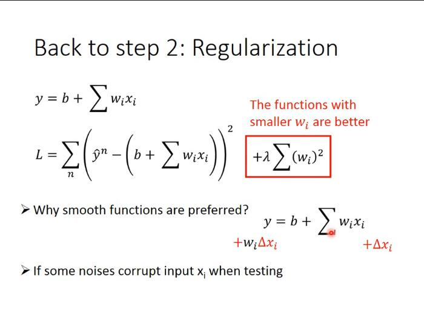
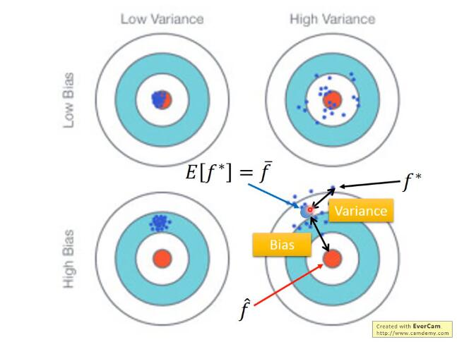
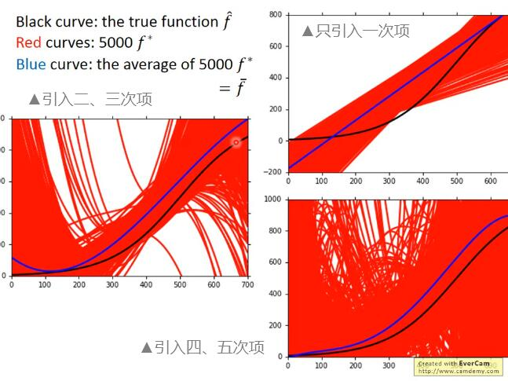
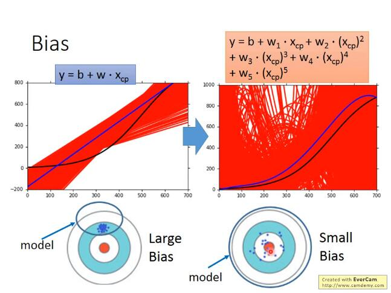
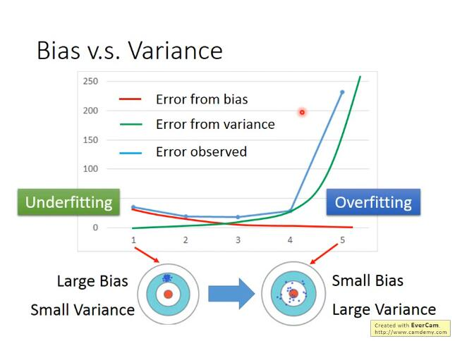
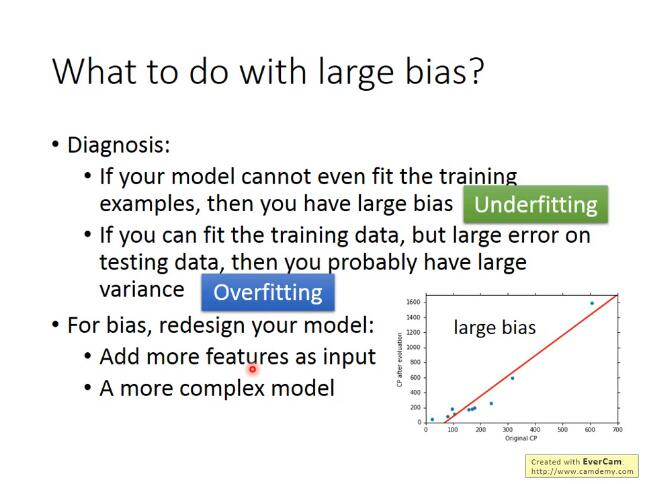
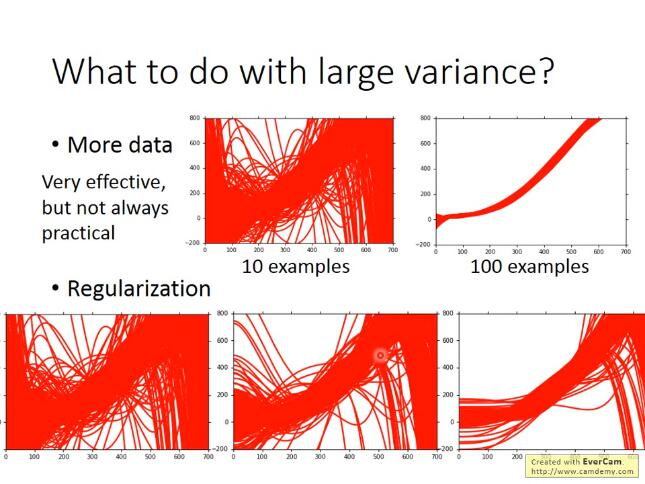
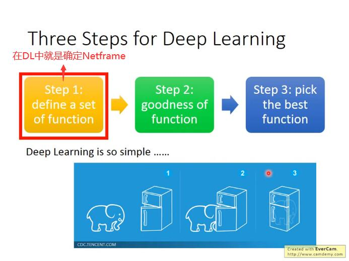
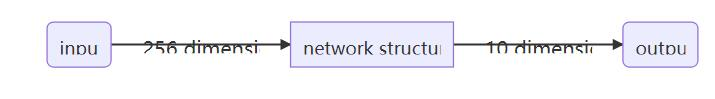
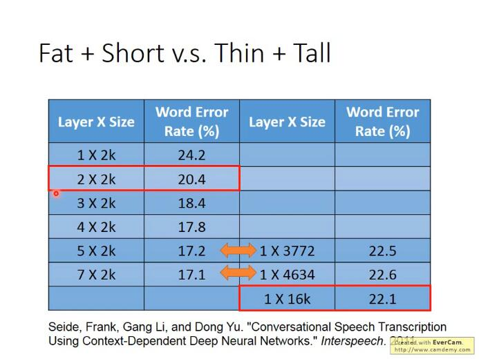

## [P3Regression - Case Study](https://www.bilibili.com/video/BV1JE411g7XF?p=3)

### regularization解决overfitting(L2正则化解决过拟合问题)

> regularization可以使曲线变得更加smooth，training data上的error变大，但是 testing data上的error变小。有关regularization的具体原理说明详见下一部分

原来的loss function只考虑了prediction的error，即$$\sum_{i}^{n}\left(\hat{y}^{i}-\left(b+\sum_{j} w_{j} x_{j}\right)\right)^{2}$$；而regularization则是在原来的loss function的基础上加上了一项$$\lambda \sum\left(w_{i}\right)^{2}$$，就是把这个model里面所有的Wi的平方和用λ加权(其中i代表遍历n个training data，j代表遍历model的每一项)

也就是说，**我们期待参数w i w_i\*w\**i\*越小甚至接近于0的function，为什么呢？**

因为参数值接近0的function，是比较平滑的；所谓的平滑的意思是，当今天的输入有变化的时候，output对输入的变化是比较不敏感的。举例来说，对$y=b+\sum w_{i} x_{i}$这个model，当input变化Δ x，output的变化就是，$$w_{i} \Delta x_{i}$$也就是说，如果w越i小越接近0的话，<u>输出对输入就越不sensitive敏感</u>，我们的function就是一个越平滑的function；说到这里你会发现，我们之前没有把bias——b这个参数考虑进去的原因是**bias的大小跟function的平滑程度是没有关系的**，bias值的大小只是把function上下移动而已

**那为什么我们喜欢比较平滑的function呢？**

如果我们有一个比较平滑的function，由于输出对输入是不敏感的，测试的时候，一些noises噪声对这个平滑的function的影响就会比较小，而给我们一个比较好的结果

**注：这里的λ需要我们手动去调整以取得最好的值**

λ值越大代表考虑smooth的那个regularization那一项的影响力越大，我们找到的function就越平滑

观察下图可知，当我们的λ越大的时候，在training data上得到的error其实是越大的，但是这件事情是非常合理的，因为当λ越大的时候，我们就越倾向于考虑w的值而越少考虑error的大小；但是有趣的是，虽然在training data上得到的error越大，但是在testing data上得到的error可能会是比较小的

我们喜欢比较平滑的function，因为它对noise不那么sensitive；但是我们又不喜欢太平滑的function，因为它就失去了对data拟合的能力；而function的平滑程度，就需要通过调整λ来决定，就像下图中，当λ=100时，在testing data上的error最小，因此我们选择λ=100

## [P4Basic Concept](https://www.bilibili.com/video/BV1JE411g7XF?p=4)

### bias和variance

bias表示离靶心的距离, 而variance表示散布情况

图中所示，只有足够大的函数搜索空间，才能找到正确的“靶心”，因此就需要吧模型设计得足够复杂。而复杂模型需要大数据来降低方差， 因此需要大量的数据防止过拟合

如果来自variance的误差很大， 那么就是过拟合； 如果来自bias的误差很大，那么就是欠拟合（underfitting）

bias大： 如果无法fit训练数据, 证明是欠拟合;如果能fit训练数据，但是在测试数据上有较大的误差，那么就是过拟合——做法：增大特征or增大次项

variance大： 更多的数据（数据增强）or 正则化

### 交叉验证： 

在trainingset训练后,虽然在公开的测试集上表示良好,但是private testing set不好的话, 则还是比较糟糕的模型。因此在判断一个模型的好坏的时候， 可以将trainingSet进行交叉验证

非常不建议因为在public testing set上表现不好而反过来重新选择trainingSet的模型， 因为这相当于在训练的时候吧testing也考虑在内了， 违背了设计的初衷，并且这样的结果在private testing set上也会表现不好。

#### N-fold cross validation （十折交叉验证）

如果不相信某一个trainset的结果的话， 那就分很多trainset

## [5. P5Gradient Descent](https://www.bilibili.com/video/BV1JE411g7XF?p=5)

$$
\theta^{*}=\arg \min _{\theta} L(\theta)
$$
L: loss function
$\theta$ : parameters(上标表示第几组参数, 下标表示这组参数中的第几个参数)

当参数有很多个的时候(>3)，其实我们很难做到将<u>loss随每个参数的变化可视化出来(因为最多只能可视化出三维的图像，也就只能可视化三维参数</u>)，但是我们可以把update的次数作为唯一的一个参数，将loss随着update的增加而变化的趋势给可视化出来(上图右半部分)

所以做gradient descent一个很重要的事情是，要把不同的learning rate下，loss随update次数的变化曲线给可视化出来，它可以提醒你该如何调整当前的learning rate的大小，直到出现稳定下降的曲线

**总结：梯度下降法指的是函数值loss随梯度下降的方向减小**

### Adaptive Learning rates

显然这样手动地去调整learning rates很麻烦，因此我们需要有一些自动调整learning rates的方法

##### 最基本、最简单的大原则是：learning rate通常是随着参数的update越来越小的

因为在起始点的时候，通常是离最低点是比较远的，这时候步伐就要跨大一点；而经过几次update以后，会比较靠近目标，这时候就应该减小learning rate，让它能够收敛在最低点的地方

##### Adagrad

> Divide the learning rate of each parameter by the root mean square(方均根) of its previous derivatives

Adagrad就是将不同参数的learning rate分开考虑的一种算法(adagrad算法update到后面速度会越来越慢，当然这只是adaptive算法中最简单的一种)

### Stochastic Gradicent Descent

随机梯度下降的方法可以让训练更快速，传统的gradient descent的思路是<u>看完所有的样本点</u>之后再构建loss function，然后去update参数；而stochastic gradient descent的做法是，<u>看到一个样本点就update一次</u>，因此它的loss function不是所有样本点的error平方和，而是这个随机样本点的error平方

### Feature Scaling

##### 概念介绍

特征缩放，当多个特征的分布范围很不一样时，最好将这些不同feature的范围缩放成一样

##### 对gradient decent的帮助

之前我们做的demo已经表明了，对于这种长椭圆形的error surface，如果不使用Adagrad之类的方法，是很难搞定它的，因为在像w1和w2这样不同的参数方向上，会需要不同的learning rate，用相同的lr很难达到最低点

如果有scale的话，loss在参数w1、w2平面上的投影就是一个正圆形，update参数会比较容易

而且gradient descent的每次update并不都是向着最低点走的，每次update的方向是顺着等高线的方向(梯度gradient下降的方向)，而不是径直走向最低点；但是当经过对input的scale使loss的投影是一个正圆的话，不管在这个区域的哪一个点，它都会向着圆心走。因此feature scaling对参数update的效率是有帮助的

##### scaling method:

z-score:

归一化

### gradient descent数学理论

注意 learning rate需要设置好, 否则Δθ不为0, 则泰勒近似不成立。

#### gradient descent的限制

▲gradient descent的限制是，它在gradient即微分值接近于0的地方就会停下来，而这个地方不一定是global minima，它可能是local minima，可能是saddle point**鞍点**，甚至可能是一个loss很高的plateau平缓高原

## [6. P10Classification_1](https://www.bilibili.com/video/BV1JE411g7XF?p=10)

特征、特征向量是什么？

> **要想把一个东西当做计算机能理解的function的input，就需要把它数值化**

特性数值化：用一组数字来描述一只宝可梦的特性， 比如用一组数字表示它有多强(total strong)、它的生命值(HP)、它的攻击力(Attack)、它的防御力(Defense)、它的特殊攻击力(Special Attack)、它的特殊攻击的防御力(Special defend)、它的速度(Speed)，以皮卡丘为例，我们可以用以上七种特性的数值就是特征量， 而多个特征量所组成的vector就是特征向量

---

我们希望蓝色的这些属于class 1的宝可梦，input到Regression的model，output越接近1越好；红色的属于class 2的宝可梦，input到Regression的model，output越接近-1越好。如果使用回归来硬解分类问题的话， 异常值影响比较大。 异常值则远远大于1， 跟目标不一致

Regression的output是连续性质的数值，而classification要求的output是离散性质的点，我们很难找到一个Regression的function使大部分样本点的output都集中在某几个离散的点附近

因此，**Regression定义model好坏的定义方式对classification来说是不适用的**

#### Solution：Generative model——朴素贝叶斯分类器

我们可以把loss function定义成$\hat{L}(f)=\sum_{n} \delta\left(f\left(x^{n}\right) \neq \hat{y}^{n}\right)$，即这个model在所有的training data上predict预测错误的次数，也就是说分类错误的次数越少，这个function表现得就越好

**贝叶斯公式=单条路径概率/所有路径概率和**

这一整套想法叫做**Generative model**(生成模型)，为什么叫它Generative model呢？因为有这个model的话，就可以拿它来generate生成x(如果你可以计算出每一个x出现的概率，就可以用这个distribution分布来生成x、sample x出来)

现在的问题是，怎么得到$P\left(x \mid C_{1}\right)$ 和 $P\left(x \mid C_{2}\right)$ 的值==> 认为数据服从 高斯分布

#### 高斯分布

$f_{\mu, \Sigma}(x)=\frac{1}{(2 \pi)^{D / 2}} \frac{1}{|\Sigma|^{1 / 2}} \exp \left\{-\frac{1}{2}(x-\mu)^{T} \Sigma^{-1}(x-\mu)\right\}$

假设海龟的vector是[103 45]，虽然这个点在已有的数据里并没有出现过，但是不可以认为它出现的概率为0，我们需要用已有的数据去估测海龟出现的可能性

你可以想象说这已有的79只水系宝可梦的data其实只是冰山一角，假定水系神奇宝贝的Defense和SP Defense是从一个Gaussian的distribution里面sample出来的，下图只是采样了79个点之后得到的分布，但是从高斯分布里采样出海龟这个点的几率并不是0，那从这79个已有的点，怎么找到那个Gaussian distribution函数呢？

#### 最大似然估计_参数估计

那接下来的问题就是怎么去找出这个Gaussian，**只需要去估测出这个Gaussian的均值和协方差即可**

估测和的方法就是极大似然估计法(Maximum Likelihood)，极大似然估计的思想是，找出最特殊的那对u和covariance，从它们<u>共同决定的高斯函数</u>中再次采样出79个点，使”得到的分布情况与当前已知79点的分布情况相同“这件事情发生的可能性最大===>最大似然估计

> 根据sample样本, 求得使出现**该样本组合可能性最大**(所以是每一个点产生的概率相乘)的那组**参数**

预测：

===> 训练结束：再把testing data上得到的结果可视化出来，即右下角的图，发现分的不是太好，正确率才是47%我们之前用的只是Defense和SP Defense这两个参数，在二维空间上得到的效果不太好，但实际上一开始就提到了宝可梦总共是有6个features的，也许在二维空间上它们是重叠在一起的，但是在六维空间上看它们也许会分得很好，每一个宝可梦都是六维空间中的一个点，于是我们的是一个6-dim的vector，则是一个6*6的matrix，发现得到的准确率也才64%，这个分类器表现得很糟糕，是否有办法将它改进的更好？

#### Modifying Model

其实之前使用的model是不常见的，你是不会经常看到给每一个Gaussian都有自己的mean和covariance，比如我们的class 1用的是u1和$\Sigma_1$，class 2用的是u2和$\Sigma_2$，比较常见的做法是，**不同的class可以share同一个cocovariance matrix**

其实variance是跟input的feature size的平方成正比的，所以当feature的数量很大的时候，$\Sigma$大小的增长是可以非常快的，在这种情况下，给不同的Gaussian以不同的covariance matrix，会造成model的参数太多，而参数多会导致该model的variance过大，出现overfitting的现象，因此对不同的class使用同一个covariance matrix，可以有效减少参数

### 案例总结

> 回顾几率模型

machine learning可以概况为以下三个step

---

选择的概率分布为经验之谈： 可以选择任意你喜欢的， 但是最后还是得看效果： 如果你选择的是简单的分布函数(参数比较少)，那你的bias就大，variance就小；如果你选择复杂的分布函数，那你的bias就小，variance就大，那你就可以用data set来判断一下，用什么样的Probability distribution作为model是比较好的

朴素贝叶斯：

这里每一个dimension的分布函数都是一维的Gaussian distribution，如果这样假设的话，等于是说，原来那多维度的Gaussian，它的covariance matrix变成是diagonal(对角的)，在不是对角线的地方，值都是0，这样就可以更加减少需要的参数量，就可以得到一个更简单的model

我们把上述这种方法叫做**Naive Bayes Classifier(朴素贝叶斯分类法)**，如果<u>真的明确了所有的feature之间是相互独立的，是不相关的，使用朴素贝叶斯分类法的performance是会很好的</u>，如果这个假设是不成立的，那么Naive bayes classfier的bias就会很大，它就不是一个好的classifier(朴素贝叶斯分类法本质就是减少参数)

当然这个例子里如果使用这样的model，得到的结果也不理想，因为各种feature之间的covariance还是必要的，比如战斗力和防御力它们之间是正相关的，covariance不能等于0

总之，寻找model总的原则是，尽量减少不必要的参数，但是必然的参数绝对不能少

那怎么去**选择分布函数**呢？有很多时候凭直觉就可以看出来，比如宝可梦有某个feature是binary的，它代表的是：是或不是，这个时候就不太可能是高斯分布了，而很有可能是伯努利分布(两点分布)

#### Analysis Posterior Probability分析后置概率的表达式

[上面的推导过程](https://sakura-gh.github.io/ML-notes/ML-notes-html/6_Classification.html)可能比较复杂，但是得到的最终结果还是比较好的：(当和共用一个时，经过化简相消z就变成了一个linear的function，x的系数是一个vector w，后面的一大串数字其实就是一个常数项b)

**$P\left(C_{1} \mid x\right)=\sigma(w \cdot x+b)$这个式子就解释了，当class 1和class 2共用的时候，它们之间的boundary会是linear的**

## [7. P11Logistic Regression](https://www.bilibili.com/video/BV1JE411g7XF?p=11)

### Three Steps of machine learning

#### Step 1：function set

这里的function set就是Logistic Regression——逻辑回归

#### Step 2：Goodness of a function

现在我们有N笔Training data，每一笔data都要标注它是属于哪一个class

假设这些Training data是从我们定义的posterior Probability中产生的(后置概率，某种意义上就是概率密度函数)，而w和b就决定了这个posterior Probability，那我们就可以去计算某一组w和b去产生这N笔Training data的概率，利用<u>极大似然估计</u>的思想，最好的那组参数就是有最大可能性产生当前N笔Training data分布的和

似然函数只需要将每一个点产生的概率相乘即可，注意，这里假定是二元分类，class 2的概率为1减去class 1的概率. $f_{w, b}(x)$为x为C1种类的概率, 则在二元分类中$( 1 - f_{w, b}(x) )$

由于 $L(w, b)$ 是乘积项的形式, 为了方便计算, 我们将上式做个变换: (注意这边的L(w,b) 是最大似然函数, 而不是Loss function)
$$
\begin{array}{l}
\qquad w^{*}, b^{*}=\arg \max _{w, b} L(w, b)=\arg \min _{w, b}(-\ln L(w, b)) \\
-\ln L(w, b)=-\ln f_{w, b}\left(x^{1}\right) \\
\quad-\ln f_{w, b}\left(x^{2}\right) \\
\quad-\ln \left(1-f_{w, b}\left(x^{3}\right)\right) \\
\quad-\ldots
\end{array}
$$
由于class 1和class 2的概率表达式不统一，上面的式子无法写成统一的形式, 为了统一格式, 这里将Logistic Regression里的所有Training data都打上0和1的标签, 即output $\hat{y}=1$ 代表class $1,$ output $\hat{y}=0$ 代表class $2,$ 于是上式进一步改写成:
$$
\begin{aligned}
-\ln L(w, b)=&-\left[\hat{y}^{1} \ln f_{w, b}\left(x^{1}\right)+\left(1-\hat{y}^{1}\right) \ln \left(1-f_{w, b}\left(x^{1}\right)\right)\right] \\
&-\left[\hat{y}^{2} \ln f_{w, b}\left(x^{2}\right)+\left(1-\hat{y}^{2}\right) \ln \left(1-f_{w, b}\left(x^{2}\right)\right)\right] \\
&-\left[\hat{y}^{3} \ln f_{w, b}\left(x^{3}\right)+\left(1-\hat{y}^{3}\right) \ln \left(1-f_{w, b}\left(x^{3}\right)\right)\right] \\
&-\ldots
\end{aligned}
$$
现在已经有了统一的格式, 我们就可以把要minimize的对象写成一个summation的形式:
$$
-\ln L(w, b)=\sum_{n}-\left[\hat{y}^{n} \ln f_{w, b}\left(x^{n}\right)+\left(1-\hat{y}^{n}\right) \ln \left(1-f_{w, b}\left(x^{n}\right)\right)\right]
$$
这里表示第n个样本点，表示第n个样本点的class标签(1表示class 1,0表示class 2)，最终这个summation的形式，里面其实是两个**Bernouli distribution(两点分布)的cross entropy(交叉熵)**

##### 交叉熵

假设有如上图所示的两个distribution p和q，它们的交叉商就是 $H(p, q)=-\sum_{x} p(x) \ln (q(x)),$ 这也就是之前的 推导中在 $-\ln L(w, b)$ 前加一个负号的原因

<u>cross entropy交叉嫡的含义是表达这两个distribution有多接近, 如果p和q这两个distribution一模一样的话, 那 它们算出来的cross entropy就是0(详细解释在“信息论"中)</u>, 而这里 $f\left(x^{n}\right)$ 表示function的output, $\hat{y}^{n}$ 表示预期 的 target, 因此交叉嫡实际上表达的是希望这个function的output和它的target越接近越好
总之, 我们要找的参数实际上就是:
$$
w^{*}, b^{*}=\arg \max _{w, b} L(w, b)=\arg \min _{w, b}\left(-\ln L(w, b)=\sum_{n}-\left[\hat{y}^{n} \ln f_{w, b}\left(x^{n}\right)+\left(1-\hat{y}^{n}\right) \ln \left(1-f_{w, b}\left(x^{n}\right)\right)\right]\right.
$$

#### step 3：Find the best function

实际上就是去找到使loss function即交叉嫡之和最小的那组参数 $w^{*}, b^{*}$ 就行了， 这里用gradient descent的方法进 行运算就Ok
这里sigmoid function的微分可以直接作为公式记下来: $\frac{\partial \sigma(z)}{\partial z}=\sigma(z)(1-\sigma(z)),$ sigmoid和它的微分的图像如 下:

先计算 $-\ln L(w, b)=\sum_{n}-\left[\hat{y}^{n} \ln f_{w, b}\left(x^{n}\right)+\left(1-\hat{y}^{n}\right) \ln \left(1-f_{w, b}\left(x^{n}\right)\right)\right]$ 对 $w_{i}$ 的偏微分 $,$ 这里 $\hat{y}^{n}$ 和 $1-\hat{y}^{n}$ 是常数先不用管它，只需要分别求出 $lnf_{w, b}\left(x^{n}\right)$ 和 $\ln \left(1-f_{w, b}\left(x^{n}\right)\right)$ 对 $w_{i}$ 的偏微分即可，整体推导过程如下：

将得到的式子进行进一步化简，可得：

梯度: 
$$
\theta^{*}=\arg \min _{\theta} L(\theta)
$$
L: loss function
$\theta$ : parameters(上标表示第几组参数, 下标表示这组参数中的第几个参数)

正好跟gradient descent的目标一致, 因此可以直接用gradient descent来找到最好的参数θ

梯度更新公式: $\left[\begin{array}{l}\Delta \theta_{1} \\ \Delta \theta_{2}\end{array}\right]=-\eta\left[\begin{array}{l}u \\ v\end{array}\right]=>\left[\begin{array}{l}\theta_{1} \\ \theta_{2}\end{array}\right]=\left[\begin{array}{l}a \\ b\end{array}\right]-\eta\left[\begin{array}{l}u \\ v\end{array}\right]=\left[\begin{array}{l}a \\ b\end{array}\right]-\eta\left[\begin{array}{l}\frac{\partial L(a, b)}{\partial \theta_{1}} \\ \frac{\partial L(a, b)}{\partial \theta_{z}}\end{array}\right]$ or $\theta^{i}=\theta^{i-1}-\eta \nabla L\left(\theta^{i-1}\right)$

我们发现最终的结果竟然异常的简洁，gradient descent每次update只需要做：

$w_{i}=w_{i}-\eta (\sum_{n}-\left(\hat{y}^{n}-f_{w, b}\left(x^{n}\right)\right) x_{i}^{n})$

那这个式子到底代表着什么意思呢? 现在你的update取决于三件事:
- learning rate, 是你自己设定的
- $\cdot x_{i},$ 来自于data
-  $\hat{y}^{n}-f_{w, b}\left(x^{n}\right),$ 代表function的output跟理想target的差距有多大, 如果离目标越远, update的步伐就要越 大

### Logistic Regression V.s. Linear Regression

##### 

compare in step1

- Logistic Regression是把每一个feature $x_{i}$ 加权求和, 加上bias, 再通过sigmoid function, 当做function的 output
- 因为Logistic Regression的output是通过sigmoid function产生的, 因此一定是介于0 1之间; 而linear Regression的output并没有通过sigmoid function, 所以它可以是任何值

##### compare in step2

在Logistic Regression中，我们定义的loss function, 即要去minimize的对象, 是所有example(样本点)的 output $\left(f\left(x^{n}\right)\right)$ )和实际target $\left(\hat{y}^{n}\right)$ 在Bernoulli distribution(两点分布)下的**cross entropy(交叉嫡)总和**

交叉嫡的描述：这里把 $f\left(x^{n}\right)$ 和 $\hat{y}^{n}$ 各自看做是一个Bernoulli distribution(两点分布)，那它们的cross entropy $l\left(f\left(x^{n}\right), \hat{y}^{n}\right)=-\left[\hat{y}^{n} \ln f\left(x^{n}\right)+\left(1-\hat{y}^{n}\right) \ln \left(1-f\left(x^{n}\right)\right)\right]$ 之和, 就是我们要去minimize的对象, 直观来讲, 就
是希望function的output $f\left(x^{n}\right)$ 和它的target $\hat{y}^{n}$ 越接近越好

注：这里的“看做"只是为了方便理解和计算，并不是真的做出它们是两点分布的假设
而在linear Regression中, loss function的定义相对比较简单, 就是单纯的function的output $\left(f\left(x^{n}\right)\right)$ 和实际 $\operatorname{target}\left(\hat{y}^{n}\right)$ 在**数值上的平方和的均值**
这里可能会有一个疑惑, 为什么Logistic Regression的loss function不能像linear Regression一样用square error 来表示呢? 后面会有进一步的解释

##### compare in step3

神奇的是，<u>Logistic Regression和linear Regression的update的方式是一模一样的</u>，唯一不一样的是，Logistic Regression的target 和output 都必须是在0和1之间的，而linear Regression的target和output的范围可以是任意值

### Logistic Regression + Square error？

> 先说结论, 在分类问题中Square error不合适, cross entropy适合于分类问题

Square error求微分情况:

现在会遇到一个问题：如果第n个点的目标target是class $1,$ 则 $\hat{y}^{n}=1,$ 此时如果function的output $f_{w, b}\left(x^{n}\right)=1$ 的话, 说明现在离target很接近了, $f_{w, b}(x)-\hat{y} 丶 \bar{x}$ 一项是0, 于是得到的微分 $\frac{\partial L}{\partial w_{i}}$ 会变成0，这件事情是很合理的; 但是当function的output $f_{w, b}\left(x^{n}\right)=0$ 的时候, 说明离target还很遥远, 但是由于在step3中求出来的update表达 式中有一个 $f_{w, b}\left(x^{n}\right),$ 因此这个时候也会导致得到的微分 $\frac{\partial L}{\partial w_{i}}$ 变成0==>简而言之, 微分的结果不便于下一步的gradient descent
如果举class 2的例子，得到的结果与class 1是一样的
如果我们把参数的变化对total loss作图的话, loss function选择cross entropy或square error, 参数的变化跟 loss的变化情况可视化出来如下所示：(黑色的是cross entropy, 红色的是square error)

假设中心点就是距离目标很近的地方，<u>如果是cross entropy的话，距离目标越远，微分值就越大，参数update的时候变化量就越大，迈出去的步伐也就越大</u>

但当你选择square error的时候，过程就会很卡，<u>因为距离目标远的时候，微分也是非常小的，移动的速度是非常慢的</u>，我们之前提到过，实际操作的时候，当gradient接近于0的时候，其实就很有可能会停下来，因此使用square error很有可能在一开始的时候就卡住不动了，而且这里也不能随意地增大learning rate，因为在做gradient descent的时候，你的gradient接近于0，有可能离target很近也有可能很远，因此不知道learning rate应该设大还是设小

综上，尽管square error可以使用，但是会出现update十分缓慢的现象，而使用cross entropy可以让你的Training更顺利

### Discriminative v.s. Generative

#### same model but different currency

Logistic Regression的方法，我们把它称之为discriminative的方法；而我们用Gaussian来描述posterior Probability这件事，我们称之为Generative的方法, 

实际上它们用的model(function set)是一模一样的, 都是 $P\left(C_{1} \mid x\right)=\sigma(w \cdot x+b),$ 如果是用Logistic Regression 的话, 可以用gradient descent的方法直接去把b和W找出来; 如果是用Generative model的话，我们要先去算 $u_{1}, u_{2}, \Sigma^{-1} \quad$ 然后算出b和w

区别在于: 是否有假设?

你会发现用这两种方法得到的b和w是不同的，尽管我们的function set是同一个，但是由于做了不同的假设，最终从同样的Training data里找出来的参数会是不一样的

在Logistic Regression里面，我们**没有做任何实质性的假设**，没有对Probability distribution有任何的描述，我们就是单纯地去找b和w(推导过程中的假设只是便于理解和计算，对实际结果没有影响)

而在Generative model里面，我们对Probability distribution是**有实质性的假设**的，之前我们假设的是Gaussian(高斯分布)，甚至假设在相互独立的前提下是否可以是naive bayes(朴素贝叶斯)，根据这些假设我们才找到最终的b和w

例子: https://sakura-gh.github.io/ML-notes/ML-notes-html/7_Logistic-Regression.html

所以，**Generative model和discriminative model的差别就在于，Generative的model它有做了某些假设，假设你的data来自于某个概率模型；而Discriminative的model是完全不作任何假设的, 完全根据数据说话**

> Generative model做的事情就是脑补，它会自己去想象一些事情，于是会做出一个和我们人类直觉想法不太一样的判断结果，就像toy example里，我们做了naive bayes这样一个假设(事实上我们并不知道这两个feature是否相互独立)，于是Naive bayes会在class 2里并没有出现过两个feature都是1的样本点的前提下，自己去脑补有这样的点
>
> 通常脑补不是一件好的事情，因为你给你的data强加了一些它并没有告诉你的属性，但是在data很少的情况下，脑补也是有用的，discriminative model并不是在所有的情况下都可以赢过Generative model，discriminative model是十分依赖于data的，当data数量不足或是data本身的label就有一些问题，那Generative model做一些脑补和假设，反而可以把data的不足或是有问题部分的影响给降到最低

---

### Conclusion

对于分类的问题(主要是二元分类)，我们一般有两种方法去处理问题，一种是Generative的方法，另一种是Discriminative的方法，注意到分类问题的model都是从贝叶斯方程出发的，即

$\begin{aligned} P\left(C_{i} \mid x\right)=& \frac{P\left(C_{i}\right) P\left(x \mid C_{i}\right)}{\sum_{j=1}^{n} P\left(C_{j}\right) P\left(x \mid C_{j}\right)}(1) \\ &=\sigma(z)=\frac{1}{1+e^{-z}}=\frac{1}{1+e^{-\left(b+\sum_{k} w_{k} x_{k}\right)}} \end{aligned}$

Generative model的好处是，它对data的依赖并没有像discriminative model那么严重，在data数量少或者data本身就存在noise的情况下受到的影响会更小，而它还可以做到Prior部分与class-dependent部分分开处理，如果可以借助其他方式提高Prior model的准确率，对整一个model是有所帮助的(比如前面提到的语音辨识)

而Discriminative model的好处是，在data充足的情况下，它训练出来的model的准确率一般是比Generative model要来的高的

### Multi-class Classification

#### softmax

> softmax的意思是对最大值做强化，因为在做第一步的时候，对取exponential会使大的值和小的值之间的差距被拉得更开，也就是强化大的值

##### Limitation of Logistic Regression

Logistic Regression其实有很强的限制，给出下图的例子中的Training data，想要用Logistic Regression对它进行分类，其实是做不到的, 如**异或**

##### Feature Transformation

如果坚持要用Logistic Regression的话，有一招叫做**Feature Transformation**，原来的feature分布不好划分，那我们可以将之转化以后，找一个比较好的feature space，让Logistic Regression能够处理

但麻烦的是，我们并不知道怎么做feature Transformation，如果在这上面花费太多的时间就得不偿失了，于是我们会希望这个Transformation是机器自己产生的，怎么让机器自己产生呢？**我们可以让很多Logistic Regression cascade(连接)起来**

我们让一个input x的两个feature $x_{1}, x_{2}$ 经过两个Logistic Regression的transform, 得到**新的feature** $x_{1}^{\prime}, x_{2}^{\prime},$ 在 这个新的feature space上, class 1和class 2是可以用一条直线分开的, 那么最后只要再接另外一个Logistic Regression的model(对它来说, $x_{1}^{\prime}, x_{2}^{\prime}$ 才是每一个样本点的"feature", 而不是原先的 $\left.x_{1}, x_{2}\right),$ 它根据新的 feature, 就可以把class 1和class 2分开

### Powerful Cascading Logistic Regression

通过上面的例子，我们发现，多个Logistic Regression连接起来会产生powerful的效果，**我们把每一个Logistic Regression叫做一个neuron(神经元)，把这些Logistic Regression串起来所形成的network，就叫做Neural Network，就是类神经网路，这个东西就是Deep Learning！**

## [8. P12 Brief Introduction of Deep Learning](https://www.bilibili.com/video/BV1JE411g7XF?p=12)

### Ups and downs of Deep Learning

- 1958：Perceptron(linear model)，感知机的提出
  - 和Logistic Regression类似，只是少了sigmoid的部分
- 1969：Perceptron has limitation，from MIT
- 1980s：Multi-layer Perceptron，多层感知机
  - 和今天的DNN很像
- 1986：Backpropagation，反向传播
  - Hinton propose的Backpropagation
  - 存在problem：通常超过3个layer的neural network，就train不出好的结果
- 、1989: 1 hidden layer is “good enough”，why deep？
  - 有人提出一个理论：只要neural network有一个hidden layer，它就可以model出任何的function，所以根本没有必要叠加很多个hidden layer，所以Multi-layer Perceptron的方法又坏掉了，这段时间Multi-layer Perceptron这个东西是受到抵制的
- 2006：RBM initialization(breakthrough)：Restricted Boltzmann Machine，受限玻尔兹曼机
  - Deep learning -> another Multi-layer Perceptron ？在当时看来，它们的不同之处在于在做gradient descent的时候选取初始值的方法如果是用RBM，那就是Deep learning；如果没有用RBM，就是传统的Multi-layer Perceptron
  - 那实际上呢，RBM用的不是neural network base的方法，而是graphical model，后来大家试验得多了发现RBM并没有什么太大的帮助，因此现在基本上没有人使用RBM做initialization了
  - RBM最大的贡献是，它让大家重新对Deep learning这个model有了兴趣(石头汤的故事)
- 2009：GPU加速的发现
- 2011：start to be popular in speech recognition，语音识别领域
- 2012：win ILSVRC image competition，Deep learning开始在图像领域流行开来

实际上，<u>Deep learning跟machine learning一样，也是“大象放进冰箱”的三个步骤</u>：

在Deep learning的step1里define的那个function，就是neural network

### Neural Network

#### concept

把多个Logistic Regression前后connect在一起，然后把一个Logistic Regression称之为neuron，整个称之为neural network

我们可以用不同的方法连接这些neuron，就可以得到不同的structure，neural network里的每一个Logistic Regression都有自己的weight和bias，这些weight和bias集合起来，就是这个network的parameter，我们用来描述

### Network Structure

如果一个**neural network**的参数weight和bias已知的话，它就是一个**function**，它的**input**是一个vector，**output**是另一个vector，这个vector里面放的是**样本点的feature**，vector的dimension就是feature的个数

- input的地方，叫做**input layer**，输入层(严格来说input layer其实不是一个layer，它跟其他layer不一样，不是由neuron所组成的)
- output的地方，叫做**output layer**，输出层
- 其余的地方，叫做**hidden layer**，隐藏层
- 激活函数: 每一个neuron里面的sigmoid function，在Deep Learning中被称为**activation function**(激励函数)，事实上它不见得一定是sigmoid function，还可以是其他function(sigmoid function是从Logistic Regression迁移过来的，现在已经较少在Deep learning里使用了)

★.network structure+neuron该如何连接在一起的含义: 其实是define了一个function set(model)

### **Feedforward network**

▲.全连接: 因为layer和layer之间，**所有的neuron都是两两连接**，所以它叫Fully connected的network；因为现在传递的方向是从layer 1->2->3，由后往前传，所以它叫做Feedforward network

#### Output Layer

我们可以把hidden layers这部分，看做是一个**feature extractor(特征提取器)**，这个feature extractor就replace了我们之前手动做feature engineering，feature transformation这些事情，经过这个feature extractor得到的就可以被当作一组新的feature

output layer做的事情，其实就是把它当做一个**Multi-class classifier**，它是拿经过feature extractor转换后的那一组比较好的feature(能够被很好地separate)进行分类的，由于我们把output layer看做是一个Multi-class classifier，所以我们会在最后一个layer加上**softmax**

### 整个手写体识别分析:

我们唯一需要的就是一个**function**，这个function的input是一个256的vector，**output是一个10维的vector**，这个function就是neural network(这里我们用简单的Feedforward network)

input固定为256维(图片)，output固定为10维的feedforward neural network，实际上这个network structure就已经确定了一个function set(model)的形状，在这个function set里的每一个function都可以拿来做手写数字识别，接下来我们要做的事情是用gradient descent去计算出一组参数，挑一个最适合拿来做手写数字识别的function

**注：input、output的dimension，加上network structure，就可以确定一个model的形状，前两个是容易知道的，而决定这个network的structure则是整个Deep Learning中最为关键的步骤**

所以这里很重要的一件事情是，我们要对network structure进行design，之前在做Logistic Regression或者是linear Regression的时候，我们对model的structure是没有什么好设计的，但是对neural network来说，我们现在已知的constraint只有input是256维，output是10维，而中间要有几个hidden layer，每个layer要有几个neuron，都是需要我们自己去设计的，它们近乎是决定了function set长什么样子

如果你的network structure设计的很差，这个function set里面根本就没有好的function，那就会像大海捞针一样，结果针并不在海里(滑稽

#### Step 1：Neural Network

intput输入为16*16的图片(256维) -->经过神经网络(函数) --> 输出10维的vector --> 经过softmax函数选出可能性最大的结果输出-output

#### Step 2：Goodness of function

input这张image的256个pixel，通过这个neural network之后，会得到一个output，称之为y；而从这张image的label中转化而来的target，称之为，有了output 和target 之后，要做的事情是计算它们之间的**cross entropy(交叉熵)**，这个做法跟我们之前做Multi-class classification的时候是一模一样的---> 分类问题多使用交叉熵

Cross Entropy $: l(y, \hat{y})=-\sum_{i=1}^{10} \hat{y}_{i}$lny$_{i}$

#### Step 3：Pick the best function

接下来就去调整参数，让这个cross entropy越小越好，当然整个training data里面不会只有一笔data，你需要把所有data的cross entropy都sum起来, 得到一个total loss $L=\sum_{n=1}^{N} l^{n}$ （所有case的Cross Entropy  ）, 得到loss function之后你要做的事情是找一组network的parameters：$\theta^{*}$。它可以minimize这个total loss，这组parameter对应的function就是我们最终训练好的model

老规矩：我们使用**Gradient Descent**来优化total loss来获得model。实际上在deep learning里面用gradient descent，跟在linear regression里面使用完全没有什么差别，只是function和parameter变得更复杂了而已，其他事情都是一模一样的。

但是相比在liner model中求导还是比较轻松的， 在network中的function式子到底是长什么样子呢？==> 需要用到反向传播--->但是人工计算是比较复杂的, 因此有了pytorch, tensorflow等微分toolkit可以来计算Backpropagation

### Design network structure V.s. Feature Engineering(网络结构设计 vs 特征工程)

> deep learning: 通过network 找到一组合适的param来训练, 让机器自动学会如何提取特征==>获得model
> 传统方法: 通过古圣先贤的先验知识对信息进行特征提取和分析==>获得model

其实network structure的design是一件蛮难的事情，我们到底要怎么决定layer的数目和每一个layer的neuron的数目呢？其实这个只能够凭着经验和直觉、多方面的尝试，有时候甚至会需要一些domain knowledge(专业领域的知识)，<u>从非deep learning的方法到deep learning的方法，并不是说machine learning比较简单，而是我们把一个问题转化成了另一个问题</u>

原先非deep learning的model，要得到一个好的结果，往往需要做**feature engineering(特征工程)**，也就是做feature transform，然后找一组好的feature；一开始学习deep learning的时候，好像会觉得deep learning的layers之间也是在做feature transform，但实际上在做deep learning的时候，往往不需要一个好的feature ，比如说在做影像辨识的时候，你可以把所有的pixel直接丢进去，但是在过去做图像识别，你是需要对图像抽取出一些人定的feature出来的，这件事情就是feature transform，但是有了deep learning之后，你完全可以直接丢pixel进去硬做

但是，今天deep learning制造了一个新的问题，它所制造的问题就是，你需要去design network的structure，所以**你的问题从本来的如何抽取feature==>(转化成)怎么design network structure**，所以deep learning是不是真的好用，取决于你觉得解决哪一个问题比较容易(如，以前做音频识别需要知道DFT些信号处理知识和方法，现在完全可以交给机器，让其自己学会DFT)

如果是影响辨识或者是语音辨识的话，design network structure可能比feature engineering要来的容易，因为，虽然我们人都会看、会听，但是这件事情，它太过潜意识了，它离我们意识的层次太远，我们无法意识到，我们到底是怎么做语音辨识这件事情，所以对人来说，你要抽一组好的feature，让机器可以很方便地用linear的方法做语音辨识，其实是很难的，<u>因为人根本就不知道好的feature到底长什么样子；所以还不如design一个network structure，或者是尝试各种network structure，让machine自己去找出好的feature，这件事情反而变得比较容易，对影像来说也是一样的</u>

有这么一个说法：deep learning在NLP上面的performance并没有那么好。语音辨识和影像辨识这两个领域是最早开始用deep learning的，一用下去进步量就非常地惊人，比如错误率一下子就降低了20%这样，但是在NLP上，它的进步量似乎并没有那么惊人，甚至有很多做NLP的人，现在认为说deep learning不见得那么work，这个原因可能是，人在做NLP这件事情的时候，由于人在文字处理上是比较强的，比如叫你设计一个rule去detect一篇document是正面的情绪还是负面的情绪，你完全可以列表，列出一些正面情绪和负面情绪的词汇，然后看这个document里面正面情绪的词汇出现的百分比是多少，你可能就可以得到一个不错的结果。<u>所以NLP这个task，对人来说是比较容易设计rule的，你设计的那些ad-hoc(特别的)的rule，往往可以得到一个还不错的结果，这就是为什么deep learning相较于NLP传统的方法，觉得没有像其他领域一样进步得那么显著(但还是有一些进步的)</u>===>简言之, 这个语言问题较为容易研究, 以及前人传统方法研究已经非常深入, 效果也较好, 因此机器学习并没有太多的提升

长久而言，可能文字处理中会有一些隐藏的资讯是人自己也不知道的，所以让机器自己去学这件事情，还是可以占到一些优势，只是眼下它跟传统方法的差异看起来并没有那么的惊人，但还是有进步的

### [P15Why Deep-](https://www.bilibili.com/video/BV1JE411g7XF?p=15)

Q:参数变多,是变宽还是变深呢? 是不是暴力的方法呢?

A: 

- 论文比较相同参数, 深度效果好于宽度;
- DNN结构一个很大的优势是，Modularization(模块化)，它用的是结构化的架构

#### Modularization

> 就像写程序一样，shallow network实际上就是把所有的程序都写在了同一个main函数中，所以它去检测不同的class使用的方法是相互独立的；而deep network则是把整个任务分为了一个个小任务，每个小任务又可以不断细分下去，以形成modularization，就像下图一样
>
> 在DNN的架构中，实际上每一层layer里的neuron都像是在解决同一个级别的任务，它们的output作为下一层layer处理更高级别任务的数据来源，低层layer里的neuron做的是对不同小特征的检测，高层layer里的neuron则根据需要挑选低层neuron所抽取出来的不同小特征，去检测一个范围更大的特征；neuron就像是一个个classifier ，后面的classifier共享前面classifier的参数
>
> 这样做的好处是，低层的neuron输出的信息可以被高层不同的neuron重复使用，而并不需要像shallow network一样，每次在用到的时候都要重新去检测一遍，因此大大降低了程序的复杂度

- 理解效果：模组化： 如分类长发的女孩、长头发的男孩、短发的女孩、短发男孩。

  ​	如果按照shallow network的想法，我们分别独立地train四个classifier(其实就相当于训练四个独立的model)，然后就可以解决这个分类的问题。但是显而易见的是长头发的男生样本会非常少，没有太多的training data，所以，你train出来的classifier就比较weak，去detect长头发男生的performance就比较差

  

但其实我们的input并不是没有关联的，长头发的男生和长头发的女生都有一个共同的特征，就是长头发，因此如果我们分别**独立地训练四个model作为分类器**，实际上就是忽视了这个共同特征，也就是没有高效地用到data提供的全部信息，这恰恰是shallow network的弊端

而利用modularization的思想，使用deep network的架构，我们可以**训练一个model作为分类器就可以完成所有的任务**，我们可以把整个任务分为**两个子任务**：

- Classifier1：检测是男生或女生
- Classifier2：检测是长头发或短头发

虽然长头发的男生data很少，但长头发的人的data就很多，经过前面几层layer的特征抽取，就可以头发的data全部都丢给Classifier2，把男生或女生的data全部都丢给Classifier1，这样就真正做到了**充分、高效地利用数据**，最终的Classifier再根据Classifier1和Classifier2提供的信息给出四类人的分类结果

你会发现，经过层层layer的任务分解，其实每一个Classifier要做的事情都是比较简单的，又因为这种分层的、模组化的方式充分利用了data，并提高了信息利用的效率，所以只要用比较少的training data就可以把结果train好

#### deep -> modularization

做modularization的好处是**把原来比较复杂的问题变得简单**，比如原来的任务是检测一个长头发的女生，但现在你的任务是检测长头发和检测性别，而当检测对象变简单的时候，就算training data没有那么多，我们也可以把这个task做好，并且**所有的classifier都用同一组参数检测子特征**，提高了参数使用效率，这就是modularization、这就是模块化的精神

**由于deep learning的deep就是在做modularization这件事，所以它需要的training data反而是比较少的**，这可能会跟你的认知相反，AI=big data+deep learning，但deep learning其实是为了解决less data的问题才提出的

每一个neuron其实就是一个basic的classifier：

- 第一层neuron，它是一个最basic的classifier，检测的是颜色、线条这样的小特征
- 第二层neuron是比较复杂的classifier，它用第一层basic的classifier的output当作input，也就是把第一层的classifier当作module，利用第一层得到的小特征分类出不同样式的花纹
- 而第三层的neuron又把第二层的neuron当作它module，利用第二层得到的特征分类出蜂窝、轮胎、人
- 以此类推

这边要强调的是，在做deep learning的时候，怎么做模块化这件事情是machine自动学到的，也就是说，第一层要检测什么特征、第二层要检测什么特征...这些都不是人为指定的，人只有定好有几层layer、每层layer有几个neuron，剩下的事情都是machine自己学到的

传统的机器学习算法，是人为地根据domain knowledge指定特征来进行提取，这种指定的提取方式，甚至是提取到的特征，也许并不是实际最优的，所以它的识别成功率并没有那么高；但是如果提取什么特征、怎么提取这件事让机器自己去学，它所提取的就会是那个最优解，因此识别成功率普遍会比人为指定要来的高

#### Conclusion

Deep总结：

- 考虑input之间的内在关联，所有的class用同一个model来做分类
- modularization思想，复杂问题简单化，把检测复杂特征的<u>大任务</u>分割成检测简单特征的<u>小任务</u>
- 所有的classifier使用同一组参数的子特征检测器，<u>共享检测到的子特征</u>
- 不同的classifier会share部分的参数和data，效率高
- 联系logic circuit和剪纸画的例子
- 多层hidden layer对complex问题的处理上比较有优势

## [9. P13Backpropagation](https://www.bilibili.com/video/BV1JE411g7XF?p=13)

Backpropagation是神经网络中用来做gradient descent的方法， 目的是使优化函数尽可能得变成我们想要的， 假设我们现在要处理的是分类任务，loss function为交叉熵， total loss为$L(\theta)=\sum_{n=1}^{N} l^{n}(\theta)$

我们把training data里任意一个样本点 $x^{n}$ 代到neural network里面, 它会output一个 $y^{n},$ 我们把这个output跟样 本点本身的label标注的target $\hat{y}^{n}$ 作cross entropy, 这个交叉嫡定义了output $y^{n}$ 与target $\hat{y}^{n}$ 之间的距离 $l^{n}(\theta)$。 如果cross entropy比较大的话, 说明output和target之间距离很远, 这个network的parameter的loss是比较大 的, 反之则说明这组parameter是比较好的， 然后总和所有training data的cross entropy $l^{n}(\theta),$ 得到total loss $L(\theta),$ 这就是我们的loss function, 用这个 $L(\theta)$ 对某一个参数w做偏微分, 表达式如下:
$$
\frac{\partial L(\theta)}{\partial w}=\sum_{n=1}^{N} \frac{\partial l^{n}(\theta)}{\partial w}
$$
这个表达式告诉我们, 只需要考虑如何计算对某一笔data的 $\frac{\partial l^{n}(\theta)}{\partial w},$ 再将所有training data的cross entropy对参数 w的偏微分累计求和, 就可以把total loss对某一个参数w的偏微分给计算出来。

我们逐一分析，我们先考虑某一个neuron, 先拿出上图中被红色三角形圈住的neuron, 假设只有两个input $x_{1}, x_{2},$ 通过这个 neuron, 我们先得到 $z=b+w_{1} x_{1}+w_{2} x_{2},$ 然后经过activation function从这个neuron中output出来, 作为后 续neuron的input, 再经过了非常非常多的事情以后, 会得到最终的output $y_{1}, y_{2}$
现在的问题是这样： $\frac{\partial l}{\partial w}$ 该怎么算? 按照chain rule, 可以把它拆分成两项, $\frac{\partial l}{\partial w}=\frac{\partial z}{\partial w} \frac{\partial l}{\partial z},$ 这两项分别去把它计算
出来。前面这一项是比较简单的, 后面这一项是比较复杂的
计算前面这一项 $\frac{\partial z}{\partial w}$ 的这个process, 我们称之为Forward pass; 而计算后面这项 $\frac{\partial l}{\partial z}$ 的process, 我们称之为 Backward pass

### Forward pass

先考虑 $\frac{\partial z}{\partial w}$ 这一项, 完全可以秒算出来, $\frac{\partial z}{\partial w_{1}}=x_{1}, \frac{\partial z}{\partial w_{2}}=x_{2}$
它的规律是这样的：**求 $\frac{\partial z}{\partial w},$ 就是看w前面连接的input是什么, 那微分后的 $\frac{\partial z}{\partial w}$ 值就是什么**，因此只要计算出 neural network里面每一个neuron的output就可以知道任意的z对W的偏微分

- 比如input layer作为neuron的输入时，前面连接的是，所以微分值就是；前面连接的是，所以微分值就是
- 比如hidden layer作为neuron的输入时，那该neuron的input就是前一层neuron的output，于是的值就是前一层的z经过activation function之后输出的值(下图中的数据是假定activation function为sigmoid function得到的)

### Backward pass

再考虑 $\frac{\partial l}{\partial z}$ 这一项, 它是比较复杂的, 这里我们依旧假设activation function是sigmoid function

**公式推导**

我们的<u>z通过activation function得到a</u>, 这个neuron的output是 $a=\sigma(z),$ 接下来这个a会乘上某一个weight $w_{3}$ 再加上其它一大堆的value得到 $z^{\prime},$ 它是下一个neuron activation function的input, 然后a又会乘上另一个 weight $w_{4},$ 再加上其它一雄value得到 $z^{\prime \prime},$ 后面还会发生很多很多其他事情, 不过这里我们就只先考虑下一步会 发生什公事情:
$$
\frac{\partial l}{\partial z}=\frac{\partial a}{\partial z} \frac{\partial l}{\partial a}
$$
这里的 $\frac{\partial a}{\partial z}$ 实际上就是<u>1. activation function的微分(在这里就是sigmoid function的微分)</u>，接下来的问题是 $\frac{\partial l}{\partial a}$ 应该长 什么样子呢? a会影响 $z^{\prime}$ 和 $z^{\prime \prime},$ 而 $z^{\prime}$ 和 $z^{\prime \prime}$ 会影响 $l,$ 所以通过chain rule可以得到
$$
\frac{\partial l}{\partial a}=\frac{\partial z^{\prime}}{\partial a} \frac{\partial l}{\partial z^{\prime}}+\frac{\partial z^{\prime \prime}}{\partial a} \frac{\partial l}{\partial z^{\prime \prime}}
$$
这里的 $\frac{\partial z^{\prime}}{\partial a}=w_{3}, \frac{\partial z^{\prime \prime}}{\partial a}=w_{4},$ 那 $\frac{\partial l}{\partial z^{\prime}}$ 和 $\frac{\partial l}{\partial z^{\prime \prime}}$ 又该怎么算呢? 这里先假设我们已经通过某种方法把 $\frac{\partial l}{\partial z^{\prime}}$ 和 $\frac{\partial l}{\partial z^{\prime \prime}}$ 这两项给算出来了，然后回过头去就可以把 $\frac{\partial l}{\partial z}$ 给轻易地算出来 ==> 上面是个递归的过程，因此需要从output计算 $\frac{\partial l}{\partial a}$ 
$$
\frac{\partial l}{\partial z}=\frac{\partial a}{\partial z} \frac{\partial l}{\partial a}=\sigma^{\prime}(z)\left[w_{3} \frac{\partial l}{\partial z^{\prime}}+w_{4} \frac{\partial l}{\partial z^{\prime \prime}}\right]
$$

case 1: Output Layer
假设蓝色的这个neuron已经是hidden layer的最后一层了, 也就是说连接在 $z^{\prime}$ 和 $z^{\prime \prime}$ 后的这两个红色的neuron已经 是output layer, 它的output就已经是整个network的output了, 这个时候计算就比较简单
$$
\frac{\partial l}{\partial z^{\prime}}=\frac{\partial y_{1}}{\partial z^{\prime}} \frac{\partial l}{\partial y_{1}}
$$
其中 $\frac{\partial y_{1}}{\partial z^{\prime}}$ 就是output layer的<u>activation function (softmax) 对 $z^{\prime}$ 的偏微分</u>
而 $\frac{\partial l}{\partial y_{1}}$ 就是<u>loss function对 $y_{1}$ 的偏微分</u>, 它取决于你的loss function是怎么定义的, 也就是你的output和target之间是怎么 evaluate的, 你可以用cross entropy, 也可以用mean square error, 用不同的定义, $\frac{\partial l}{\partial y_{1}}$ 的值就不一样
这个时候, 你就已经可以把l对 $w_{1}$ 和 $w_{2}$ 的偏微分 $\frac{\partial l}{\partial w_{1}}, \frac{\partial l}{\partial u_{2}}$ 算出来了

另一个观点——反向计算的一句

这个式子还是蛮简单的, 然后, 我们可以从另外一个观点来看待这个式子
你可以想象说, 现在有另外一个neuron, 它不在我们原来的network里面, 在下图中它被画成三角形, 这个 neuron的input就是 $\frac{\partial l}{\partial z^{\prime}}$ 和 $\frac{\partial l}{\partial z^{n}},$ 那input $\frac{\partial l}{\partial z^{\prime}}$ 就乘上 $w_{3},$ input $\frac{\partial l}{\partial z^{\prime \prime}}$ 就乘上 $w_{4},$ 它们两个相加再乘上activation
function的微分 $\sigma^{\prime}(z),$ 就可以得到output $\frac{\partial l}{\partial z}$

这张图描述了一个新的“neuron"，它的含义跟图下方的表达式是一模一样的, 作这张图的目的是为了方便理解
值得注意的是, 这里的 $\sigma^{\prime}(z)$ 是一个constant常数, 它并不是一个function, 因为z其实在计算forward pass的时候 就已经被决定好了, z是一个固定的值
所以这个neuron其实跟我们之前看到的sigmoid function是不一样的, 它并不是把input通过一个non-linear进行 转换, 而是直接把input乘上一个constant $\sigma^{\prime}(z),$ 就得到了output, 因此这个neuron被画成三角形, 代表它跟我 们之前看到的圆形的neuron的运作方式是不一样的, 它是直接乘上一个constant(这里的三角形有点像电路里的运 算放大器op-amp, 它也是乘上一个constant)

知道 $z^{\prime}$ 和 $z^{\prime \prime}$ 就可以知道 $z,$ 知道 $z_{a}$ 和 $z_{b}$ 就可以知道 $z^{\prime}, \ldots \ldots,$ 现在这个过程就可以反复进行下去, 直到找到output layer, 我们可以算出确切的值, 然后再一层一层反推回去
你可能会想说, 这个方法听起来挺让人崩溃的, 每次要算一个微分的值, 都要一路往后走, 一直走到network的 output, 如果写成表达式的话, 一层一层往后展开, 感觉会是一个很可怕的式子, 但是! 实际上并不是这个样子 做的
你只要换一个方向, 从output layer的 $\frac{\partial l}{\partial z}$ 开始算, 你就会发现它的运算量跟原来的network的Feedforward path 其实是一样的

▲注: 如果是正向做Backward pass的话, 实际上每次计算一个 $\frac{\partial l}{\partial z},$ 就需要把该neuron后面所有的 $\frac{\partial l}{\partial z}$ 都给计算一 遍, 会造成很多不必要的里复运算, 如果写成code的形式, 就<u>相当于调用了很多次里复的函数;</u> 而如果是反向做 Backward pass，实际上就是把这些调用函数的过程都变成调用“值"的过程, 因此可以直接计算出结果, 而不需要 占用过多的堆栈空间

### Summary

最后，我们来总结一下Backpropagation是怎么做的

**Forward pass**，每个neuron的activation function的output，就是它所连接的weight的

**Backward pass**，建一个与原来方向相反的neural network，它的三角形neuron的output就是

把通过forward pass得到的和通过backward pass得到的乘起来就可以得到对的偏微分

## [11. P17Convolutional Neural Network](https://www.bilibili.com/video/BV1JE411g7XF?p=17)

[11_Convolutional Neural Network part1](https://sakura-gh.github.io/ML-notes/ML-notes-html/11_Convolutional-Neural-Network-part1.html)
[12_Convolutional Neural Network part2](https://sakura-gh.github.io/ML-notes/ML-notes-html/12_Convolutional-Neural-Network-part2.html)

## [12. P14Tips for Training DNN](https://www.bilibili.com/video/BV1JE411g7XF?p=14)

包含卷积层和池化层，主要用来识别位移、缩放及其他形式扭曲不变性的二维图形。特殊性特显在1.神经元之间的连接是非全连接的，2.同一层中某些神经元的连接权重是共享的（即相同的）==>从而减少了权值的数量、降低了模型的复杂

## [P13. Recurrent Neural Network (Part I)](https://www.bilibili.com/video/BV1JE411g7XF?p=20)

## [P14. Recurrent Neural Network (Part II)](https://www.bilibili.com/video/BV1JE411g7XF?p=21)

## [P22Semi-supervised](https://www.bilibili.com/video/BV1JE411g7XF?p=22)

## [P23Unsupervised Learning - Word Embedding](https://www.bilibili.com/video/BV1JE411g7XF?p=23)

## [P24Explainable ML (1_8)](https://www.bilibili.com/video/BV1JE411g7XF?p=24)

## [P33Attack ML Models (1_8)](https://www.bilibili.com/video/BV1JE411g7XF?p=33)

## [P43Network Compression (1_6)](https://www.bilibili.com/video/BV1JE411g7XF?p=43)

## [P51Conditional Generation by RNN & Attention](https://www.bilibili.com/video/BV1JE411g7XF?p=51)

## [P52Pointer Network](https://www.bilibili.com/video/BV1JE411g7XF?p=52)

## [P53Recursive](https://www.bilibili.com/video/BV1JE411g7XF?p=53)

## [P54Transformer](https://www.bilibili.com/video/BV1JE411g7XF?p=54)

## [P56Unsupervised Learning - Linear Methods](https://www.bilibili.com/video/BV1JE411g7XF?p=56)

## [P57Unsupervised Learning - Neighbor Embedding](https://www.bilibili.com/video/BV1JE411g7XF?p=57)

## [P58Unsupervised Learning - Auto-encoder](https://www.bilibili.com/video/BV1JE411g7XF?p=58)

> 自编码模型（Auto-encoder AE），是一种无监督学习算法，使用了反向传播算法，让目标值等于输入值
>

## [P63ELMO, BERT, GPT](https://www.bilibili.com/video/BV1JE411g7XF?p=63)

## [P65Anomaly Detection (1_7)](https://www.bilibili.com/video/BV1JE411g7XF?p=65)

## [P72Generative Adversarial Network(1_10)——GAN](https://www.bilibili.com/video/BV1JE411g7XF?p=72)

## [P83Transfer Learning](https://www.bilibili.com/video/BV1JE411g7XF?p=83)

## [P86Meta Learning – MAML (1_9)](https://www.bilibili.com/video/BV1JE411g7XF?p=86)

## [P100Life Long Learning (1_7)](https://www.bilibili.com/video/BV1JE411g7XF?p=100)

## [P108Deep Reinforcemen Learning(3_1)](https://www.bilibili.com/video/BV1JE411g7XF?p=108)

## [P111RL Advanced Version_1_Policy Gradient](https://www.bilibili.com/video/BV1JE411g7XF?p=111)

# 附录

## [机器学习系列10-手写数字识别(Keras2.0)](https://blog.csdn.net/weixin_44406200/article/details/104328947) ——[10_Keras](https://sakura-gh.github.io/ML-notes/ML-notes-html/10_Keras.html)

## [机器学习系列6-分类问题(概率生成模型)](https://blog.csdn.net/weixin_44406200/article/details/104272160)

## [P16PyTorch Tutorial](https://www.bilibili.com/video/BV1JE411g7XF?p=16)

## [P8Optimization for Deep Learning (1_2) (选学)](https://www.bilibili.com/video/BV1JE411g7XF?p=8)