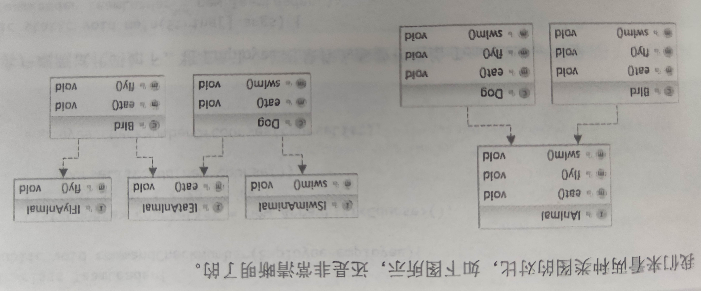

> 《研磨设计模式》和《设计模式就该这样学：基于经典框架源码和真实业务场景》的读书笔记

## 设计模式是什么？

模式：从字面上理解，模，就是<u>模型、模板</u>的意思；式，就是方式、方法的意思。综合起来，所谓模式就是：可以作为模型或模板的方式或方法。再简单点说就是可以用来作为样板的方式或方法，类似于大家所熟悉的范例。

所以设计模式就是设计方面的模板，具体定义为：是指在软件开发中，**经过验证的**，用于解决在**特定环境**下、**重复出现**的、特定问题的**解决方案**。

### 　　每个设计模式的构成如下：

　　　　1、模式名称：模式的一个好记的名字

　　　　2、环境和问题：描述在什么环境下，出现什么特定的问题

　　　　3、解决方案：描述如何解决问题

　　　　4、效果：描述应用模式后的效果，以及可能带来的问题

## 设计模式分类：

为了缩小范围，我们仅讨论Java设计模式，也就是GoF著作中的23种设计模式，对于这23种设计模式，GoF把它们分为三类。

- 创建型模式：抽象了对象实例化过程，用来帮助创建对象的实例。
  - 简单工厂模式
  - 单例模式
  - 工厂方法模式
  - 抽象工厂模式
  - 生成器模式
  - 原型模式
- 结构型模式：描述如何组合类和对象以获得更大的结构。
  - 外观模式
  - 适配器模式
  - 代理模式
  - 组合模式
  - 享元模式
  - 装饰模式
  - 桥接模式
- 行为型模式：描述算法和对象间职责的分配。
  - 中介模式
  - 观察者模式
  - 命令模式
  - 迭代器模式
  - 模板模式
  - 策略模式
  - 状态模式
  - 备忘录模式
  - 解释器模式
  - 责任链模式
  - 访问者模式

《**设计模式就该这样学：基于经典框架源码和真实业务场景**》中提到了新的设计模式：

- 对象池模式
- 规格模式
- 空对象模式
- 雇工模式

## JAVA中的面向接口编程

### 1.Java中接口的概念

在Java中接口是一种特殊的抽象类，跟一般的抽象类相比，接口里面的所有方法都是抽象方法，接口里面的所有属性都是常量。也就是说，接口里面只有方法定义而没有任何方法实现。

### 2.接口用来干什么

通常用接口来定义实现类的外观，也就是实现类的行为定义，用来约束实现类的行为。接口就相当于一份契约，根据外部应用需要的功能，约定了实现类应该要实现的功能，但是具体的实现类除了实现接口约定的功能外，还可以根据需要实现其他一些功能，这是允许的，也就是说实现类的功能包含但不仅限于接口约束的功能。
通过使用接口，可以实现不相关类的相同行为，而不需考虑这些类之间的层次关系，接口就是实现类对外的外观。

### 3.接口的思想

根据接口的作用和用途，浓缩下来，**接口的思想就是“封装隔离”**。
通常提到的封装是指对数据的封装，但是这里的封装是指“对被隔离体的行为的封装”，或者是“对被隔离体的职责的封装”；而隔离指的是外部调用和内部实现，外部调用只能通过接口进行调用，外部调用是不知道内部具体实现的，也就是说外部调用和内部实现是被接口隔离开的。

### 4.使用接口的好处

由于外部调用和内部实现被接口隔离开了，那么只要接口不变，内部实现的变化就不会影响到外部应用，从而使得系统更灵活，具有更好的扩展性和可维护性，这也就是所谓“接口是系统可插拔性的保证”这句话的意思。

### 5.接口和抽象类的选择

既然接口是一种特殊的抽象类，那么在开发中，何时选用接口？何时选用抽象类呢？
对于它们的选择，在开发中是一个很重要的问题，特别总结两句话给大家：

- 优先选用接口
- 在既要定义子类的行为，又要为子类提供公共的功能时应选择抽象类。

## 设计原则

> 面向对象的分析设计有很多原则，这些原则大多从<u>思想层面</u>给我们指出了面向对象分析设计的正确<u>方向</u>，是我们进行面向对象分析设计时应该尽力遵守的<u>准则</u>。而设计模式已经是针对某个场景下某些问题的某个解决方案。也就是说这些设计原则是思想上的指导，而<u>设计模式</u>是<u>实现上的手段</u>，因此设计模式也应该遵守这些原则，换句话说，设计模式就是这些设计原则的一些具体体现。

### 常见的面向对象设计原则——SOLID原则

#### 单一职责原则SRP（Single Responsibility Principle）

所谓单一职责原则，指的是，一个类应该仅有一个引起它变化的原因。总体来说就是一个class、interface、method只负责一项职责。
这里变化的原因就是所说的“职责”，如果一个类有多个引起它变化的原因，那么也就意味着这个类有多个职责，再进一步说，就是把多个职责耦合在一起了。
这会造成职责的相互影响，可能一个职责的变化，会影响到其他职责的实现，甚至引起其他职责随着变化，这种设计是很脆弱的。
这个原则看起来是最简单和最好理解的，但是实际上是很难完全做到的，难点在于如何区分“职责”。这是个没有标准量化的东西，哪些算职责、到底这个职责有多大的粒度、这个职责如何细化等。*因此，在实际开发中，这个原则也是最容易违反的*。

**▲一句话总结**：一个类只干一件事，从而便于立即额，提高代码可读性

#### 开放-关闭原则OCP（Open-Closed Principle）

> 所谓开放-关闭原则，指的是，一个类应该对扩展开放，对修改关闭。一般也被简称为开闭原则，开闭原则是设计中非常核心的一个原则。
>
> OCP的核心思想是面对抽象编程，强调用抽象构建框架，用实现拓展细节，从而额提高软件系统的可复用性和可维护性。

开闭原则要求的是，类的行为是可以扩展的，而且是在不修改已有代码的情况下进行扩展，也不必改动已有的源代码或者二进制代码。
看起来好像是矛盾的，怎么样才能实现呢？
实现开闭原则的关键就在于合理地抽象、分离出变化与不变化的部分，为<u>变化的部分预留下可扩展的方式</u>，比如，<u>钩子方法或是动态组合对象</u>等。

这个原则看起来也很简单。但事实上，一个系统要全部做到遵守开闭原则，几乎是不可能的，也没这个必要。适度的抽象可以提高系统的灵活性，使其可扩展、可维护，但是过度地抽象，会大大增加系统的复杂程度。应该在需要改变的地方应用开闭原则就可以了，而不用到处使用，从而陷入过度设计。

**▲一句话总结**：对扩展开放，对修改关闭，从而降低维护带来的新风险

#### 里氏替换原则LSP（Liskov Substitution Principle）

所谓里氏替换原则，指的是，子类型**必须能够**替换掉它们的父类型。这很明显是一种多态的使用情况，它可以避免在多态的应用中，出现某些隐蔽的错误。

> 这条原则的定义是比较抽象的，可以理解为
>
> 1. 一个软件实体如果使用一个父类，则一定适用于其子类，即要求所有引用父类的地方必须能透明地使用子类对象，子类能够代替父类对象，而程序逻辑不变。
> 2. 子类可以拓展父类的功能，但不能改变父类原有的功能，根据这个理解，我们可以将DIP定义总结如下：
>    1. 子类可以实现父类的抽象方法，但不能覆盖父类的非抽象方法
>    2. 子类可以增加自己特有的方法
>    3. 当子类的方法重载父类的方法时，方法的前置条件（入参）要比父类的更宽松
>    4. 当子类的方法实现父类的方法时（重写、重载或实现抽象方法），方法的后置条件（输出、返回值）要比父类的更严格或相等

**▲一句话总结**：子类重写方法功能改变，不应该影响父类方法的含义，从而防止继承泛滥

#### 依赖倒置原则DIP（Dependence Inversion Principle）

所谓依赖倒置原则，指的是，要依赖于抽象，不要依赖于具体类。要做到依赖倒置，典型的应该做到：

- 高层模块不应该依赖于底层模块，二者都应该依赖于抽象。
- 抽象不应该依赖于具体实现，具体实现应该依赖于抽象。

很多人觉得，层次化调用的时候，应该是高层调用“底层所拥有的接口”，这是一种典型的误解。事实上，一般高层模块包含对业务功能的处理和业务策略选择，应该被重用，是高层模块去影响底层的具体实现。
因此，这个底层的接口应该是由高层提出的，然后由底层实现的。也就是说底层的接口的所有权在高层模块，因此是一种所有权的倒置。
倒置接口所有权，这就是著名的Hollywood（好莱坞）原则：不要找我们，我们会联系你。

**一句话总结**：高层不应该依赖底层，从而更利用代码结构的省级扩展

#### 接口隔离原则ISP（Interface Segregation Principle）

> 指用多个专门的接口，而不使用单一的总接口，客户端不应该依赖它不需要的接口（不需要的接口对客户来说不可见）。
>
> 这个原则告诉我们的注意点为：
>
> - 一个雷对另一个类的依赖应该建立在最小接口上
> - 建立单一接口，不要建立庞大臃肿的接口
> - 尽量细化接口，接口中的方法越少越好（适量少）
>
> 这些“高聚合、低耦合”要求的设计思想，使得类具有很好的可读性、可扩展性和可维护性。

所谓接口隔离原则，指的是，不应该强迫客户依赖于他们不用的方法。
这个原则用来处理那些比较“庞大”的接口，这种接口通常会有较多的操作声明，涉及到很多的职责。客户在使用这样的接口的时候，通常会有很多他不需要的方法，这些方法对于客户来讲，就是一种接口污染，相当于强迫用户在一大堆“垃圾方法”中去寻找他需要的方法。
因此，这样的接口应该被分离，应该按照不同的客户需要来分离成为针对客户的接口。<u>这样的接口中，只包含客户需要的操作声明</u>，这样既方便了客户的使用，也可以避免因误用接口而导致的错误。

分离接口的方式，除了直接进行代码分离之外，还可以使用委托来分离接口，在能够支持多重继承的语言中，还可以采用多重继承的方式进行分离。

**▲一句话总结**：一个接口只干一件事，从而功能解耦，高聚合、低耦合

---

demo：针对动物Animal接口，显然需要将飞的、游的隔离开，因此需要针对不同动物的行为来设计不同的接口。

### 其他一些设计原则

#### 最少知道原则LKP（Least Knowledge Principle）——迪米特原则LoD

> 指一个对象应该对其他对象保持最少的了解，尽量降低类与类之间的耦合。强调之和朋友交流、不和陌生人说话，出现在成员变量、方法的输入、输出参数中的类可以被称为成员朋友类，出现在方法体内部的类不属于朋友类。

这个原则用来指导我们在设计系统的时候，应该尽量减少对象之间的交互，对象只和自己的朋友谈话，<u>也就是只和自己的朋友交互</u>，从而松散类之间的耦合。通过松散类之间的耦合来降低类之间的相互依赖，这样在修改系统的某一个部分的时候，就不会影响其他的部分，从而使得系统具有更好的可维护性。

那么究竟哪些对象才能被当作朋友呢？最少知识原则提供了一些指导。

- 当前对象本身。
- 通过方法的参数传递进来的对象。
- 当前对象所创建的对象。——成员变量
- 当前对象的实例变量所引用的对象。——成员变量
- 方法内所创建或实例化的对象。 ---> ???

请注意！！！1-5条的意思是，<mark>如果某对象是调用其他方法的返回结果，不要调用该对象的方法！</mark>即要求我们只调用以下范围的方法： 

（1）该对象本身； 
（2）被当作方法的**参数**而传递进来的对象； 
（3）此方法所**创建或实例化**的任何对象； 
（4）对象的任何组件； 

总之，最少知识原则要求我们的方法调用必须保持在一定的界限范围之内，尽量减少对象的依赖关系。

**▲一句话总结**：不该知道的不要知道，从而减少代码臃肿

#### 合成复用原则

> 尽量使用对象组合或对象聚合的方式来实现代码复用，而不是继承关系达到代码复用的目的。

**▲一句话总结**：尽量使用组合实现代码复用而不是用继承，从而降低代码耦合

除了上面提到的这些原则，还有一些大家都熟知的原则，比如：

- 面向接口编程；
- 优先使用组合，而非继承。

当然也还有很多大家不是很熟悉的原则，比如：

- 一个类需要的数据应该隐藏在类的内部；
- 类之间应该零耦合，或者只有传导耦合，换句话说，类之间要么没有关系，要么只使用另一个类的接口提供的操作；
- 在水平方向上尽可能统一地分布系统功能；

# 附录

Github图说设计模式: https://design-patterns.readthedocs.io/zh_CN/latest/creational_patterns/simple_factory.html

[设计模式就该这么学：以微信订阅号来讲观察者模式(第三篇)](http://www.cnblogs.com/zishengY/p/8869823.html)

[观察者模式实际应用：监听线程，意外退出线程后自动重启](http://www.cnblogs.com/zishengY/p/7056948.html)