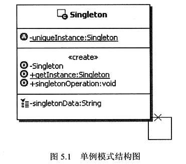

虽然还没正式踏入开发就业浪潮中，但为了保证自己的代码质量，最近还是在学设计模式相关内容。以下为读《研磨设计模式》和《设计模式就该这样学：基于经典框架源码和真实业务场景》的读书笔记。

> GoF的《设计模式》就是设计模式的始祖、经典教科书。其描述严谨，举例恰当，分类组织，是应该反复细读的经典，两本书皆提及了GoF这本书，引用了GoF中的部分例子。

# 单例模式

## 虚拟场景：

读取配置文件的内容（假设系统采用的是properties格式的配置文件）

```java
package cn.javass.dp.singleton.example1;

import java.io.*;
import java.util.*;

public class AppConfig {
	/**
	 * 用来存放配置文件中参数A的值
	 */
	private String parameterA;
	/**
	 * 用来存放配置文件中参数B的值
	 */
	private String parameterB;
	
	public String getParameterA() {
		return parameterA;
	}
	public String getParameterB() {
		return parameterB;
	}
    
	public AppConfig(){
		//调用读取配置文件的方法
		readConfig();
	}
	/**
	 * 读取配置文件，把配置文件中的内容读出来设置到属性上
	 */
	private void readConfig(){
		Properties p = new Properties(); 
		InputStream in = null;
		try {
			in = AppConfig.class.getResourceAsStream("AppConfig.properties");
			p.load(in);
			//把配置文件中的内容读出来设置到属性上
			this.parameterA = p.getProperty("paramA");
			this.parameterB = p.getProperty("paramB");
		} catch (IOException e) {
			System.out.println("装载配置文件出错了，具体堆栈信息如下：");
			e.printStackTrace();
		}finally{
			try {
				in.close();
			} catch (IOException e) {
				e.printStackTrace();
			}
		}
	}
	
}

```


## 存在的问题：

系统运行期间，如果存在很多个AppConfig的实例对象即配置内容，会严重浪费内存资源。实际上，对于AppConfig这种类**在运行期间只要一个实例对象就够了**。===>单例模式

> 定义：保证一个类仅有一个实例，并提供一个访问它的全局访问点。

## 单例实现思路：

一个类能够被创建多个实例的问题根源在于类的构造方法是公开的，也就是可以让类的外部通过构造方法来创建多个实例。换句话说，只要类的构造方法能让类的外部访问，就没有办法去控制外部来创建这个类的实例个数。要想控制一个类只被创建一个实例，那么首要的问题就是要把**创建实例的权限收回来，让类自身来负责自己类实例的创建工作**，然后由这个类来提供外部可以访问这个类实例的方法，这就是单例模式的实现方式。

## 单例模式的结构和说明：



Singleton：私有化构造函数来隐藏构造，从而自己负责创建Singleton类自己的唯一实例，并提供一个getlnstance的方法，让外部来访问这个类的唯一实例。


## 基础级单例

### 饿汉式

> 所谓饿汉式，既然饿，那么在创建对象实例的时候就比较着急，饿了嘛，于是在**装载类的时候就创建对象实例**，写法如下：

```java
public class Singleton {
    private static Singleton instance = new Singleton();

    private Singleton(){

    }
    
    public static Singleton getInstance(){
        return instance;
    }
}

```

#### 实现方式：

1. 私有化构造方法
2. 提供获取实例的方法getInstance
3. 把获取实例的方法变成静态方法
4. 定义存储实例的属性(成员变量)instance
5. 将实例成员变量instance定义为静态的（由于要在静态方法中使用，被迫写成static，没用到static特性）
6. 从而实现控制实例的创建


### 懒汉式

> 所谓懒汉式，既然是**懒**，那么在创建对象实例的时候就不着急，**会一直等到马上要使用对象实例的时候才会创建**，懒人嘛，总是推托不开的时候才去真正执行工作，因此在装载对象的时候不创建对象实例，写法如下：
>
> 懒汉式体现了延迟加载的思想，lazy load，这个lazy并不是懒惰的意思，而是延迟的意思，Lazy load在实际开发中是种很常见的思想，可以尽可能的节约资源。

```java

public class Singleton {
	/**
	 * 定义一个变量来存储创建好的类实例
	 */
	private static Singleton uniqueInstance = null;
	/**
	 * ▲私有化构造方法，将构造方法权限回收，好在内部控制创建实例的数目
	 */
	private Singleton(){
		//
	}
	/**
	 * 定义一个方法来为客户端提供类实例， 提供访问方法
	 * @return 一个Singleton的实例
	 */
    public static synchronized Singleton getInstance() {
        if (instance == null) instance = new Singleton();
        return instance;
    }
}
```

#### 实现方式：

1. 私有化构造方法
2. 提供获取实例的方法getInstance
3. 把获取实例的方法变成静态方法
4. 定义存储实例的属性(成员变量)instance
5. 将实例成员变量instance定义为静态的（利用static在类装载的时候执行的特性，从而实现初始化）
6. 从而实现控制实例的创建

:dart:以上两种就是最基础的单例写法，在不考虑复杂的条件下仅是满足了定义所要求的功能：运行期间只会被创建一个实例，切提供了一个全局唯一访问点（即getInstance方法）

### 优缺点分析：

- 时间和空间：
  - 饿汉：空间换时间，类加载时就创建。因此当系统有大量单例对象存在时，系统初始化就会造成大量的内存浪费
  - 懒汉：时间换空间，每次获取时都需要判断是否需要创建实例
- 线程安全：
  - 饿汉：线程安全，因为虚拟机保证智慧加载以此类推，并且加载类的时候不会并发发生。
  - 懒汉：需要加上synchronized关键字才能确认线程安全，但synchronized加在方法上会比较影响性能，导致大批量线程阻塞，从而导致程序性能大幅下降


## 双重检查锁

> 为了保证加载时的性能->即不能采用饿汉，而是得采用懒汉lazy load的模式
>
> 那么如何较好地保证线程安全呢？===>在懒汉式的基础上，我们得到了双重检查锁

懒汉式的做法好比地铁进站限流，在寒风刺骨的冬天，所有人都在站前广场转圈，用户体验会不好；而双重检查就是设置两重检查，好比在入站门处和入厅后再闸口检票处再检查一次

```java
public class Singleton {
	/**
	 * 对保存实例的变量添加volatile的修饰。
	 */
	private volatile static Singleton instance = null;
	private Singleton(){
		
	}
	public static  Singleton getInstance(){
		//先检查实例是否存在，如果不存在才进入下面的同步块
		if(instance == null){
			//同步块，线程安全的创建实例
			synchronized(Singleton.class){
				//再次检查实例是否存在，如果不存在才真的创建实例
				if(instance == null){
					instance = new Singleton();
				}
			}
		}
		return instance;
	}
}

```

双重检查加锁机制和懒汉不同的在于并不是进入getInstace方法需要同步(由方法加锁->方法内部加对象锁)，而是不存在实例的时候才会进入同步块。此处阻塞的不是基于整个LazyDoubleCheckSingleton类的阻塞，而是在getInstance方法内部的阻塞，只要逻辑不复杂，对于调用者是感觉不到的。

▲注：被volatile修饰的变量的值不会被本地线程缓存，所有对该变量的读写都是直接操作共享内存的，从而使得多个线程能够正确的处理该变量。（由于Java1.4前对volatile关键字实现有问题，因此双重检查锁适用于Java1.5以后）。此外<u>volatile可能会屏蔽JVM一些必要的代码优化，所以会降低运行效率</u>，因此一般建议没有特别需要，不要使用volatile。因此，**不建议系统中大量使用双重检查锁**。

## 静态内部类式（类级内部类）

> 虽然双重检查锁较之懒汉和饿汉有了不少优化，但双重检查锁仍存在1.volatile性能、2.synchronized性能，有没有什么办法不使用synchronized关键字，还能实现延迟加载和线程安全呢？==>静态内部类式

### 什么是类级内部类？

简单点说，**类级内部类**指的是，有<u>static修饰的成员式内部类</u>。如果没有static修饰的成员式内部类被称为**对象级内部类**。

- 类级内部类相当于其外部类的static成分，<u>它的对象(类级内部类对象)与外部类对象间不存在依赖关系</u>，因此可直接创建。而对象级内部类的实例，是绑定在外部对象实例中的。
- 类级内部类中，可以定义静态的方法。在<u>内部类的静态方法</u>中只能够引用外部类中的**静态**成员方法或者成员变量。
- **类级内部类相当于其外部类的成员，只有在第一次被使用的时候才会被装载。**

#### JVM隐含执行同步的情况：

- 由静态初始化器（在静态字段上或static{}块中的初始化器）初始化数据时
- 访问final字段时
- 在创建线程之前创建对象时
- 线程可以看见它将要处理的对象时

```java
public class LazyStaticInnerClassSingleton {
	/**
	 * 类级的内部类，也就是静态的成员式内部类，该内部类的实例与外部类的实例没有绑定关系，
	 * 而且只有被调用到才会装载，从而实现了延迟加载
	 */
	private static class SingletonHolder{
		/**
		 * 静态初始化器，由JVM来保证线程安全
		 */
		private static LazyStaticInnerClassSingleton instance = new LazyStaticInnerClassSingleton();
	}
	/**
	 * 私有化构造方法
	 */
	private LazyStaticInnerClassSingleton(){
	}
	
	public static LazyStaticInnerClassSingleton getInstance(){
		return SingletonHolder.instance;
	}
}
```

### 解决反射破坏单例问题

```java
public class LazyStaticInnerClassSingleton {
	/**
	 * 类级的内部类，也就是静态的成员式内部类，该内部类的实例与外部类的实例没有绑定关系，
	 * 而且只有被调用到才会装载，从而实现了延迟加载
	 */
	private static class SingletonHolder{
		/**
		 * 静态初始化器，由JVM来保证线程安全
		 */
		private static LazyStaticInnerClassSingleton instance = new LazyStaticInnerClassSingleton();
	}
	/**
	 * 私有化构造方法
	 */
	private LazyStaticInnerClassSingleton(){
        if (LazyStaticInnerClassSingleton.instance != null){
            throw new RuntimeException("不允许创建多个实例")
        }
	}
	
	public static LazyStaticInnerClassSingleton getInstance(){
		return SingletonHolder.instance;
	}
}
```


## 枚举式单例

> 虽然静态内部类式已经接近完美了，但还不够优雅，还有没有更优雅的写法呢？--->枚举式单例

对枚举的观点：

- Java的枚举类型实质上是功能齐全的类，因此可以有自己的属性和方法。
- Java枚举类型的基本思想是通过公有的静态final域为每个<u>枚举常量</u>导出<u>实例的类</u>。
- 从某个角度讲，<u>枚举</u>是单例的泛型化，<u>本质上是*单元素*的枚举</u>。


```java
public enum Singleton {	
	/**
	 * 定义一个枚举的元素,它就代表了Singleton的一个实例
	 */
	uniqueInstance;
	
	/**
	 * 示意方法，单例可以有自己的操作
	 */
	public void singletonOperation(){
		//功能处理
	}
}
```

使用枚举来实现单实例控制会更加简洁，而且**无偿地提供了防序列化（需要增加readResove方法）、反射破坏的机制**，并由JVM从根本上提供保障，绝对防止多次实例化，是更简洁、高效、安全的实现单例的方式。至于为什么可以这么玩，可以看《设计模式就该这样学：基于经典框架源码和真实业务场景》中的源码分析

## 容器式单例

> 适用于需要大量创建单例对象的场景，便于管理，但它是非线程安全的。Spring中有用到容器式单例的写法。容器一般就是一个Map

```java
public class ContainerSingleton {
    private ContainerSingleton(){}
    private static Map<String, Object> ioc = new ConcurrentHashMap<>();

    public static Object getBean(String className) {
        synchronized (ioc) {
            if (!ioc.containsKey(className)) {
                Object obj = null;
                try {
                    obj = Class.forName(className).newInstance();
                    ioc.put(className, obj);
                } catch (Exception e) {
                    e.printStackTrace();
                }
                return obj;
            } else {
                return ioc.get(className)
            }
        }
    }
}

```


## 模式讲解：

单例模式的范围为一个虚拟机的范围，因为加载类的载类的功能是虚拟机的，一个虚拟机在通过自己的ClassLoader 装载饿汉式实现单例类的时候就会创建一个类的实例。

▲所以需要注意的是，如果一个虚拟机里面有很多个ClassLoader，而且<u>这些ClassLoader都装载某个类的话(针对饿汉式)，就算这个类是单例，它也会产生很多个实例</u>。当然，如果一个机器上有多个虚拟机，那么每个虚拟机里面都应该至少有一个这个类的实例，也就是说整个机器。**所以这边讨论的单例都不适用于集群环境。**

▲单例模式的本质：控制实例数目


## 应用场景：

> 对于Java来说单例模式就是要保证在一个JVM中只存在单一实例

- 需要频繁创建的一些类，使用单例可以降低系统的内存压力，减少GC
- 某些类创建实例时占用资源较多，或实例化耗时较长，且经常使用
- 频繁访问数据库或文件的对象
- 对于一些控制硬件级别的操作，或者从系统上来讲应当是单一控制逻辑的操作，如果有多个实例，则无法保证逻辑的统一性。

p.s. 抽象工厂模式中具体的工厂类就是一个单例


## 单例模式的优点：

1. 可以保证内存中只有一个实例，减少了内存的开销
2. 可以避免对资源的多重占用
3. 设置全局访问点，可以优化和共享资源的访问

## 单例模式的缺点：

1. 没有接口，扩展困难。如果要扩展，则除了修改原来的代码，没有第二种途径， 违背了开闭原则。好在的是，一般修改单例也比较简单
2. 在并发测试中，单例不利于代码调试。在调试过程总，如果单例代码没有执行完，也不能模拟生成一个恶心的对象
3. 单例模式的功能代码通常写在一个类中，如果功能设计不合理，很容易违背单一职责原则


# 附录

## Lazy load->缓存思想

缓存使用场景：当某些资源或者数据被频繁地使用，而这些资源或数据存储在系统外部，比如数据库、硬盘文件等，那么每次操作这些数据的时候都得从数据库或者硬盘上去获取，速度会很慢，将造成性能问题。
一个简单的解决方法就是：把这些数据**缓存到内存**里面，每次操作的时候，先到内存里面找，看有没有这些数据，如果有，就直接使用，如果没有就获取它，并设置到缓存中，<u>下一次访问的时候就可以直接从内存中获取了</u>，从而节省大量的时间。当然，缓存是一种**典型的空间换时间**的方案。

### 缓存基本实现

在Java开发中最常见的一种实现缓存的方式就是使用*Map*，基本步骤如下。
（1）先到缓存里面查找，看看是否存在需要使用的数据。
（2）如果没有找到，那么就创建一个满足要求的数据，然后把这个数据设置到缓存中，以备下次使用。如果找到了相应的数据，或者是创建了相应的数据，那就直接使用这个数据。


## 多例控制模式

▲单例模式的本质：控制实例数目，只要按照这种思想，我们除了控制单例以外，还可以限制实例具体数目为2、3、4...

```java
package cn.javass.dp.singleton.example9;
import java.util.*;
/**
 * 简单演示如何扩展单例模式，控制实例数目为3个 
 */
public class OneExtend {
	/**
	 * 定义一个缺省的key值的前缀
	 */
	private final static String DEFAULT_PREKEY = "Cache";
	/**
	 * 缓存实例的容器
	 */
	private static Map<String,OneExtend> map = new HashMap<String,OneExtend>();
	/**
	 * 用来记录当前正在使用第几个实例，到了控制的最大数目，就返回从1开始
	 */
	private static int num = 1;
	/**
	 * 定义控制实例的最大数目
	 */
	private final static int NUM_MAX = 3; 
	private OneExtend(){}
	public static OneExtend getInstance(){
		String key = DEFAULT_PREKEY+num;
		OneExtend oneExtend = map.get(key);
		if(oneExtend==null){
			oneExtend = new OneExtend();
			map.put(key, oneExtend);
		}
		//把当前实例的序号加1
		num++;
		if(num > NUM_MAX){
			//如果实例的序号已经达到最大数目了，那就重复从1开始获取
			num = 1;
		}
		return oneExtend;		
	}
	
	public static void main(String[] args) {
		OneExtend t1 = getInstance();
		OneExtend t2 = getInstance();
		OneExtend t3 = getInstance();
		OneExtend t4 = getInstance();
		OneExtend t5 = getInstance();
		OneExtend t6 = getInstance();
		
		System.out.println("t1=="+t1);
		System.out.println("t2=="+t2);
		System.out.println("t3=="+t3);
		System.out.println("t4=="+t4);
		System.out.println("t5=="+t5);
		System.out.println("t6=="+t6);
	}
}

```

